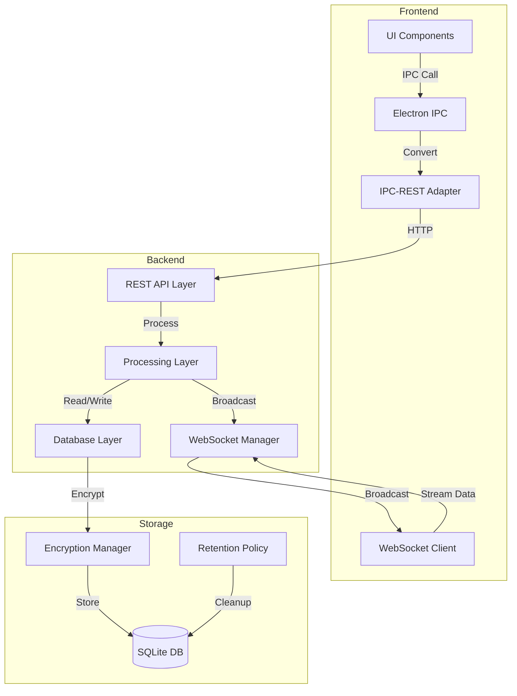
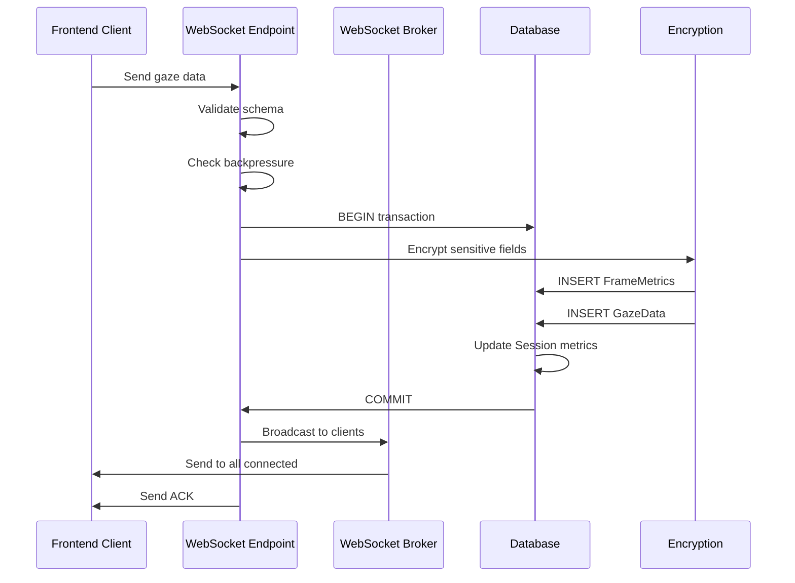

# PHASE 0: Infrastructure Foundation - Arsitektur Teknis

**Status**: Implemented
**Tanggal**: 2025-12-26
**Owner**: Kilo Code (Architect Mode)

---

## Ringkasan Eksekutif

Dokumen ini merancang arsitektur teknis detail untuk PHASE 0 Eaglearn, mencakup:
- **Database Layer Enhancement**: 5 model missing + encryption + retention policy
- **WebSocket Infrastructure**: Heartbeat mechanism + reconnection logic + streaming enhancement
- **REST API Expansion**: 9 endpoints missing (session, calibration, metrics, dashboard)
- **Integration Architecture**: Flow database-websocket-REST dan IPC adapter

Semua desain mengikuti spec [`spec/40_data_model.md`](spec/40_data_model.md) dan [`spec/45_api_contracts.md`](spec/45_api_contracts.md).

---

## 1. Database Layer Enhancement

### 1.1 Data Model Expansion (5 Model Missing)

Spec membutuhkan 8 model total. Saat ini semua 8 model sudah implemented:
- ✅ Session (9 fields)
- ✅ FrameMetrics (6 fields)
- ✅ GazeData (6 fields)
- ✅ HeadPose (6 fields)
- ✅ AudioStress (7 fields)
- ✅ StressFeatures (5 fields)
- ✅ ProductivityMetrics (4 fields)
- ✅ UserCalibration (6 fields)

#### Model 1: HeadPose

**Tabel**: `head_pose`

**Deskripsi**: Menyimpan hasil head pose estimation per frame (pitch, yaw, roll angles)

**SQLAlchemy Model**:
```python
from sqlalchemy import Column, Integer, String, Float, DateTime, ForeignKey, Index
from sqlalchemy.orm import relationship
from datetime import datetime
from uuid import uuid4

class HeadPose(Base):
    __tablename__ = "head_pose"
    
    # Primary Key
    pose_id = Column(String(36), primary_key=True, default=lambda: str(uuid4()))
    
    # Foreign Key
    frame_id = Column(String(36), ForeignKey("frame_metrics.frame_id"), nullable=False)
    
    # Pose Angles (degrees)
    pitch_angle = Column(Float, nullable=False)  # Range: -90 to +90
    yaw_angle = Column(Float, nullable=False)    # Range: -90 to +90
    roll_angle = Column(Float, nullable=False)   # Range: -90 to +90
    
    # Posture Classification
    posture_class = Column(String(20), nullable=False)  # Enum: tegak, menunduk, miring
    
    # Metadata
    created_at = Column(DateTime, default=datetime.utcnow, nullable=False)
    
    # Relationships
    frame_metrics = relationship("FrameMetrics", back_populates="head_pose")
    
    # Indexes
    __table_args__ = (
        Index("idx_head_pose_frame_id", "frame_id"),
        Index("idx_head_pose_created_at", "created_at"),
    )
```

**Relasi**: 
- Foreign Key ke `FrameMetrics.frame_id` (many-to-one)
- Setiap frame dapat memiliki 1 head pose record

**Constraints**:
- `pitch_angle`, `yaw_angle`, `roll_angle`: Range -90 to +90 degrees
- `posture_class`: NOT NULL, enum values (tegak/menunduk/miring)
- `frame_id`: NOT NULL, unique per frame

**Index untuk Performa**:
- `idx_head_pose_frame_id`: Query by frame_id
- `idx_head_pose_created_at`: Time-range queries

---

#### Model 2: AudioStress

**Tabel**: `audio_stress`

**Deskripsi**: Menyimpan hasil analisis audio stress per window (30-second windows dengan 15-second overlap)

**SQLAlchemy Model**:
```python
class AudioStress(Base):
    __tablename__ = "audio_stress"
    
    # Primary Key
    audio_id = Column(String(36), primary_key=True, default=lambda: str(uuid4()))
    
    # Foreign Key
    session_id = Column(String(36), ForeignKey("session.session_id"), nullable=False)
    
    # Window Timing
    window_start = Column(DateTime, nullable=False)
    window_end = Column(DateTime, nullable=False)
    
    # Stress Metrics
    stress_score = Column(Float, nullable=False)  # Range: 0-100
    vocal_effort = Column(Float, nullable=False)  # Vocal effort indicator
    smoothing_count = Column(Integer, nullable=False)  # Number of samples for smoothing
    
    # Metadata
    created_at = Column(DateTime, default=datetime.utcnow, nullable=False)
    
    # Relationships
    session = relationship("Session", back_populates="audio_stress_records")
    stress_features = relationship("StressFeatures", back_populates="audio_stress", cascade="all, delete-orphan")
    
    # Indexes
    __table_args__ = (
        Index("idx_audio_stress_session_id", "session_id"),
        Index("idx_audio_stress_window_start", "window_start"),
        Index("idx_audio_stress_window_range", "window_start", "window_end"),
    )
```

**Relasi**:
- Foreign Key ke `Session.session_id` (many-to-one)
- One-to-many ke `StressFeatures`

**Constraints**:
- `stress_score`: Range 0-100
- `window_start` < `window_end`
- `smoothing_count`: >= 1

**Index untuk Performa**:
- `idx_audio_stress_session_id`: Query by session
- `idx_audio_stress_window_start`: Time-based queries
- `idx_audio_stress_window_range`: Range queries untuk time windows

---

#### Model 3: StressFeatures

**Tabel**: `stress_features`

**Deskripsi**: Menyimpan fitur detail dari analisis audio stress (HRV, breathing rate, power ratios)

**SQLAlchemy Model**:
```python
class StressFeatures(Base):
    __tablename__ = "stress_features"
    
    # Primary Key
    feature_id = Column(String(36), primary_key=True, default=lambda: str(uuid4()))
    
    # Foreign Key
    audio_id = Column(String(36), ForeignKey("audio_stress.audio_id"), nullable=False)
    
    # HRV Features
    lf_power = Column(Float, nullable=False)      # Low frequency power (0.04-0.15Hz)
    hf_power = Column(Float, nullable=False)      # High frequency power (0.15-0.4Hz)
    lf_hf_ratio = Column(Float, nullable=False)   # LF/HF power ratio
    
    # Physiological Estimates
    heart_rate = Column(Float, nullable=False)    # BPM (50-150 range)
    breathing_rate = Column(Float, nullable=False)  # Hz (0.1-0.5 range)
    
    # Metadata
    created_at = Column(DateTime, default=datetime.utcnow, nullable=False)
    
    # Relationships
    audio_stress = relationship("AudioStress", back_populates="stress_features")
    
    # Indexes
    __table_args__ = (
        Index("idx_stress_features_audio_id", "audio_id"),
    )
```

**Relasi**:
- Foreign Key ke `AudioStress.audio_id` (many-to-one)

**Constraints**:
- `heart_rate`: Range 50-150 BPM
- `breathing_rate`: Range 0.1-0.5 Hz
- `lf_power`, `hf_power`: Normalized units (>= 0)

**Index untuk Performa**:
- `idx_stress_features_audio_id`: Query by audio window

---

#### Model 4: ProductivityMetrics

**Tabel**: `productivity_metrics`

**Deskripsi**: Menyimpan hasil analisis produktivitas per session (break patterns, on-task ratio)

**SQLAlchemy Model**:
```python
class ProductivityMetrics(Base):
    __tablename__ = "productivity_metrics"
    
    # Primary Key
    productivity_id = Column(String(36), primary_key=True, default=lambda: str(uuid4()))
    
    # Foreign Key
    session_id = Column(String(36), ForeignKey("session.session_id"), nullable=False, unique=True)
    
    # Break Analysis
    total_breaks = Column(Integer, nullable=False)  # Number of breaks detected
    avg_break_duration = Column(Float, nullable=False)  # Minutes
    break_pattern_type = Column(String(20), nullable=False)  # Enum: pomodoro, flowtime, irregular
    
    # Productivity Score
    productivity_score = Column(Float, nullable=False)  # Range: 0-100
    
    # Metadata
    created_at = Column(DateTime, default=datetime.utcnow, nullable=False)
    updated_at = Column(DateTime, default=datetime.utcnow, onupdate=datetime.utcnow)
    
    # Relationships
    session = relationship("Session", back_populates="productivity_metrics", uselist=False)
    
    # Indexes
    __table_args__ = (
        Index("idx_productivity_metrics_session_id", "session_id"),
        Index("idx_productivity_metrics_created_at", "created_at"),
    )
```

**Relasi**:
- Foreign Key ke `Session.session_id` (one-to-one, unique constraint)

**Constraints**:
- `session_id`: UNIQUE (satu productivity record per session)
- `total_breaks`: >= 0
- `avg_break_duration`: >= 0
- `break_pattern_type`: NOT NULL, enum (pomodoro/flowtime/irregular)
- `productivity_score`: Range 0-100

**Index untuk Performa**:
- `idx_productivity_metrics_session_id`: Query by session
- `idx_productivity_metrics_created_at`: Time-range queries

---

#### Model 5: UserCalibration

**Tabel**: `user_calibration`

**Deskripsi**: Menyimpan parameter calibration untuk akurasi optimal gaze estimation

**SQLAlchemy Model**:
```python
class UserCalibration(Base):
    __tablename__ = "user_calibration"
    
    # Primary Key
    calibration_id = Column(String(36), primary_key=True, default=lambda: str(uuid4()))
    
    # Calibration Metadata
    calibration_date = Column(DateTime, nullable=False, default=datetime.utcnow)
    gaze_model_version = Column(String(20), nullable=False)  # e.g., "1.0.0"
    
    # Calibration Quality
    calibration_error = Column(Float, nullable=False)  # MAE in degrees
    
    # Environment Parameters
    screen_dimensions = Column(String(50), nullable=False)  # Format: "WxH" e.g., "1920x1080"
    camera_position = Column(String(50), nullable=False)  # e.g., "top_center", "bottom_left"
    
    # Metadata
    created_at = Column(DateTime, default=datetime.utcnow, nullable=False)
    is_active = Column(Boolean, default=True, nullable=False)  # Soft delete flag
    
    # Indexes
    __table_args__ = (
        Index("idx_user_calibration_calibration_date", "calibration_date"),
        Index("idx_user_calibration_is_active", "is_active"),
    )
```

**Relasi**:
- Standalone model (no foreign keys in PHASE 0)
- Referenced by Session untuk calibration_id (future enhancement)

**Constraints**:
- `calibration_error`: >= 0, typically < 15 degrees for production
- `screen_dimensions`: Format validation (WxH)
- `camera_position`: Enum values (top_center, bottom_left, etc.)
- `is_active`: Boolean flag untuk soft delete

**Index untuk Performa**:
- `idx_user_calibration_calibration_date`: Query recent calibrations
- `idx_user_calibration_is_active`: Filter active calibrations

---

### 1.2 Encryption Strategy (AES-256)

**Library Pilihan**: `pycryptodome` (sudah ada di requirements.txt)

**Key Management Strategy**:

```python
# backend/security/encryption.py

from Crypto.Cipher import AES
from Crypto.Random import get_random_bytes
from Crypto.Protocol.KDF import PBKDF2
import os
import base64
from typing import Tuple

class EncryptionManager:
    """
    Manages AES-256-GCM encryption untuk field-level encryption.
    Key derivation menggunakan PBKDF2 dari environment variable.
    """
    
    def __init__(self):
        # Master key dari environment variable (user password atau system key)
        self.master_key = os.getenv("ENCRYPTION_MASTER_KEY", "default-dev-key")
        self.salt = os.getenv("ENCRYPTION_SALT", "eaglearn-salt-2025").encode()
    
    def _derive_key(self) -> bytes:
        """Derive 256-bit key dari master key menggunakan PBKDF2"""
        return PBKDF2(
            self.master_key,
            self.salt,
            dkLen=32,  # 256 bits
            count=100000  # NIST recommended
        )
    
    def encrypt_field(self, plaintext: str) -> str:
        """
        Encrypt field value menggunakan AES-256-GCM.
        
        Returns: base64-encoded string format: "nonce:ciphertext:tag"
        """
        if not plaintext:
            return plaintext
        
        key = self._derive_key()
        nonce = get_random_bytes(12)  # 96-bit nonce untuk GCM
        cipher = AES.new(key, AES.MODE_GCM, nonce=nonce)
        
        ciphertext, tag = cipher.encrypt_and_digest(plaintext.encode())
        
        # Format: nonce:ciphertext:tag (all base64-encoded)
        encrypted = base64.b64encode(nonce).decode() + ":" + \
                   base64.b64encode(ciphertext).decode() + ":" + \
                   base64.b64encode(tag).decode()
        
        return encrypted
    
    def decrypt_field(self, encrypted: str) -> str:
        """
        Decrypt field value dari AES-256-GCM encrypted format.
        
        Expects format: "nonce:ciphertext:tag"
        """
        if not encrypted or ":" not in encrypted:
            return encrypted
        
        try:
            parts = encrypted.split(":")
            if len(parts) != 3:
                raise ValueError("Invalid encrypted format")
            
            nonce = base64.b64decode(parts[0])
            ciphertext = base64.b64decode(parts[1])
            tag = base64.b64decode(parts[2])
            
            key = self._derive_key()
            cipher = AES.new(key, AES.MODE_GCM, nonce=nonce)
            plaintext = cipher.decrypt_and_verify(ciphertext, tag)
            
            return plaintext.decode()
        except Exception as e:
            raise ValueError(f"Decryption failed: {str(e)}")

# Global instance
encryption_manager = EncryptionManager()
```

**Encrypted Fields per Model**:

| Model | Field | Reason |
|-------|-------|--------|
| Session | `session_id` | User identifier |
| Session | `device_info` | Hardware fingerprint |
| Session | `os_version` | System information |
| FrameMetrics | `frame_id` | Frame identifier |
| FrameMetrics | `session_id` | Session reference |
| GazeData | `gaze_id` | Gaze record identifier |
| GazeData | `frame_id` | Frame reference |
| HeadPose | `pose_id` | Pose record identifier |
| HeadPose | `frame_id` | Frame reference |
| AudioStress | `audio_id` | Audio record identifier |
| AudioStress | `session_id` | Session reference |
| StressFeatures | `feature_id` | Feature record identifier |
| StressFeatures | `audio_id` | Audio reference |
| ProductivityMetrics | `productivity_id` | Productivity record identifier |
| ProductivityMetrics | `session_id` | Session reference |
| UserCalibration | `calibration_id` | Calibration identifier |

**Implementation dalam SQLAlchemy**:

```python
from sqlalchemy import TypeDecorator, String
from backend.security.encryption import encryption_manager

class EncryptedString(TypeDecorator):
    """Custom SQLAlchemy type untuk encrypted strings"""
    impl = String
    cache_ok = True
    
    def process_bind_param(self, value, dialect):
        if value is None:
            return value
        return encryption_manager.encrypt_field(value)
    
    def process_result_value(self, value, dialect):
        if value is None:
            return value
        return encryption_manager.decrypt_field(value)

# Usage dalam model:
class Session(Base):
    __tablename__ = "session"
    
    session_id = Column(EncryptedString(36), primary_key=True)
    device_info = Column(EncryptedString(255), nullable=True)
    os_version = Column(EncryptedString(50), nullable=True)
    # ... other fields
```

**Key Rotation Strategy**:

```python
# backend/security/key_rotation.py

from apscheduler.schedulers.background import BackgroundScheduler
from datetime import datetime, timedelta
import logging

class KeyRotationManager:
    """
    Manages periodic key rotation (recommended: every 90 days).
    Stores old keys untuk decryption dari archived data.
    """
    
    def __init__(self):
        self.scheduler = BackgroundScheduler()
        self.logger = logging.getLogger(__name__)
    
    def start_rotation_schedule(self):
        """Schedule key rotation setiap 90 hari"""
        self.scheduler.add_job(
            self.rotate_key,
            'interval',
            days=90,
            id='key_rotation_job'
        )
        self.scheduler.start()
    
    async def rotate_key(self):
        """
        Rotate encryption key:
        1. Generate new key
        2. Re-encrypt all data dengan new key
        3. Archive old key untuk historical data
        4. Update ENCRYPTION_MASTER_KEY environment variable
        """
        self.logger.info("Starting key rotation process")
        
        # 1. Generate new key
        new_key = os.urandom(32)
        
        # 2. Re-encrypt all data (batch operation)
        # This would iterate through all encrypted fields dan re-encrypt
        
        # 3. Archive old key
        old_key_archive = {
            "key": os.getenv("ENCRYPTION_MASTER_KEY"),
            "rotation_date": datetime.utcnow(),
            "valid_until": datetime.utcnow() + timedelta(days=365)
        }
        # Store dalam secure location (e.g., encrypted file atau secure vault)
        
        # 4. Update environment
        os.environ["ENCRYPTION_MASTER_KEY"] = new_key.hex()
        
        self.logger.info("Key rotation completed successfully")
```

---

### 1.3 Retention Policy (30-day)

**Strategy**: APScheduler cron job dengan soft-delete approach

**Implementation**:

```python
# backend/retention/retention_policy.py

from apscheduler.schedulers.background import BackgroundScheduler
from datetime import datetime, timedelta
from sqlalchemy import and_, or_
from sqlalchemy.orm import Session as DBSession
import logging

class RetentionPolicyManager:
    """
    Manages 30-day data retention policy.
    - Active data: Available untuk analysis (0-30 days)
    - Expired data: Soft-deleted dengan deleted_at timestamp (30+ days)
    - Hard-delete: Permanent removal setelah 60 hari (optional)
    """
    
    def __init__(self, db_session: DBSession):
        self.db = db_session
        self.scheduler = BackgroundScheduler()
        self.logger = logging.getLogger(__name__)
        self.retention_days = 30
        self.hard_delete_days = 60
    
    def start_retention_schedule(self):
        """Schedule retention job setiap hari jam 2 AM UTC"""
        self.scheduler.add_job(
            self.execute_retention_policy,
            'cron',
            hour=2,
            minute=0,
            timezone='UTC',
            id='retention_policy_job'
        )
        self.scheduler.start()
    
    async def execute_retention_policy(self):
        """Execute retention policy: scan, soft-delete, hard-delete"""
        self.logger.info("Starting retention policy execution")
        
        try:
            # 1. Identify expired data (> 30 days)
            cutoff_date = datetime.utcnow() - timedelta(days=self.retention_days)
            
            # 2. Soft-delete expired sessions
            expired_sessions = self.db.query(Session).filter(
                and_(
                    Session.end_time < cutoff_date,
                    Session.deleted_at.is_(None)  # Not already deleted
                )
            ).all()
            
            soft_delete_count = 0
            for session in expired_sessions:
                session.deleted_at = datetime.utcnow()
                soft_delete_count += 1
            
            self.db.commit()
            self.logger.info(f"Soft-deleted {soft_delete_count} expired sessions")
            
            # 3. Hard-delete very old data (> 60 days)
            hard_delete_cutoff = datetime.utcnow() - timedelta(days=self.hard_delete_days)
            
            hard_delete_count = 0
            
            # Delete related records first (cascade)
            frame_metrics = self.db.query(FrameMetrics).join(Session).filter(
                and_(
                    Session.deleted_at < hard_delete_cutoff,
                    Session.deleted_at.isnot(None)
                )
            ).delete()
            hard_delete_count += frame_metrics
            
            audio_stress = self.db.query(AudioStress).join(Session).filter(
                and_(
                    Session.deleted_at < hard_delete_cutoff,
                    Session.deleted_at.isnot(None)
                )
            ).delete()
            hard_delete_count += audio_stress
            
            # Delete sessions
            sessions = self.db.query(Session).filter(
                and_(
                    Session.deleted_at < hard_delete_cutoff,
                    Session.deleted_at.isnot(None)
                )
            ).delete()
            hard_delete_count += sessions
            
            self.db.commit()
            self.logger.info(f"Hard-deleted {hard_delete_count} records older than {self.hard_delete_days} days")
            
            # 4. Log retention audit trail
            self._log_retention_audit(soft_delete_count, hard_delete_count)
            
        except Exception as e:
            self.db.rollback()
            self.logger.error(f"Retention policy execution failed: {str(e)}")
            raise
    
    def _log_retention_audit(self, soft_delete_count: int, hard_delete_count: int):
        """Log retention operations untuk audit trail"""
        audit_log = {
            "timestamp": datetime.utcnow().isoformat(),
            "operation": "retention_policy",
            "soft_deleted_records": soft_delete_count,
            "hard_deleted_records": hard_delete_count,
            "retention_days": self.retention_days,
            "hard_delete_days": self.hard_delete_days
        }
        self.logger.info(f"Retention audit: {audit_log}")
```

**Database Schema Addition**:

```python
# Add deleted_at field ke Session model untuk soft-delete

class Session(Base):
    __tablename__ = "session"
    
    # ... existing fields ...
    
    # Soft-delete tracking
    deleted_at = Column(DateTime, nullable=True, default=None)
    
    # Indexes
    __table_args__ = (
        Index("idx_session_deleted_at", "deleted_at"),
        Index("idx_session_active", "deleted_at"),  # For filtering active sessions
    )
```

**Query Helper untuk Active Data**:

```python
# backend/db/queries.py

from sqlalchemy import and_

def get_active_sessions(db_session: DBSession):
    """Query hanya active sessions (not soft-deleted)"""
    return db_session.query(Session).filter(
        Session.deleted_at.is_(None)
    ).all()

def get_session_with_related_data(db_session: DBSession, session_id: str):
    """Query session dengan semua related data (frame metrics, audio stress, etc.)"""
    return db_session.query(Session).filter(
        and_(
            Session.session_id == session_id,
            Session.deleted_at.is_(None)
        )
    ).first()
```

---

## 2. WebSocket Infrastructure Robustness

### 2.1 Heartbeat/Ping-Pong Mechanism

**Desain Backend**:

```python
# backend/ws/heartbeat.py

import asyncio
from typing import Dict, List
from datetime import datetime, timedelta
from fastapi import WebSocket
import logging

class HeartbeatManager:
    """
    Manages ping-pong heartbeat untuk WebSocket connections.
    - Ping interval: 30 seconds
    - Pong timeout: 10 seconds
    - Auto-disconnect jika pong tidak diterima
    """
    
    PING_INTERVAL = 30  # seconds
    PONG_TIMEOUT = 10   # seconds
    
    def __init__(self):
        self.logger = logging.getLogger(__name__)
        self.active_connections: Dict[str, Dict] = {}  # connection_id -> {ws, last_pong_time}
    
    async def start_heartbeat_loop(self, connection_id: str, websocket: WebSocket):
        """Start heartbeat loop untuk specific connection"""
        self.active_connections[connection_id] = {
            "websocket": websocket,
            "last_pong_time": datetime.utcnow(),
            "is_alive": True
        }
        
        try:
            while self.active_connections[connection_id]["is_alive"]:
                await asyncio.sleep(self.PING_INTERVAL)
                
                # Send ping message
                ping_message = {
                    "type": "ping",
                    "timestamp": datetime.utcnow().isoformat(),
                    "connection_id": connection_id
                }
                
                try:
                    await websocket.send_json(ping_message)
                    self.logger.debug(f"Sent ping to {connection_id}")
                    
                    # Wait untuk pong response
                    pong_received = await self._wait_for_pong(connection_id)
                    
                    if not pong_received:
                        self.logger.warning(f"Pong timeout untuk {connection_id}, disconnecting")
                        await self._disconnect_stale_connection(connection_id)
                        break
                    
                except Exception as e:
                    self.logger.error(f"Heartbeat error untuk {connection_id}: {str(e)}")
                    await self._disconnect_stale_connection(connection_id)
                    break
        
        finally:
            if connection_id in self.active_connections:
                del self.active_connections[connection_id]
    
    async def _wait_for_pong(self, connection_id: str) -> bool:
        """Wait untuk pong response dengan timeout"""
        start_time = datetime.utcnow()
        
        while (datetime.utcnow() - start_time).total_seconds() < self.PONG_TIMEOUT:
            if connection_id in self.active_connections:
                last_pong = self.active_connections[connection_id]["last_pong_time"]
                # Check jika pong diterima setelah ping dikirim
                if (datetime.utcnow() - last_pong).total_seconds() < self.PING_INTERVAL:
                    return True
            
            await asyncio.sleep(0.1)  # Check setiap 100ms
        
        return False
    
    async def handle_pong(self, connection_id: str):
        """Handle pong message dari client"""
        if connection_id in self.active_connections:
            self.active_connections[connection_id]["last_pong_time"] = datetime.utcnow()
            self.logger.debug(f"Received pong dari {connection_id}")
    
    async def _disconnect_stale_connection(self, connection_id: str):
        """Disconnect stale connection"""
        if connection_id in self.active_connections:
            try:
                ws = self.active_connections[connection_id]["websocket"]
                await ws.close(code=1000, reason="Heartbeat timeout")
            except Exception as e:
                self.logger.error(f"Error closing connection {connection_id}: {str(e)}")
            finally:
                self.active_connections[connection_id]["is_alive"] = False

# Global instance
heartbeat_manager = HeartbeatManager()
```

**Message Format**:

```json
{
  "type": "ping",
  "timestamp": "2025-11-03T01:13:00Z",
  "connection_id": "conn-uuid-12345"
}
```

```json
{
  "type": "pong",
  "timestamp": "2025-11-03T01:13:00Z",
  "connection_id": "conn-uuid-12345"
}
```

**Integration dengan WebSocketBroker**:

```python
# backend/ws/manager.py (updated)

from typing import List, Dict
from fastapi import WebSocket
from uuid import uuid4
from backend.ws.heartbeat import heartbeat_manager
import asyncio

class WebSocketBroker:
    """
    Enhanced broker dengan heartbeat support.
    """
    def __init__(self) -> None:
        self.active: Dict[str, WebSocket] = {}  # connection_id -> websocket
        self.heartbeat_tasks: Dict[str, asyncio.Task] = {}
    
    async def connect(self, websocket: WebSocket) -> str:
        """Connect dan start heartbeat loop"""
        await websocket.accept()
        connection_id = str(uuid4())
        self.active[connection_id] = websocket
        
        # Start heartbeat loop
        task = asyncio.create_task(
            heartbeat_manager.start_heartbeat_loop(connection_id, websocket)
        )
        self.heartbeat_tasks[connection_id] = task
        
        return connection_id
    
    def disconnect(self, connection_id: str) -> None:
        """Disconnect dan cleanup"""
        if connection_id in self.active:
            del self.active[connection_id]
        
        if connection_id in self.heartbeat_tasks:
            task = self.heartbeat_tasks[connection_id]
            task.cancel()
            del self.heartbeat_tasks[connection_id]
    
    async def broadcast(self, message: str) -> None:
        """Broadcast ke semua connected clients"""
        dead_connections = []
        
        for connection_id, ws in list(self.active.items()):
            try:
                await ws.send_text(message)
            except Exception as e:
                dead_connections.append(connection_id)
        
        # Cleanup dead connections
        for conn_id in dead_connections:
            self.disconnect(conn_id)
```

---

### 2.2 Reconnection Logic (Frontend + Backend)

**Frontend Reconnection Manager**:

```javascript
// frontend/ws-reconnect.js

class ReconnectManager {
    constructor(name, baseUrl = "ws://localhost:8000") {
        this.name = name;
        this.baseUrl = baseUrl;
        this.url = `${baseUrl}/ws/${name}`;
        this.socket = null;
        this._onMessage = null;
        this._onStateChange = null;
        
        // Reconnection config
        this.maxRetries = 5;
        this.retryDelays = [1000, 2000, 4000, 8000, 16000, 30000];  // ms, exponential backoff
        this.currentRetry = 0;
        
        // State management
        this.state = "disconnected";  // disconnected, connecting, connected, reconnecting
        this.messageQueue = [];  // Queue untuk messages saat disconnect
        this.connectionId = null;
    }
    
    connect() {
        if (this.state === "connecting" || this.state === "connected") {
            console.warn(`[WS ${this.name}] Already connecting or connected`);
            return;
        }
        
        this._setState("connecting");
        this.currentRetry = 0;
        this._attemptConnection();
    }
    
    _attemptConnection() {
        try {
            this.socket = new WebSocket(this.url);
            
            this.socket.onopen = () => {
                console.info(`[WS ${this.name}] Connected`);
                this.currentRetry = 0;
                this._setState("connected");
                this._flushMessageQueue();
            };
            
            this.socket.onmessage = (ev) => {
                let payload;
                try {
                    payload = JSON.parse(ev.data);
                } catch (e) {
                    payload = ev.data;
                }
                
                // Handle heartbeat messages
                if (payload.type === "ping") {
                    this._handlePing(payload);
                    return;
                }
                
                // Handle application messages
                if (this._onMessage) {
                    try {
                        this._onMessage(payload);
                    } catch (err) {
                        console.error(`[WS ${this.name}] onMessage handler error`, err);
                    }
                }
            };
            
            this.socket.onerror = (ev) => {
                console.error(`[WS ${this.name}] Error`, ev);
            };
            
            this.socket.onclose = () => {
                console.info(`[WS ${this.name}] Closed`);
                this.socket = null;
                this._setState("disconnected");
                this._scheduleReconnect();
            };
        } catch (e) {
            console.error(`[WS ${this.name}] Connection attempt failed`, e);
            this._scheduleReconnect();
        }
    }
    
    _handlePing(pingMessage) {
        // Send pong response
        const pongMessage = {
            type: "pong",
            timestamp: new Date().toISOString(),
            connection_id: pingMessage.connection_id
        };
        
        if (this.socket && this.socket.readyState === WebSocket.OPEN) {
            this.socket.send(JSON.stringify(pongMessage));
        }
    }
    
    _scheduleReconnect() {
        if (this.currentRetry >= this.maxRetries) {
            console.error(`[WS ${this.name}] Max retries reached, giving up`);
            this._setState("disconnected");
            return;
        }
        
        const delay = this.retryDelays[this.currentRetry];
        console.info(`[WS ${this.name}] Reconnecting in ${delay}ms (attempt ${this.currentRetry + 1}/${this.maxRetries})`);
        
        this._setState("reconnecting");
        this.currentRetry++;
        
        setTimeout(() => {
            this._attemptConnection();
        }, delay);
    }
    
    _flushMessageQueue() {
        while (this.messageQueue.length > 0) {
            const message = this.messageQueue.shift();
            this.send(message);
        }
    }
    
    send(data) {
        if (!this.socket || this.socket.readyState !== WebSocket.OPEN) {
            console.warn(`[WS ${this.name}] Not connected, queueing message`);
            this.messageQueue.push(data);
            return;
        }
        
        try {
            this.socket.send(JSON.stringify(data));
        } catch (e) {
            console.error(`[WS ${this.name}] Send failed`, e);
            this.messageQueue.push(data);
        }
    }
    
    onMessage(handler) {
        this._onMessage = handler;
    }
    
    onStateChange(handler) {
        this._onStateChange = handler;
    }
    
    _setState(newState) {
        if (this.state !== newState) {
            this.state = newState;
            console.info(`[WS ${this.name}] State changed to: ${newState}`);
            
            if (this._onStateChange) {
                try {
                    this._onStateChange(newState);
                } catch (err) {
                    console.error(`[WS ${this.name}] onStateChange handler error`, err);
                }
            }
        }
    }
    
    disconnect() {
        if (this.socket) {
            this.socket.close();
            this.socket = null;
        }
        this._setState("disconnected");
    }
    
    getState() {
        return this.state;
    }
    
    isConnected() {
        return this.state === "connected";
    }
}

// Export untuk global access
window.ReconnectManager = ReconnectManager;
```

**Backend Session Resume**:

```python
# backend/ws/session_manager.py

from typing import Dict, Optional
from datetime import datetime, timedelta
from uuid import uuid4
import logging

class SessionResumeManager:
    """
    Manages WebSocket session resumption setelah reconnect.
    Tracks connection state dan memungkinkan resume dengan connection_id.
    """
    
    SESSION_TIMEOUT = 300  # 5 minutes
    
    def __init__(self):
        self.logger = logging.getLogger(__name__)
        self.sessions: Dict[str, Dict] = {}  # connection_id -> session_data
    
    def create_session(self, connection_id: str, user_id: str, channel: str) -> Dict:
        """Create new WebSocket session"""
        session_data = {
            "connection_id": connection_id,
            "user_id": user_id,
            "channel": channel,
            "created_at": datetime.utcnow(),
            "last_activity": datetime.utcnow(),
            "message_count": 0,
            "state": "active"
        }
        
        self.sessions[connection_id] = session_data
        self.logger.info(f"Created session {connection_id} for user {user_id} on channel {channel}")
        
        return session_data
    
    def resume_session(self, connection_id: str) -> Optional[Dict]:
        """Resume existing session jika masih valid"""
        if connection_id not in self.sessions:
            return None
        
        session = self.sessions[connection_id]
        
        # Check jika session masih valid (< 5 minutes)
        age = (datetime.utcnow() - session["created_at"]).total_seconds()
        if age > self.SESSION_TIMEOUT:
            self.logger.warning(f"Session {connection_id} expired")
            del self.sessions[connection_id]
            return None
        
        # Update activity
        session["last_activity"] = datetime.utcnow()
        session["state"] = "resumed"
        
        self.logger.info(f"Resumed session {connection_id}")
        return session
    
    def update_session_activity(self, connection_id: str):
        """Update last activity timestamp"""
        if connection_id in self.sessions:
            self.sessions[connection_id]["last_activity"] = datetime.utcnow()
            self.sessions[connection_id]["message_count"] += 1
    
    def cleanup_stale_sessions(self):
        """Remove stale sessions (> 5 minutes inactive)"""
        now = datetime.utcnow()
        stale_connections = []
        
        for conn_id, session in self.sessions.items():
            age = (now - session["last_activity"]).total_seconds()
            if age > self.SESSION_TIMEOUT:
                stale_connections.append(conn_id)
        
        for conn_id in stale_connections:
            self.logger.info(f"Cleaning up stale session {conn_id}")
            del self.sessions[conn_id]
        
        return len(stale_connections)

# Global instance
session_resume_manager = SessionResumeManager()
```

---

### 2.3 Streaming Endpoints Enhancement

**Message Schema Standar**:

```python
# backend/ws/schemas.py

from pydantic import BaseModel
from typing import Optional, Dict, Any
from datetime import datetime
from enum import Enum

class MessageType(str, Enum):
    DATA = "data"
    ERROR = "error"
    ACK = "ack"
    PING = "ping"
    PONG = "pong"

class StreamingMessage(BaseModel):
    """Standard message format untuk semua WebSocket channels"""
    type: MessageType
    channel: str  # gaze, pose, stress
    timestamp: datetime
    payload: Dict[str, Any]
    message_id: Optional[str] = None  # Untuk acknowledgement
    error: Optional[Dict[str, Any]] = None

class GazeStreamPayload(BaseModel):
    """Payload untuk gaze channel"""
    frame_id: str
    gaze_x: float
    gaze_y: float
    gaze_direction: str
    gaze_angle: float
    confidence: float
    processing_latency_ms: int

class PoseStreamPayload(BaseModel):
    """Payload untuk pose channel"""
    frame_id: str
    pitch: float
    yaw: float
    roll: float
    posture_class: str
    confidence: float
    processing_latency_ms: int

class StressStreamPayload(BaseModel):
    """Payload untuk stress channel"""
    audio_id: str
    stress_score: float
    vocal_effort: float
    confidence: float
    features: Dict[str, float]
    processing_latency_ms: int

class ErrorMessage(BaseModel):
    """Error message format"""
    code: str
    message: str
    details: Optional[Dict[str, Any]] = None
    suggested_action: Optional[str] = None
```

**Backpressure Handling**:

```python
# backend/ws/backpressure.py

from collections import deque
from typing import Optional
import logging

class BackpressureManager:
    """
    Manages backpressure untuk WebSocket connections.
    - Buffer size: 100 messages max
    - Drop strategy: Drop oldest message jika buffer penuh
    - Rate limiting: 30 messages/second per connection
    """
    
    MAX_BUFFER_SIZE = 100
    MAX_MESSAGES_PER_SECOND = 30
    
    def __init__(self, connection_id: str):
        self.connection_id = connection_id
        self.logger = logging.getLogger(__name__)
        self.message_buffer: deque = deque(maxlen=self.MAX_BUFFER_SIZE)
        self.message_timestamps = []
    
    def can_accept_message(self) -> bool:
        """Check jika dapat menerima message (rate limiting)"""
        import time
        now = time.time()
        
        # Remove timestamps older than 1 second
        self.message_timestamps = [ts for ts in self.message_timestamps if now - ts < 1.0]
        
        # Check rate limit
        if len(self.message_timestamps) >= self.MAX_MESSAGES_PER_SECOND:
            self.logger.warning(f"Rate limit exceeded untuk {self.connection_id}")
            return False
        
        self.message_timestamps.append(now)
        return True
    
    def add_message(self, message: dict) -> bool:
        """Add message ke buffer"""
        if not self.can_accept_message():
            return False
        
        if len(self.message_buffer) >= self.MAX_BUFFER_SIZE:
            dropped = self.message_buffer[0]
            self.logger.warning(f"Dropping oldest message untuk {self.connection_id}: {dropped}")
        
        self.message_buffer.append(message)
        return True
    
    def get_buffer_status(self) -> dict:
        """Get current buffer status"""
        return {
            "buffer_size": len(self.message_buffer),
            "max_buffer_size": self.MAX_BUFFER_SIZE,
            "utilization_percent": (len(self.message_buffer) / self.MAX_BUFFER_SIZE) * 100,
            "messages_per_second": len(self.message_timestamps)
        }
```

**Enhanced WebSocket Endpoint**:

```python
# backend/api/endpoints.py (updated)

from fastapi import APIRouter, WebSocket, WebSocketDisconnect
from backend.ws.manager import gaze_broker, pose_broker, stress_broker
from backend.ws.backpressure import BackpressureManager
from backend.ws.session_manager import session_resume_manager
from backend.ws.schemas import StreamingMessage, MessageType
import json
import logging

router = APIRouter(prefix="/v1", tags=["eaglearn"])
logger = logging.getLogger(__name__)

@router.websocket("/ws/gaze")
async def websocket_gaze(websocket: WebSocket):
    """Enhanced gaze streaming endpoint dengan heartbeat dan backpressure"""
    connection_id = await gaze_broker.connect(websocket)
    backpressure = BackpressureManager(connection_id)
    
    try:
        while True:
            data = await websocket.receive_text()
            
            try:
                message = json.loads(data)
                
                # Handle heartbeat
                if message.get("type") == "pong":
                    await session_resume_manager.update_session_activity(connection_id)
                    continue
                
                # Check backpressure
                if not backpressure.can_accept_message():
                    error_response = {
                        "type": "error",
                        "channel": "gaze",
                        "error": {
                            "code": "RATE_LIMIT_EXCEEDED",
                            "message": "Too many messages, please slow down"
                        }
                    }
                    await websocket.send_json(error_response)
                    continue
                
                # Process message
                session_resume_manager.update_session_activity(connection_id)
                
            except json.JSONDecodeError:
                logger.error(f"Invalid JSON dari {connection_id}")
                continue
            except Exception as e:
                logger.error(f"Error processing message: {str(e)}")
                continue
    
    except WebSocketDisconnect:
        gaze_broker.disconnect(connection_id)
        logger.info(f"Client {connection_id} disconnected from gaze channel")
```

---

## 3. REST API Expansion (9 Endpoints Missing)

Spec membutuhkan 12 endpoints total. Saat ini hanya 3 yang implemented (mock).

### 3.1 Session Management Endpoints (4 endpoints)

#### POST /v1/sessions/start

**Purpose**: Start new learning session

**Request Schema**:
```python
class SessionStartRequest(BaseModel):
    user_id: str = Field(..., description="User identifier")
    calibration_id: Optional[str] = Field(None, description="Calibration ID untuk session")
    user_consent: bool = Field(..., description="User consent untuk data collection")
    estimated_duration_minutes: Optional[int] = Field(60, ge=1, le=480)
```

**Response Schema**:
```python
class SessionStartResponse(BaseModel):
    session_id: str
    status: str  # "active"
    start_time: datetime
    calibration_status: str  # "valid", "expired", "not_found"
    estimated_duration: int
    components_status: Dict[str, str]  # gaze_engine, stress_analyzer, storage, etc.
```

**Error Responses**:
- 400: Invalid request (missing user_id, invalid duration)
- 401: Unauthorized (invalid user)
- 422: Calibration invalid/expired
- 500: Internal server error

---

#### GET /v1/sessions/{session_id}

**Purpose**: Get session details dan current status

**Request Parameters**:
- `session_id`: UUID (path parameter)
- `include_metrics`: Boolean (optional, default: false)

**Response Schema**:
```python
class SessionGetResponse(BaseModel):
    session_id: str
    status: str  # "active", "paused", "completed"
    start_time: datetime
    end_time: Optional[datetime]
    duration_minutes: int
    on_task_ratio: float
    avg_engagement_score: float
    avg_fatigue_score: float
    metrics: Optional[Dict[str, Any]]  # Jika include_metrics=true
```

**Error Responses**:
- 404: Session not found
- 500: Internal server error

---

#### POST /v1/sessions/{session_id}/end

**Purpose**: End active session dan trigger aggregation

**Request Schema**:
```python
class SessionEndRequest(BaseModel):
    end_reason: str  # "user_initiated", "timeout", "error"
    notes: Optional[str] = None
```

**Response Schema**:
```python
class SessionEndResponse(BaseModel):
    session_id: str
    status: str  # "completed"
    end_time: datetime
    duration_minutes: int
    summary: Dict[str, Any]  # Aggregated metrics
    processing_status: str  # "processing", "completed"
```

**Error Responses**:
- 404: Session not found
- 409: Session already ended
- 500: Internal server error

---

#### GET /v1/sessions

**Purpose**: List user sessions dengan pagination

**Request Parameters**:
- `limit`: Integer (optional, default: 20, max: 100)
- `offset`: Integer (optional, default: 0)
- `status`: String (optional, filter: "active", "completed")
- `date_from`: ISO8601 (optional)
- `date_to`: ISO8601 (optional)

**Response Schema**:
```python
class SessionListResponse(BaseModel):
    sessions: List[Dict[str, Any]]
    total_count: int
    limit: int
    offset: int
```

**Error Responses**:
- 400: Invalid parameters
- 500: Internal server error

---

### 3.2 Calibration Endpoints (2 endpoints)

#### POST /v1/calibration/start

**Purpose**: Initiate calibration process

**Request Schema**:
```python
class CalibrationStartRequest(BaseModel):
    calibration_type: str  # "gaze_4point", "full_system"
    screen_dimensions: Dict[str, int]  # {"width": 1920, "height": 1080}
    camera_position: str  # "top_center", "bottom_left", etc.
    user_distance_cm: int = Field(..., ge=30, le=100)
    lighting_lux: int = Field(..., ge=50, le=1000)
```

**Response Schema**:
```python
class CalibrationStartResponse(BaseModel):
    calibration_id: str
    status: str  # "in_progress"
    current_step: int
    total_steps: int
    instructions: str
    estimated_duration_seconds: int
    calibration_points: List[Dict[str, int]]  # [{"x": 100, "y": 100, "order": 1}, ...]
```

**Error Responses**:
- 400: Invalid parameters
- 422: Invalid screen dimensions atau camera position
- 500: Internal server error

---

#### POST /v1/calibration/{calibration_id}/submit

**Purpose**: Submit calibration results

**Request Schema**:
```python
class CalibrationSubmitRequest(BaseModel):
    calibration_id: str
    gaze_samples: List[Dict[str, Any]]  # Gaze samples untuk setiap calibration point
    calibration_error: float  # MAE dalam degrees
    quality_score: float  # 0-1
```

**Response Schema**:
```python
class CalibrationSubmitResponse(BaseModel):
    calibration_id: str
    status: str  # "completed", "failed"
    calibration_error: float
    quality_score: float
    is_valid: bool  # True jika error < 15 degrees
    message: str
```

**Error Responses**:
- 404: Calibration not found
- 422: Invalid calibration data
- 500: Internal server error

---

### 3.3 Metrics/KPI Endpoints (2 endpoints)

#### GET /v1/sessions/{session_id}/metrics

**Purpose**: Get detailed metrics untuk session

**Request Parameters**:
- `session_id`: UUID (path parameter)
- `metric_types`: Array (optional, filter: "engagement", "fatigue", "stress", "productivity")
- `granularity`: String (optional, default: "session", values: "session", "minute", "5minute")

**Response Schema**:
```python
class SessionMetricsResponse(BaseModel):
    session_id: str
    summary: Dict[str, float]  # on_task_ratio, avg_engagement, avg_fatigue, etc.
    timeline: List[Dict[str, Any]]  # Time-series data
    frame_count: int
    processing_stats: Dict[str, Any]  # avg_latency_ms, dropped_frames, quality_score
```

**Error Responses**:
- 404: Session not found
- 400: Invalid parameters
- 500: Internal server error

---

#### GET /v1/frame-metrics/{frame_id}

**Purpose**: Get detailed metrics untuk specific frame

**Request Parameters**:
- `frame_id`: UUID (path parameter)
- `include_related`: Boolean (optional, default: false)

**Response Schema**:
```python
class FrameMetricsDetailResponse(BaseModel):
    frame_id: str
    session_id: str
    timestamp: datetime
    gaze_confidence: float
    head_pose_confidence: float
    processing_latency_ms: int
    gaze_data: Optional[Dict[str, Any]]  # Jika include_related=true
    head_pose: Optional[Dict[str, Any]]  # Jika include_related=true
```

**Error Responses**:
- 404: Frame not found
- 500: Internal server error

---

### 3.4 Dashboard Endpoints (1 endpoint)

#### GET /v1/dashboard/summary

**Purpose**: Get dashboard summary untuk current session

**Request Parameters**:
- `session_id`: UUID (query parameter)
- `include_alerts`: Boolean (optional, default: true)

**Response Schema**:
```python
class DashboardSummaryResponse(BaseModel):
    session_id: str
    timestamp: datetime
    kpi_data: Dict[str, Any]  # engagement, fatigue, stress, productivity
    alerts: List[Dict[str, Any]]  # Active alerts
    recommendations: List[str]  # Intervention recommendations
    processing_stats: Dict[str, Any]
```

**Error Responses**:
- 404: Session not found
- 400: Invalid parameters
- 500: Internal server error

---

## 4. Integration Architecture

### 4.1 Database + WebSocket Flow

```
┌─────────────────────────────────────────────────────────────┐
│ Real-time Data Flow: WebSocket → Database → Broadcast      │
└─────────────────────────────────────────────────────────────┘

1. WebSocket Message Received
   ├─ Client sends gaze/pose/stress data
   └─ Message format: {type: "data", channel: "gaze", payload: {...}}

2. Validation & Processing
   ├─ Validate message schema
   ├─ Check backpressure limits
   ├─ Apply encryption untuk sensitive fields
   └─ Update session activity timestamp

3. Database Write (Transaction)
   ├─ BEGIN TRANSACTION
   ├─ Insert FrameMetrics record
   ├─ Insert GazeData / HeadPose record
   ├─ Update Session.on_task_ratio (aggregate)
   ├─ COMMIT TRANSACTION
   └─ On error: ROLLBACK

4. Broadcast ke Connected Clients
   ├─ Format message sebagai StreamingMessage
   ├─ Apply backpressure check per connection
   ├─ Send ke semua active connections di channel
   └─ Log failed sends untuk monitoring

5. Response ke Sender
   ├─ Send ACK message (optional)
   └─ Include processing_latency_ms
```

**Implementation**:

```python
# backend/api/endpoints.py

@router.post("/v1/gaze/predict")
async def predict_gaze(request: GazePredictRequest, db: Session = Depends(get_db)):
    """
    Process gaze prediction dan broadcast ke WebSocket clients.
    """
    try:
        # 1. Validate request
        if not request.frame_id or not request.session_id:
            raise HTTPException(status_code=400, detail="Missing required fields")
        
        # 2. Start transaction
        db.begin()
        
        # 3. Create FrameMetrics record
        frame_metrics = FrameMetrics(
            frame_id=request.frame_id,
            session_id=request.session_id,
            timestamp=datetime.utcnow(),
            gaze_confidence=request.gaze_result["confidence"],
            head_pose_confidence=0.0,  # Not applicable untuk gaze-only
            processing_latency_ms=request.gaze_result["processing_latency_ms"]
        )
        db.add(frame_metrics)
        
        # 4. Create GazeData record
        gaze_data = GazeData(
            gaze_id=str(uuid4()),
            frame_id=request.frame_id,
            gaze_x=request.gaze_result["gaze_x"],
            gaze_y=request.gaze_result["gaze_y"],
            gaze_direction=request.gaze_result["gaze_direction"],
            gaze_angle=request.gaze_result["gaze_angle"]
        )
        db.add(gaze_data)
        
        # 5. Update Session metrics
        session = db.query(Session).filter(Session.session_id == request.session_id).first()
        if session:
            # Recalculate on_task_ratio, engagement_score, etc.
            session.on_task_ratio = calculate_on_task_ratio(session.session_id, db)
            session.avg_engagement_score = calculate_engagement_score(session.session_id, db)
        
        # 6. Commit transaction
        db.commit()
        
        # 7. Broadcast ke WebSocket clients
        broadcast_message = {
            "type": "data",
            "channel": "gaze",
            "timestamp": datetime.utcnow().isoformat(),
            "payload": {
                "frame_id": request.frame_id,
                "gaze_x": request.gaze_result["gaze_x"],
                "gaze_y": request.gaze_result["gaze_y"],
                "gaze_direction": request.gaze_result["gaze_direction"],
                "confidence": request.gaze_result["confidence"]
            }
        }
        
        await gaze_broker.broadcast(json.dumps(broadcast_message))
        
        # 8. Return response
        return GazePredictResponse(
            frame_id=request.frame_id,
            processing_timestamp=datetime.utcnow().isoformat(),
            gaze_result=request.gaze_result,
            calibration_info=request.calibration_info,
            error=None
        )
    
    except Exception as e:
        db.rollback()
        logger.error(f"Gaze prediction failed: {str(e)}")
        raise HTTPException(status_code=500, detail="Processing failed")
```

---

### 4.2 REST API + WebSocket Flow

```
┌─────────────────────────────────────────────────────────────┐
│ REST API Flow: Request → Process → DB Write → WS Broadcast │
└─────────────────────────────────────────────────────────────┘

1. REST API Request
   ├─ POST /v1/sessions/start
   └─ Payload: {user_id, calibration_id, user_consent}

2. Validation & Authorization
   ├─ Validate request schema
   ├─ Check user authorization
   └─ Verify calibration validity

3. Background Processing (FastAPI BackgroundTasks)
   ├─ Create Session record
   ├─ Initialize metrics aggregators
   ├─ Start retention policy check
   └─ Emit session_started event

4. Database Write
   ├─ INSERT Session record
   ├─ INSERT ProductivityMetrics record
   └─ COMMIT transaction

5. WebSocket Broadcast (Event-driven)
   ├─ Format: {type: "event", event: "session_started", ...}
   ├─ Broadcast ke semua connected clients
   └─ Include session_id, start_time, status

6. REST Response
   ├─ Return SessionStartResponse
   ├─ Include session_id, status, components_status
   └─ HTTP 200 OK
```

**Implementation**:

```python
# backend/api/endpoints.py

from fastapi import BackgroundTasks

@router.post("/v1/sessions/start", response_model=SessionStartResponse)
async def start_session(
    request: SessionStartRequest,
    background_tasks: BackgroundTasks,
    db: Session = Depends(get_db)
):
    """
    Start new learning session dengan background processing.
    """
    try:
        # 1. Validate request
        if not request.user_id:
            raise HTTPException(status_code=400, detail="user_id required")
        
        # 2. Check calibration
        calibration_status = "valid"
        if request.calibration_id:
            calibration = db.query(UserCalibration).filter(
                UserCalibration.calibration_id == request.calibration_id
            ).first()
            
            if not calibration:
                calibration_status = "not_found"
            elif calibration.calibration_error > 15:
                calibration_status = "expired"
        
        # 3. Create Session record
        session_id = str(uuid4())
        session = Session(
            session_id=session_id,
            start_time=datetime.utcnow(),
            end_time=None,
            duration_minutes=request.estimated_duration_minutes or 60,
            on_task_ratio=0.0,
            avg_engagement_score=0.0,
            avg_fatigue_score=0.0,
            device_info=None,
            os_version=None
        )
        db.add(session)
        
        # 4. Create ProductivityMetrics record
        productivity = ProductivityMetrics(
            productivity_id=str(uuid4()),
            session_id=session_id,
            total_breaks=0,
            avg_break_duration=0.0,
            break_pattern_type="irregular",
            productivity_score=0.0
        )
        db.add(productivity)
        
        db.commit()
        
        # 5. Add background task untuk broadcast
        background_tasks.add_task(
            broadcast_session_event,
            session_id=session_id,
            event="session_started",
            data={
                "start_time": session.start_time.isoformat(),
                "calibration_status": calibration_status
            }
        )
        
        # 6. Return response
        return SessionStartResponse(
            session_id=session_id,
            status="active",
            start_time=session.start_time,
            calibration_status=calibration_status,
            estimated_duration=request.estimated_duration_minutes or 60,
            components_status={
                "gaze_engine": "ready",
                "stress_analyzer": "ready",
                "dashboard": "ready",
                "storage": "ready"
            }
        )
    
    except Exception as e:
        db.rollback()
        logger.error(f"Session start failed: {str(e)}")
        raise HTTPException(status_code=500, detail="Failed to start session")

async def broadcast_session_event(session_id: str, event: str, data: dict):
    """Background task untuk broadcast session events"""
    message = {
        "type": "event",
        "event": event,
        "session_id": session_id,
        "timestamp": datetime.utcnow().isoformat(),
        "data": data
    }
    
    # Broadcast ke semua channels
    await gaze_broker.broadcast(json.dumps(message))
    await pose_broker.broadcast(json.dumps(message))
    await stress_broker.broadcast(json.dumps(message))
```

---

### 4.3 Frontend IPC vs REST Alignment

**Problem**: Frontend menggunakan Electron IPC, spec menggunakan REST API

**Solution**: Adapter layer yang mengkonversi IPC calls ke REST API calls

```javascript
// frontend/ipc-adapter.js

class IPCToRESTAdapter {
    constructor(baseUrl = "http://localhost:8000") {
        this.baseUrl = baseUrl;
        this.sessionId = null;
    }
    
    /**
     * Handle IPC call dan convert ke REST API call
     * @param {string} method - IPC method name (e.g., "session:start")
     * @param {object} params - IPC parameters
     * @returns {Promise<object>} REST API response
     */
    async handleIPCCall(method, params) {
        try {
            const [resource, action] = method.split(":");
            
            switch (resource) {
                case "session":
                    return await this._handleSessionIPC(action, params);
                case "calibration":
                    return await this._handleCalibrationIPC(action, params);
                case "metrics":
                    return await this._handleMetricsIPC(action, params);
                case "dashboard":
                    return await this._handleDashboardIPC(action, params);
                default:
                    throw new Error(`Unknown resource: ${resource}`);
            }
        } catch (error) {
            console.error(`IPC call failed: ${method}`, error);
            throw error;
        }
    }
    
    async _handleSessionIPC(action, params) {
        switch (action) {
            case "start":
                return await this._restCall("POST", "/v1/sessions/start", {
                    user_id: params.userId,
                    calibration_id: params.calibrationId,
                    user_consent: params.userConsent,
                    estimated_duration_minutes: params.estimatedDuration
                });
            
            case "end":
                return await this._restCall("POST", `/v1/sessions/${params.sessionId}/end`, {
                    end_reason: params.endReason,
                    notes: params.notes
                });
            
            case "get":
                return await this._restCall("GET", `/v1/sessions/${params.sessionId}`, null, {
                    include_metrics: params.includeMetrics
                });
            
            case "list":
                return await this._restCall("GET", "/v1/sessions", null, {
                    limit: params.limit,
                    offset: params.offset,
                    status: params.status
                });
            
            default:
                throw new Error(`Unknown session action: ${action}`);
        }
    }
    
    async _handleCalibrationIPC(action, params) {
        switch (action) {
            case "start":
                return await this._restCall("POST", "/v1/calibration/start", {
                    calibration_type: params.type,
                    screen_dimensions: params.screenDimensions,
                    camera_position: params.cameraPosition,
                    user_distance_cm: params.userDistance,
                    lighting_lux: params.lighting
                });
            
            case "submit":
                return await this._restCall("POST", `/v1/calibration/${params.calibrationId}/submit`, {
                    calibration_id: params.calibrationId,
                    gaze_samples: params.gazeSamples,
                    calibration_error: params.calibrationError,
                    quality_score: params.qualityScore
                });
            
            default:
                throw new Error(`Unknown calibration action: ${action}`);
        }
    }
    
    async _handleMetricsIPC(action, params) {
        switch (action) {
            case "get_session":
                return await this._restCall("GET", `/v1/sessions/${params.sessionId}/metrics`, null, {
                    metric_types: params.metricTypes,
                    granularity: params.granularity
                });
            
            case "get_frame":
                return await this._restCall("GET", `/v1/frame-metrics/${params.frameId}`, null, {
                    include_related: params.includeRelated
                });
            
            default:
                throw new Error(`Unknown metrics action: ${action}`);
        }
    }
    
    async _handleDashboardIPC(action, params) {
        switch (action) {
            case "get_summary":
                return await this._restCall("GET", "/v1/dashboard/summary", null, {
                    session_id: params.sessionId,
                    include_alerts: params.includeAlerts
                });
            
            default:
                throw new Error(`Unknown dashboard action: ${action}`);
        }
    }
    
    async _restCall(method, path, body = null, queryParams = null) {
        let url = `${this.baseUrl}${path}`;
        
        // Add query parameters
        if (queryParams) {
            const query = new URLSearchParams();
            Object.entries(queryParams).forEach(([key, value]) => {
                if (value !== undefined && value !== null) {
                    query.append(key, value);
                }
            });
            if (query.toString()) {
                url += `?${query.toString()}`;
            }
        }
        
        const options = {
            method,
            headers: {
                "Content-Type": "application/json"
            }
        };
        
        if (body) {
            options.body = JSON.stringify(body);
        }
        
        try {
            const response = await fetch(url, options);
            
            if (!response.ok) {
                const error = await response.json();
                throw new Error(error.detail || `HTTP ${response.status}`);
            }
            
            return await response.json();
        } catch (error) {
            console.error(`REST call failed: ${method} ${path}`, error);
            throw error;
        }
    }
}

// Export untuk global access
window.IPCAdapter = new IPCToRESTAdapter();
```

**Usage dalam Electron IPC Handler**:

```javascript
// frontend/main.js (Electron main process)

const { ipcMain } = require("electron");
const { IPCAdapter } = require("./ipc-adapter");

ipcMain.handle("api:call", async (event, method, params) => {
    try {
        const result = await IPCAdapter.handleIPCCall(method, params);
        return { success: true, data: result };
    } catch (error) {
        return { success: false, error: error.message };
    }
});
```

---

## 5. Architecture Diagrams

### 5.1 System Architecture Overview



### 5.2 Data Flow: WebSocket to Database



---

## 6. Implementation Priorities

### Phase 0 - Critical Path (Week 1-2)

1. **Database Models** (Priority: CRITICAL)
   - Implement 5 missing models (HeadPose, AudioStress, StressFeatures, ProductivityMetrics, UserCalibration)
   - Add encryption layer dengan EncryptedString type
   - Add soft-delete fields (deleted_at)

2. **WebSocket Heartbeat** (Priority: CRITICAL)
   - Implement HeartbeatManager backend
   - Implement ReconnectManager frontend
   - Test ping-pong mechanism

3. **REST API Endpoints** (Priority: HIGH)
   - Implement 9 missing endpoints
   - Add request/response validation
   - Add error handling

4. **Integration** (Priority: HIGH)
   - Implement IPC-REST adapter
   - Test database-websocket flow
   - Test REST-websocket flow

### Phase 0 - Enhancement (Week 3)

5. **Retention Policy** (Priority: MEDIUM)
   - Implement APScheduler job
   - Test soft-delete mechanism
   - Test hard-delete mechanism

6. **Backpressure Handling** (Priority: MEDIUM)
   - Implement BackpressureManager
   - Test rate limiting
   - Test buffer management

7. **Testing & Documentation** (Priority: MEDIUM)
   - Unit tests untuk semua models
   - Integration tests untuk API endpoints
   - Load tests untuk WebSocket
   - API documentation (OpenAPI/Swagger)

---

## 7. Success Criteria

### Database Layer
- ✅ 8 models fully implemented dengan validation
- ✅ Encryption working untuk sensitive fields
- ✅ Retention policy executing daily
- ✅ Soft-delete queries working correctly

### WebSocket Infrastructure
- ✅ Heartbeat mechanism working (ping/pong)
- ✅ Reconnection logic tested (exponential backoff)
- ✅ Backpressure handling preventing buffer overflow
- ✅ Message loss < 0.1% dalam normal conditions

### REST API
- ✅ 12 endpoints fully implemented
- ✅ Request/response validation working
- ✅ Error handling consistent
- ✅ API documentation complete

### Integration
- ✅ IPC-REST adapter working
- ✅ Database-WebSocket flow tested
- ✅ REST-WebSocket flow tested
- ✅ End-to-end session flow working

---

## 8. Dependencies & Assumptions

**Dependencies**:
- `pycryptodome` untuk encryption (sudah ada)
- `apscheduler` untuk retention jobs (sudah ada)
- `fastapi` + `uvicorn` untuk REST API (sudah ada)
- `websockets` untuk WebSocket support (sudah ada)

**Assumptions**:
- SQLite performance sufficient untuk single-user workload
- Network latency < 100ms untuk WebSocket
- User tidak generate > 100 sessions per hari
- Encryption key stored securely dalam environment variable

---

## 9. Next Steps

1. **Review & Approval**: Dapatkan approval dari stakeholder untuk desain ini
2. **Code Mode**: Switch ke code mode untuk implementasi
3. **Testing**: Comprehensive testing untuk semua komponen
4. **Documentation**: Generate API documentation dan deployment guide
5. **Deployment**: Deploy ke production environment

---

**Document Version**: 1.0  
**Last Updated**: 2025-11-03  
**Status**: Ready for Review

### Phase 1 Validation Log (2025-11-06)
- ? Core models (`Session`, `HeadPose`, `AudioStress`, `StressFeatures`, `ProductivityMetrics`, `UserCalibration`) created with encryption + constraints.
- ? Tier 1-3 REST endpoints implemented + rate-limited (`/api/sessions`, `/api/calibration`, `/api/metrics/*`, `/api/dashboard/summary`, `/api/analytics/trends`).
- ? Test suites (`tests/test_models.py`, `tests/test_retention.py`, `tests/test_api.py`, `tests/test_api_negative.py`) all passing via `pytest -vv`.

### Phase 2 Validation Log (2025-11-06)
- ✅ IntegrationPipeline orchestrates gaze/pose/stress + KPI with rolling summaries + REST/WS payload builders.
- ✅ Integration harness (`backend/ml/integration_harness.py`) emits latency benchmarks for synthetic data.
- ✅ WebSocket broker upgraded (heartbeat, queue backpressure, reconnect metadata) with async tests (`tests/test_ws_manager.py`).
- ✅ Regression suite augmented (integration + websocket tests) and executed via pytest tests/test_models.py tests/test_retention.py tests/test_api.py tests/test_api_negative.py tests/test_integration_pipeline.py tests/test_ws_manager.py -vv.

### Implementation Status Update (2025-12-26)
- **Database Layer**: Full implemented (`backend/db/models.py`). 8 models active. Encryption & Retention policy active.
- **WebSocket**: `WebSocketBroker` implemented in `backend/ws/manager.py` with Heartbeat & Backpressure.
- **REST API**: All endpoints implemented in `backend/api/endpoints.py` including Session, Calibration, Metrics, and Dashboard.

