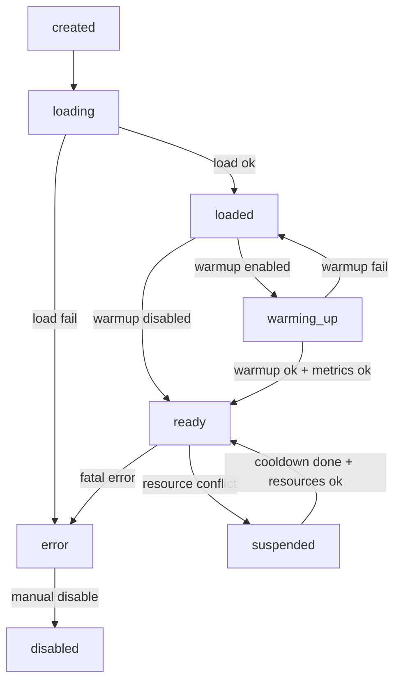

# VLM Operational Plan (Beta → Prod)

Dokumen ini mendefinisikan timeline penyelesaian pengembangan VLM, kriteria kelayakan (ready state), dan protokol operasional untuk transisi status di runtime.

## 1) Timeline Penyelesaian

### Phase A — Stabilization (1–2 hari)

Deliverables:
- State machine VLM (created/loading/loaded/warming_up/ready/suspended/error/disabled)
- Status telemetry minimal: `status`, `device`, `loaded`, `ready`, `last_error`
- Default `vlm.enabled: false` di `config.yaml`
- Event status realtime: `vlm_status_update`

Exit criteria:
- Import aplikasi tidak gagal walau dependency VLM tidak ada
- VLM disabled tidak menambah latensi pipeline webcam

### Phase B — Readiness & Monitoring (3–5 hari)

Deliverables:
- Warmup + validasi format (JSON schema minimal)
- Metric latency/throughput runtime dicatat di status
- Monitoring realtime via:
  - REST: `/api/environment` (field `vlm_status`)
  - WebSocket: `vlm_status_update`

Exit criteria:
- Transisi `loaded → ready` bisa terjadi saat aplikasi sedang berjalan, tanpa restart
- Ready status stabil minimal 30 menit (tidak flapping)

### Phase C — Resource Orchestration (4–7 hari)

Deliverables:
- Protokol resource allocation saat ready (cooldown inference, gating FPS, gating VRAM)
- Suspended mode saat konflik resource (GPU OOM / VRAM rendah / FPS drop)
- Fallback behavior yang deterministik

Exit criteria:
- Tidak ada crash saat VRAM turun atau inference error
- FPS tidak turun di bawah target saat VLM aktif (lihat ready criteria)

### Phase D — Quality & Acceptance (1–2 minggu)

Deliverables:
- Dataset evaluasi offline (gambar + label) untuk metrik “akurasi”
- Benchmark & profil memori (GPU/CPU)
- Regression test dan SOP release

Exit criteria:
- Lulus semua kriteria “Production Ready”

## 2) Definisi Ready State

Ready state dibagi menjadi 3 level: Functional Ready, Performance Ready, dan Production Ready.

### A. Functional Ready

Syarat:
- Model dan processor ter-load
- Warmup sukses (1 inference) dan output dapat diparse menjadi JSON
- JSON mengandung key wajib:
  - `cognitive_load`
  - `engagement_type`
  - `task_inference`
  - `intervention_needed`
  - `suggested_action`
  - `confidence`
  - `reasoning`

### B. Performance Ready

Metrik runtime minimal:
- Latensi inference warmup:
  - GPU: `p50 <= 3000ms`
  - CPU: `p50 <= 8000ms`
- Throughput:
  - GPU: `tokens/s >= 5`
  - CPU: `tokens/s >= 1`
- Stabilitas pipeline:
  - VLM berjalan hanya saat `fps >= min_fps_to_run`
  - VLM skip saat VRAM bebas < `min_free_vram_mb`

### C. Production Ready

Tambahan syarat:
- Akurasi offline (dataset internal):
  - “Task inference accuracy” >= target (mis. 0.70) pada top-1 label
  - “Intervention precision/recall” >= target (mis. F1 >= 0.60)
- Error budget:
  - `vlm_analysis` error rate < 1%/jam
  - Tidak ada crash/OOM fatal
- Observability:
  - Status + latency + error code terekam pada log dan dapat diekspor

## 3) Protokol Skenario: VLM Jadi Ready di Tengah Eksekusi

### 3.1 Mekanisme Deteksi Perubahan Status (loaded → ready)

Sumber deteksi:
- Callback status internal pada `LocalVLMService`
- Polling status periodik dari pipeline (max 1Hz)

Event yang dipublish:
- WebSocket: `vlm_status_update` dengan payload `vlm_status`
- `state_update` mengandung `state.vlm` (status ringkas)

### 3.2 Protokol Alokasi Resource Saat VLM Ready

Aturan:
- Setelah `ready`, set `analysis_cooldown_seconds` ke nilai konfigurasi
- Inference hanya berjalan jika:
  - `calibration_in_progress == false`
  - `fps >= min_fps_to_run`
  - `free_vram_mb >= min_free_vram_mb` (GPU)
- Maks 1 inference aktif (non-overlapping)

### 3.3 Skema Fallback Saat Konflik Resource

Trigger konflik:
- Error inference mengandung `out of memory` / `cuda` / `cublas`
- VRAM bebas di bawah batas
- FPS turun di bawah batas

Respons:
- Masuk status `suspended` selama `cooldown_on_skip_seconds` (atau 60s untuk OOM)
- Tidak menjalankan inference selama suspended
- UI tetap menampilkan last insights yang valid (jika ada) atau status “not available”

## 4) Sistem Monitoring Realtime

### 4.1 Status Telemetry (Minimal)

- `status`: created/loading/loaded/warming_up/ready/suspended/error/disabled
- `device`: cpu/cuda
- `loaded`, `ready`
- `metrics`: load_ms, warmup_ms, last_infer_ms, last_tokens_per_s, format_ok_rate
- `last_error`

### 4.2 Perubahan Status (Real-time)

- WebSocket: `vlm_status_update`
- REST: `/api/environment` mengembalikan `vlm_status`

## 5) Load Balancing: Loaded vs Ready

Interpretasi operasional:
- `loaded/warming_up`: model ada, tetapi belum diizinkan melayani inference produksi
- `ready`: inference boleh berjalan dengan gating resource (FPS/VRAM/cooldown)
- `suspended`: model tetap resident (untuk cepat resume), namun inference dihentikan sementara

## 6) Flowchart Transisi Status

## 7) SOP Edge Cases

### Edge Case: Status flapping (ready ↔ suspended)

Langkah:
1. Naikkan `analysis_cooldown_seconds`
2. Naikkan `min_free_vram_mb`
3. Turunkan frekuensi trigger request (mis. frame interval)

### Edge Case: OOM saat inference

Langkah:
1. Masuk `suspended` 60s
2. Jika terjadi 3x/10 menit: set `vlm.enabled=false` (operasional)
3. Kumpulkan log dan status payload untuk diagnosis

### Edge Case: Kalibrasi berjalan

Aturan:
- VLM tidak boleh inference saat `calibration_in_progress=true`

## 8) Logging & Reporting

### Logging minimal (per event)

- event: `vlm_status_change`, `vlm_infer_skip`, `vlm_infer_error`
- status payload ringkas: `status`, `device`, `ready`, `last_infer_ms`, `last_error`

### Reporting

- `/api/environment` digunakan untuk snapshot environment dan status VLM saat bug report

