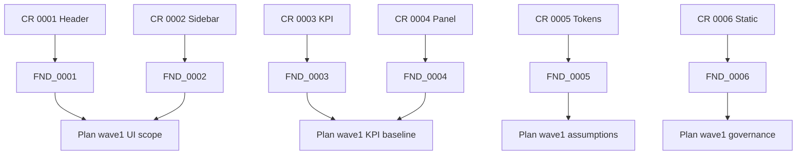

## Ringkasan Konteks Alignment

### Ringkasan Rencana Wave Pertama
- Rencana wave pertama menargetkan penyusunan artefak `00_index.md` s.d `75_acceptance_criteria.md` dengan fokus konsistensi requirement dan asumsi konservatif Q01–Q04 [`spec/05_planning_wave1.md`](spec/05_planning_wave1.md:18).
- Dashboards dan pipeline UI berada dalam lingkup `65_solution_architecture.md` dan `70_test_plan.md`, menuntut fidelitas UX untuk memenuhi FR_M01 serta NFR-03 [`spec/05_planning_wave1.md`](spec/05_planning_wave1.md:140).
- Profil asumsi menekankan penggunaan referensi ganda dan konsolidasi token resmi untuk mengurangi risiko rework UI [`spec/05_planning_wave1.md`](spec/05_planning_wave1.md:199).

### Ringkasan Temuan F3
- Audit F3 mencatat enam deviasi layout dan perilaku terhadap spesifikasi Figma, dengan fokus pada header, sidebar, kisi KPI, panel region, token warna, dan logika interaktif [`prototypes/figma-export/validation-log.md`](prototypes/figma-export/validation-log.md:31).
- Setiap deviasi berisiko menurunkan fidelitas <95% sehingga menahan laju validasi acceptance FR_M01 dan NFR-03 [`prototypes/figma-export/validation-log.md`](prototypes/figma-export/validation-log.md:24).

### Gap Prioritas
- Rencana alignment menuntut dashboard renderer konsisten terhadap layout statis, namun implementasi saat ini masih memuat modul interaktif yang mengubah komposisi header dan state UI (FND-0001, FND-0006).
- Konsolidasi token warna yang dijanjikan via pedoman asumsi belum diterapkan; terdapat kode RGBA manual yang memutus traceability ke `tokens.json` (FND-0005).
- Grid KPI dan panel region belum mengunci lebar konservatif sehingga target performa dan observabilitas per `70_test_plan.md` berpotensi gagal karena baseline visual tidak stabil (FND-0003, FND-0004).

## Paket Change Request

| CR-ID | Judul | Reason | Lintasan/Finding Terkait | Scope Impact | Risiko & Mitigasi | Deliverable Bukti | Owner | Prioritas |
| --- | --- | --- | --- | --- | --- | --- | --- | --- |
| CR-0001 | Normalisasi Header Dashboard | Header menampilkan modul tambahan dan padding >60px sehingga menyimpang dari komposisi Figma. | FND-0001; [`spec/05_planning_wave1.md`](spec/05_planning_wave1.md:140); [`prototypes/figma-export/validation-log.md`](prototypes/figma-export/validation-log.md:31) | Memengaruhi rencana dashboard renderer untuk FR_M01 di [`spec/05_planning_wave1.md`](spec/05_planning_wave1.md:143); perubahan pada `frontend/index.html` dan `frontend/styles-figma.css`. | Risiko regresi layout; mitigasi dengan overlay Dev Mode dan review silang sebelum merge. | #screenshot overlay 1440x900; #css-diff terverifikasi | Frontend Engineer | High |
| CR-0002 | Penyesuaian Sidebar Rail | Sidebar masih menampilkan label teks dan gap yang tidak sesuai sehingga mengganggu rasio ikon. | FND-0002; [`spec/05_planning_wave1.md`](spec/05_planning_wave1.md:140); [`prototypes/figma-export/validation-log.md`](prototypes/figma-export/validation-log.md:32) | Menjaga konsistensi komponen navigasi yang menopang use case dashboard di [`spec/05_planning_wave1.md`](spec/05_planning_wave1.md:193). | Risiko usability turun; mitigasi dengan audit hover state setelah penyetelan gap. | #screenshot overlay sidebar; #css-diff spacing | Frontend Engineer | Medium |
| CR-0003 | Penguncian Grid KPI | Grid KPI melebar melebihi baseline sehingga mengubah densitas informasi dan target wawasan. | FND-0003; [`spec/05_planning_wave1.md`](spec/05_planning_wave1.md:65); [`prototypes/figma-export/validation-log.md`](prototypes/figma-export/validation-log.md:33) | Penting untuk traceability KPI terhadap FR_P01/NFR-02 sebagaimana dijabarkan di [`spec/05_planning_wave1.md`](spec/05_planning_wave1.md:192). | Risiko overflow; mitigasi dengan fallback scroll horizontal dan pengujian p95 latensi. | #screenshot grid fix; #css-diff grid-template | Frontend Engineer | High |
| CR-0004 | Stabilisasi Panel Region | Panel region masih berbagi kolom fleksibel sehingga melepas spacing konservatif Figma. | FND-0004; [`spec/05_planning_wave1.md`](spec/05_planning_wave1.md:137); [`prototypes/figma-export/validation-log.md`](prototypes/figma-export/validation-log.md:34) | Menjaga konsistensi area insight dan log sesuai arsitektur wave pertama di [`spec/05_planning_wave1.md`](spec/05_planning_wave1.md:255). | Risiko overflow horizontal; mitigasi dengan uji lintas resolusi 1440×900 dan 1280×720. | #screenshot panel; #css-diff panel width | Frontend Engineer | Medium |
| CR-0005 | Konsolidasi Token Warna | Warna sekunder/tersier hard-coded RGBA memutus traceability terhadap `tokens.json`. | FND-0005; [`spec/05_planning_wave1.md`](spec/05_planning_wave1.md:199); [`prototypes/figma-export/validation-log.md`](prototypes/figma-export/validation-log.md:35) | Menopang strategi asumsi konservatif dan traceability non-fungsional di [`spec/05_planning_wave1.md`](spec/05_planning_wave1.md:121). | Risiko mismatch tema; mitigasi dengan CR token baru bila nilai belum tersedia. | #token-audit log; #css-diff token mapping | Design Systems + Frontend | High |
| CR-0006 | Mode Statis untuk Validasi Figma | `renderer-figma.js` masih menjalankan timer dan binding tombol sehingga menggangu validasi layout statis. | FND-0006; [`spec/05_planning_wave1.md`](spec/05_planning_wave1.md:191); [`prototypes/figma-export/validation-log.md`](prototypes/figma-export/validation-log.md:36) | Menjamin proses review wave pertama tetap pada jalur EXPLORATORY tanpa intervensi logika runtime. | Risiko fitur fokus terganggu; mitigasi dengan memisahkan flag mode figma vs production. | #feature-flag doc; #runtime-log bukti nonaktif | Frontend Engineer | High |

## Checklist Tugas Turunan per CR

### CR-0001 Normalisasi Header Dashboard
- [ ] Refaktor struktur header agar hanya memuat logo dan user cluster dengan padding 10px dan border 2px menyeluruh.
  - Mode: code
  - Dependensi: [`prototypes/figma-export/layout-spec.md`](prototypes/figma-export/layout-spec.md:17)
  - Bukti: #screenshot overlay 1440x900, #css-diff
- [ ] Verifikasi tinggi header 60px melalui Chrome DevTools Measurement dan arsipkan hasil di repo evidensi.
  - Mode: debug
  - Dependensi: Tugas sebelumnya
  - Bukti: #measurement-log, #screenshot

### CR-0002 Penyesuaian Sidebar Rail
- [ ] Terapkan konfigurasi ikon-only dengan padding (8px, 18px) dan gap vertikal 30px sesuai layout spec.
  - Mode: code
  - Dependensi: [`prototypes/figma-export/layout-spec.md`](prototypes/figma-export/layout-spec.md:23)
  - Bukti: #css-diff, #screenshot overlay
- [ ] Validasi aksesibilitas hover/focus setelah perubahan dan catat hasil.
  - Mode: debug
  - Dependensi: Tugas sebelumnya
  - Bukti: #accessibility-log, #screencast

### CR-0003 Penguncian Grid KPI
- [ ] Kunci `grid-template-columns` ke repeat(4, 315.75px) dengan gap 25px dan dokumentasikan fallback responsive.
  - Mode: code
  - Dependensi: [`prototypes/figma-export/layout-spec.md`](prototypes/figma-export/layout-spec.md:35)
  - Bukti: #css-diff, #screenshot overlay
- [ ] Jalankan uji regresi viewport 1440×900 dan 1280×720 untuk memastikan densitas informasi stabil.
  - Mode: debug
  - Dependensi: Tugas sebelumnya
  - Bukti: #test-log, #screenshot

### CR-0004 Stabilisasi Panel Region
- [ ] Terapkan lebar panel 435.33px dengan container scroll horizontal konservatif.
  - Mode: code
  - Dependensi: [`prototypes/figma-export/layout-spec.md`](prototypes/figma-export/layout-spec.md:45)
  - Bukti: #css-diff, #screenshot overlay
- [ ] Verifikasi jarak antar panel 16px melalui Chrome DevTools dan catat baseline.
  - Mode: debug
  - Dependensi: Tugas sebelumnya
  - Bukti: #measurement-log, #screenshot

### CR-0005 Konsolidasi Token Warna
- [ ] Audit seluruh penggunaan warna RGBA manual dan mapping-kan ke token resmi atau usulkan entri baru.
  - Mode: code
  - Dependensi: [`prototypes/figma-export/tokens.json`](prototypes/figma-export/tokens.json:1)
  - Bukti: #token-audit log, #css-diff
- [ ] Ajukan CR token baru bila diperlukan melalui kanal desain dan tunggu persetujuan sebelum implementasi.
  - Mode: ask
  - Dependensi: Hasil audit warna
  - Bukti: #decision-log, #approval-screenshot

### CR-0006 Mode Statis untuk Validasi Figma
- [ ] Pisahkan flag mode figma agar timer sesi dan binding tombol dinonaktifkan selama validasi parity.
  - Mode: code
  - Dependensi: [`frontend/renderer-figma.js`](frontend/renderer-figma.js:65)
  - Bukti: #feature-flag doc, #runtime-log
- [ ] Lakukan smoke test untuk memastikan interaksi fokus/report hanya aktif di mode non-figma.
  - Mode: debug
  - Dependensi: Tugas sebelumnya
  - Bukti: #test-log, #screencast

## Visual Mapping

## Catatan Pelaksanaan

- Paket ini tetap berada pada jalur EXPLORATORY — NOT PRODUCTION; promosi ke EVOLUTIONARY membutuhkan review SB.
- Setiap bukti wajib disimpan di direktori evidensi dengan penamaan `<CR-ID>_<artefak>.<ext>`.