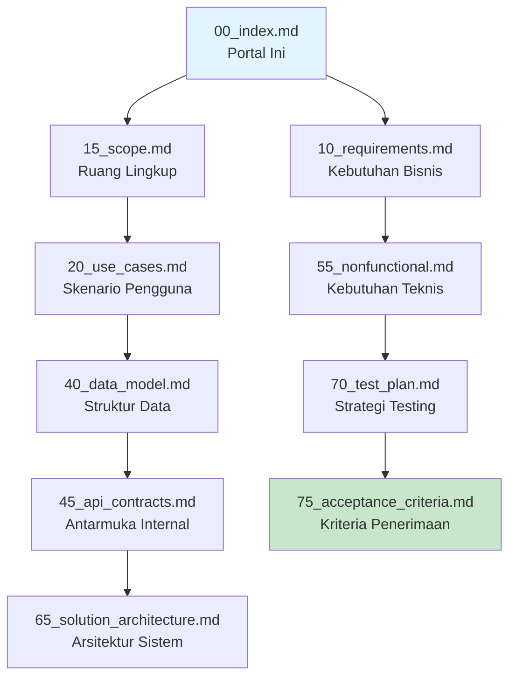

## 1. Ringkasan Proyek Eaglearn

Eaglearn adalah aplikasi pemantauan belajar berbasis kecerdasan buatan untuk mahasiswa mandiri yang beroperasi pada perangkat laptop Acer Nitro 5 AN515-58. Sistem ini memberikan ketajaman analitik seperti mata elang melalui pemantauan real-time terhadap keterlibatan visual, deteksi kelelahan dan stres, serta analisis pola produktivitas tanpa memerlukan koneksi internet eksternal.

**Wave Pertama (Versi 0.1.0)**: Fokus pada implementasi inti dengan pemrosesan offline penuh, dashboard desktop native, dan retensi data lokal maksimum 30 hari sesuai standar GDPR.

## 2. Tujuan Rilis Iteratif

| Iterasi | Fokus Utama | Status | Target Selesai |
|---------|-------------|--------|----------------|
| **Wave 1** | Core monitoring (gaze, stress, produktivitas) + dashboard native | In Progress | Q4 2025 |
| **Wave 2** | Advanced analytics + personalized interventions | Planned | Q1 2026 |
| **Wave 3** | Multi-device sync + cloud integration | Planned | Q2 2026 |

## 3. Daftar Artefak Spesifikasi Aktif

| Artefak | Versi | Status | Deskripsi Singkat | Pemilik |
|---------|-------|--------|------------------|---------|
| [`00_index.md`](spec/00_index.md) | 0.1.0 | Draft | Portal navigasi dan ringkasan proyek | System Designer |
| [`05_planning_wave1.md`](spec/05_planning_wave1.md) | 0.1.0 | Draft | Perencanaan detail wave pertama | System Designer |
| [`10_requirements.md`](spec/10_requirements.md) | 0.1.0 | Draft | Kebutuhan bisnis dan fungsional | System Designer |
| [`15_scope.md`](spec/15_scope.md) | 0.1.0 | Draft | Definisi ruang lingkup produk | System Designer |
| [`20_use_cases.md`](spec/20_use_cases.md) | 0.1.0 | Draft | Skenario pengguna dan alur | System Designer |
| [`40_data_model.md`](spec/40_data_model.md) | 0.1.0 | Draft | Struktur data dan skema | System Designer |
| [`45_api_contracts.md`](spec/45_api_contracts.md) | 0.1.0 | Draft | Kontrak antarmuka internal | System Designer |
| [`55_nonfunctional.md`](spec/55_nonfunctional.md) | 0.1.0 | Draft | Kebutuhan non-fungsional detail | System Designer |
| [`65_solution_architecture.md`](spec/65_solution_architecture.md) | 0.1.0 | Draft | Desain arsitektur sistem | System Designer |
| [`70_test_plan.md`](spec/70_test_plan.md) | 0.1.0 | Draft | Strategi dan kasus pengujian | System Designer |
| [`75_acceptance_criteria.md`](spec/75_acceptance_criteria.md) | 0.1.0 | Draft | Kriteria penerimaan | System Designer |

## 4. Status Kebutuhan Utama

### 4.1 Sasaran Bisnis (SB-01 hingga SB-04)

| ID | Deskripsi | Status | Artefak Terkait |
|----|-----------|--------|-----------------|
| **SB-01** | Keterlibatan visual tinggi selama belajar mandiri | Defined | [`20_use_cases.md`](spec/20_use_cases.md), [`70_test_plan.md`](spec/70_test_plan.md) |
| **SB-02** | Deteksi dini kelelahan dan stres | Defined | [`45_api_contracts.md`](spec/45_api_contracts.md), [`65_solution_architecture.md`](spec/65_solution_architecture.md) |
| **SB-03** | Metrik produktivitas akurat | Defined | [`40_data_model.md`](spec/40_data_model.md), [`75_acceptance_criteria.md`](spec/75_acceptance_criteria.md) |
| **SB-04** | Pengalaman dual-mode responsif | Defined | [`55_nonfunctional.md`](spec/55_nonfunctional.md), [`70_test_plan.md`](spec/70_test_plan.md) |

### 4.2 Fitur Utama (FR-E01 hingga FR-M02)

| Kategori | Fitur | Status | Prioritas |
|----------|-------|--------|-----------|
| **Engagement (FR-E)** | Gaze estimation, Head pose, Gesture detection | Specified | Must/Should |
| **Stress (FR-S)** | Audio stress analysis, Micro-expression, Fatigue scoring | Specified | Must |
| **Produktivitas (FR-P)** | On-task tracking, Break pattern identification | Specified | Must/Should |
| **Monitoring (FR-M)** | Dashboard native, Data retention | Specified | Must |

### 4.3 Kebutuhan Non-Fungsional (NFR-01 hingga NFR-08)

| Kategori | Kebutuhan | Status | Prioritas |
|----------|-----------|--------|-----------|
| **Performa** | Offline processing, Latensi <200ms | Defined | Must |
| **Keamanan** | AES-256 encryption, GDPR compliance | Defined | Must |
| **Aksesibilitas** | High contrast mode, WCAG 2.1 AA | Defined | Should |
| **Platform** | Windows 11 & Ubuntu 22.04 LTS | Defined | Must |

## 5. Asumsi dan Dependensi Terbuka

### 5.1 Pertanyaan Kritis (Q01-Q04)

| ID | Pertanyaan | Status | Dampak | Resolusi |
|----|------------|--------|---------|----------|
| **Q01** | Parameter kalibrasi detail gaze, posture, gesture | **Resolved** | Baseline model accuracy | Menggunakan parameter konservatif dari [`science-source/17_Webcam_Gaze_Estimation_Computer_Screen.pdf`](science-source/17_Webcam_Gaze_Estimation_Computer_Screen.pdf) dan [`science-source/19_Deep_Learning_Micro_Expression_Survey.pdf`](science-source/19_Deep_Learning_Micro_Expression_Survey.pdf) |
| **Q02** | Ambang intervensi dashboard real-time | **Resolved** | User experience | Implementasi non-intrusive dengan indikator visual gradual |
| **Q03** | Preferensi gaya visual UI | **Resolved** | Accessibility compliance | Tema netral dengan dukungan high contrast dan WCAG 2.1 AA |
| **Q04** | Kebijakan retensi pasca 30 hari | **Resolved** | Data governance | Purge total otomatis dengan mekanisme emergency export |

### 5.2 Asumsi Konservatif

**Hardware Baseline:**
- Acer Nitro 5 AN515-58 sebagai perangkat referensi
- Kamera 720p@30fps sebagai input utama
- Mikrofon internal untuk analisis audio
- Penyimpanan lokal minimum 50 GB

**Model Baseline:**
- Gaze estimation: MAE ≤10° (konservatif dari 6.95° yang dilaporkan)
- Stress detection: Sensitivity ≥80% untuk micro-expression utama
- Fatigue scoring: Update interval 30-60 detik

**Performance Baseline:**
- End-to-end latency ≤200ms untuk processing 720p
- Dashboard refresh rate ≥30 FPS
- Resource usage: GPU <60%, CPU <70%

## 6. Navigasi Spesifikasi

## 7. Traceability Matrix Wave Pertama

| Requirement | 15_Scope | 20_Use_Cases | 40_Data_Model | 45_API_Contracts | 55_Nonfunctional | 65_Architecture | 70_Test_Plan | 75_Acceptance |
|-------------|----------|--------------|---------------|------------------|------------------|----------------|--------------|---------------|
| **SB-01** | ✅ | ✅ | ➖ | ➖ | ➖ | ➖ | ✅ | ➖ |
| **SB-02** | ✅ | ✅ | ✅ | ✅ | ✅ | ✅ | ✅ | ✅ |
| **SB-03** | ✅ | ✅ | ✅ | ➖ | ✅ | ➖ | ✅ | ✅ |
| **SB-04** | ✅ | ✅ | ➖ | ➖ | ✅ | ✅ | ✅ | ➖ |
| **FR-E01** | ✅ | ✅ | ✅ | ✅ | ➖ | ✅ | ✅ | ✅ |
| **FR-S01** | ✅ | ✅ | ✅ | ✅ | ➖ | ✅ | ✅ | ✅ |
| **FR-P01** | ✅ | ✅ | ✅ | ➖ | ➖ | ➖ | ✅ | ✅ |
| **FR-M01** | ✅ | ✅ | ➖ | ➖ | ✅ | ✅ | ✅ | ✅ |
| **NFR-02** | ➖ | ➖ | ➖ | ➖ | ✅ | ➖ | ✅ | ✅ |
| **NFR-04** | ➖ | ➖ | ✅ | ➖ | ✅ | ➖ | ➖ | ✅ |

Legenda: ✅ = Coverage penuh, ➖ = Tidak berlaku, 🔶 = Coverage sebagian

## 8. Referensi Teknis

**Riset Foundation:**
- [`science-source/17_Webcam_Gaze_Estimation_Computer_Screen.pdf`](science-source/17_Webcam_Gaze_Estimation_Computer_Screen.pdf) - Baseline gaze estimation (MAE 6.95°)
- [`science-source/18_Contact_Free_Cognitive_Stress_Measurement.pdf`](science-source/18_Contact_Free_Cognitive_Stress_Measurement.pdf) - Remote stress measurement via PPG
- [`science-source/19_Deep_Learning_Micro_Expression_Survey.pdf`](science-source/19_Deep_Learning_Micro_Expression_Survey.pdf) - Micro-expression recognition techniques

**Standar Compliance:**
- GDPR Article 5, 6, 7, 32 - Data protection and security
- WCAG 2.1 AA - Web accessibility guidelines
- ISO/IEC 25010 - Software quality standards

## 9. Catatan untuk System Builder

**Prioritas Implementasi:**
1. **Phase 1**: Core sensor pipeline (gaze + audio) dengan baseline model
2. **Phase 2**: Real-time dashboard dengan indikator non-intrusive
3. **Phase 3**: Data retention dan housekeeping mechanism

**Kontrak Utama:**
- Semua artefak wave pertama menggunakan asumsi konservatif
- Model baseline menggunakan parameter dari dua sumber riset minimum
- Setiap komponen harus memiliki mekanisme fallback untuk error handling

**Validation Checkpoint:**
Sebelum handoff ke implementasi, pastikan:
- ✅ Semua requirement memiliki test case yang dapat diverifikasi
- ✅ Arsitektur mendukung offline-first operation
- ✅ Data model kompatibel dengan retensi 30 hari
- ✅ API contracts memiliki error handling yang jelas