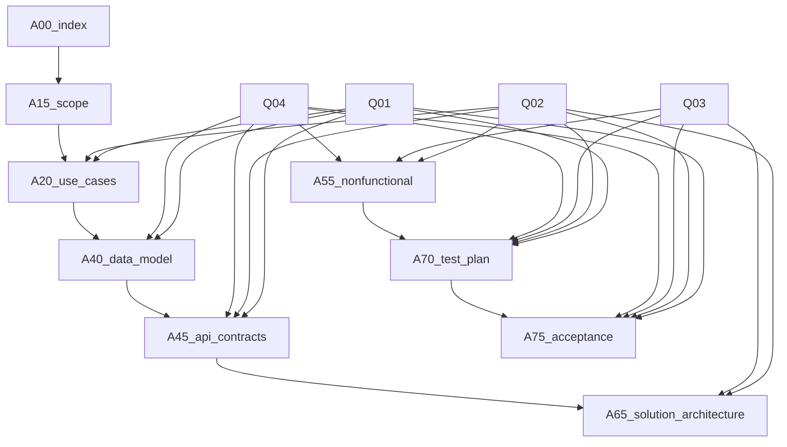

## 1. Kondisi Spesifikasi Terkini

| Artefak | Status | Cakupan Aktual | Gap terhadap Wave 1 |
| --- | --- | --- | --- |
| [`spec/10_requirements.md`](spec/10_requirements.md) | Draft 0.1.0 | Menetapkan sasaran bisnis SB-01 s.d SB-04, kebutuhan fungsional FR\_E01–FR\_M02, non-fungsional NFR-01–NFR-08, asumsi hardware dan referensi riset. | Belum ada pemetaan eksplisit ke struktur tiap artefak wave pertama; belum mengikat dependensi Q01–Q04; belum memetakan prioritas penulisan per artefak. |
| [`spec/inbox.md`](spec/inbox.md) | Draft 0.1.0 | Mendokumentasikan empat pertanyaan terbuka (Q01–Q04) kepada PO dengan SLA. | Belum ada rencana integrasi jawaban ke artefak wave pertama; belum ada pendekatan asumsi konservatif untuk menahan gap informasi. |

## 2. Isi Minimum Viable Artefak Wave Pertama (Strategi Opsi C)

### 2.1 `00_index.md`

- **Tujuan**: Menjadi portal navigasi resmi paket spesifikasi, menegaskan status rilis iteratif dan daftar artefak yang termasuk wave pertama.
- **Outline Target**:
  1. Ringkasan proyek dan tujuan rilis iteratif.
  2. Daftar artefak aktif dengan versi, status, dan tautan.
  3. Matriks status kebutuhan utama (SB, FR, NFR).
  4. Catatan asumsi dan dependensi terbuka (flag Q01–Q04).
- **Konten Minimum Viable**:

| Bagian | Deskripsi | Sumber/Sinkronisasi |
| --- | --- | --- |
| Kover rilis | Menyebutkan scope wave pertama, opsi konservatif, perangkat target. | SB-01–SB-04, NFR-01 |
| Tabel artefak | Menampilkan 00, 05, 10, 15, 20, 40, 45, 55, 65, 70, 75. | Struktur spesifikasi dan rencana ini |
| Status requirement | Ringkasan FR\_E01–FR\_M02 dan NFR terkait. | [`spec/10_requirements.md`](spec/10_requirements.md) |
| Flag pertanyaan | Menandai Q01–Q04 dengan status dan dampak. | [`spec/inbox.md`](spec/inbox.md) |

- **Dependensi & Catatan**: Perlu jawaban Q01 untuk menyebut referensi kalibrasi; sementara gunakan asumsi konservatif dengan dua referensi riset.

### 2.2 `15_scope.md`

- **Tujuan**: Mendefinisikan ruang lingkup produk wave pertama secara eksplisit (apa masuk, apa tidak).
- **Outline Target**:
  1. Konteks produk dan batasan platform.
  2. Ruang lingkup fungsional (per requirement).
  3. Ruang lingkup non-fungsional (per NFR).
  4. Out-of-scope dan trigger akses.
- **Konten Minimum Viable**:

| Elemen | Deskripsi | Requirement Terkait |
| --- | --- | --- |
| Ringkasan platform | Laptop Acer Nitro 5 AN515-58, offline processing. | Sasaran SB-01, NFR-01 |
| In-scope feature | Gaze estimation, stress detection, produktivitas, dashboard. | FR\_E01–FR\_M02 |
| Non-functional scope | Latensi, enkripsi, konsumsi resource, aksesibilitas. | NFR-01–NFR-08 |
| Out-of-scope | Integrasi cloud, dukungan multi-perangkat, penjadwalan lintas pengguna. | Asumsi hardware, NFR-01 |

- **Dependensi & Catatan**: Q04 memengaruhi keputusan retensi di luar 30 hari; tandai sebagai constraint sementara.

### 2.3 `20_use_cases.md`

- **Tujuan**: Memformalkan skenario pengguna utama dengan alur, prasyarat, dan hasil.
- **Outline Target**:
  1. Daftar aktor.
  2. Use case utama (Belajar campuran, Belajar digital penuh, Monitoring fatique).
  3. Diagram alir atau tabel langkah per use case.
  4. Syarat keberhasilan dan variasi (alternate flow).
- **Konten Minimum Viable**:

| Use Case | Deskripsi | FR/NFR Pendukung | Dependensi Q |
| --- | --- | --- | --- |
| UC-01 Belajar campuran | Tracking gaze saat catatan fisik. | FR\_E01, FR\_E02, NFR-03 | Q01 (kalibrasi sudut) |
| UC-02 Belajar digital penuh | KPI real-time ≤2 detik. | FR\_M01, NFR-02 | Q02 (intervensi dashboard) |
| UC-03 Deteksi kelelahan | Kombinasi audio-video, retensi data 30 hari. | FR\_S01–FR\_S03, FR\_M02, NFR-04, NFR-08 | Q04 (kebijakan lanjutan) |

- **Dependensi & Catatan**: Perlu asumsi konservatif untuk parameter Q01 sampai data tersedia.

### 2.4 `40_data_model.md`

- **Tujuan**: Menentukan skema data KPI, log, dan metadata retensi.
- **Outline Target**:
  1. Entitas dan relasi (KPI session, frame-level data, audio stress index).
  2. Definisi atribut dengan tipe, satuan, sumber sensor.
  3. Retensi dan enkripsi field.
  4. Data flow ringkas.
- **Konten Minimum Viable**:

| Entitas | Atribut Kunci | Requirement | Sumber |
| --- | --- | --- | --- |
| SessionLog | session\_id, start\_time, end\_time, on\_task\_ratio | FR\_P01, NFR-08 | Modul produktivitas |
| FrameMetrics | frame\_timestamp, gaze\_direction, head\_pose | FR\_E01, FR\_E02 | Kamera 720p |
| AudioStress | window\_start, stress\_score, smoothing\_flag | FR\_S01, FR\_S03 | Mikrofon internal |
| RetentionPolicy | retention\_days, purge\_method | FR\_M02, NFR-08 | Housekeeping |

- **Dependensi & Catatan**: Q01 menentukan parameter kalibrasi, Q04 menentukan action setelah 30 hari; gunakan asumsi konservatif (retensi berhenti di purge total).

### 2.5 `45_api_contracts.md`

- **Tujuan**: Menyediakan kontrak antarmuka internal (pipeline sensor → inference → dashboard).
- **Outline Target**:
  1. Ringkasan modul dan interface (video pipeline, audio pipeline, KPI aggregator, dashboard service).
  2. Spesifikasi request/response (JSON/IPC) per endpoint.
  3. Error handling dan latensi yang diharapkan.
  4. Security dan enkripsi channel lokal.
- **Konten Minimum Viable**:

| Interface | Direction | Payload Inti | Requirement | Dependensi Q |
| --- | --- | --- | --- | --- |
| `/v1/gaze/predict` | Camera → Gaze Engine | frame\_id, gaze\_vector, confidence | FR\_E01 | Q01 |
| `/v1/stress/score` | Audio Analyzer → Dashboard | window\_id, stress\_score, trend | FR\_S01, FR\_S03 | Q02 |
| `/v1/session/summary` | KPI Aggregator → Dashboard | session\_stats, break\_pattern | FR\_P01, FR\_P02 | Q02 |
| `/v1/retention/housekeeping` | Scheduler → Storage | retention\_days, purge\_result | FR\_M02, NFR-08 | Q04 |

- **Dependensi & Catatan**: Asumsi konservatif mensyaratkan definisi parameter default berbasis dua referensi riset di `science-source/17_Webcam_Gaze_Estimation_Computer_Screen.pdf` dan `science-source/18_Contact_Free_Cognitive_Stress_Measurement.pdf`.

### 2.6 `55_nonfunctional.md`

- **Tujuan**: Menguraikan target performa, keamanan, aksesibilitas, dan konsumsi resource secara detail.
- **Outline Target**:
  1. Matriks KPI non-fungsional (kategori: performa, keamanan, aksesibilitas, platform).
  2. Metode verifikasi dan alat ukur.
  3. Risiko dan mitigasi konservatif.
- **Konten Minimum Viable**:

| Kategori | Requirement | Target | Verifikasi | Catatan Risiko |
| --- | --- | --- | --- | --- |
| Performa | NFR-02 | Latensi p95 ≤200 ms | Profiling 1000 frame | Tergantung konfigurasi GPU (asumsi referensi vendor) |
| Keamanan | NFR-04 | AES-256, kunci lokal | Audit file system | Q04 dapat menambah export lokal |
| Aksesibilitas | NFR-06 | Mode kontras tinggi | Checklist WCAG 2.1 AA | Q03 memengaruhi palet dan tipografi |
| Resource | NFR-07 | GPU<60%, CPU<70% | Monitoring p95 60 menit | Butuh baseline hardware Acer Nitro |

### 2.7 `65_solution_architecture.md`

- **Tujuan**: Menjelaskan arsitektur logis dan fisik wave pertama.
- **Outline Target**:
  1. Diagram komponen (sensor input, ML inference, aggregator, UI).
  2. Deployment topology (on-device modules, IPC).
  3. Data flow dan pengendalian offline.
  4. Observability hooks.
- **Konten Minimum Viable**:

| Komponen | Peran | Requirement | Dependensi Q |
| --- | --- | --- | --- |
| Sensor Capture Service | Menangkap video/audio 720p | FR\_E01, FR\_S01 | Q01 |
| Inference Engine | Gaze, stress, fatigue scoring | FR\_E01–FR\_S03 | Q01 |
| KPI Aggregator | Menggabungkan skor, smoothing | FR\_P01, FR\_S03 | Q02 |
| Dashboard Renderer | UI responsif offline | FR\_M01, NFR-03 | Q02, Q03 |
| Retention Daemon | Housekeeping 30 hari | FR\_M02, NFR-08 | Q04 |

- **Dependensi & Catatan**: Asumsi konservatif mengunci modul inference untuk baseline model open-source (dari `science-source/26_AHMSA_Net_Micro_Expression_Recognition.pdf`) sampai PO menentukan parameter kustom.

### 2.8 `70_test_plan.md`

- **Tujuan**: Mendefinisikan strategi pengujian wave pertama.
- **Outline Target**:
  1. Strategi test (unit, integrasi pipeline, sistem, non-fungsional).
  2. Matriks traceability FR/NFR → test case.
  3. Jadwal eksekusi dan alat.
  4. Exit criteria.
- **Konten Minimum Viable**:

| Domain | Fokus | Test Case Awal | Requirement | Dependensi Q |
| --- | --- | --- | --- | --- |
| Computer Vision | Akurasi gaze, head pose | CV-TC-01 (gaze accuracy), CV-TC-02 (pose MAE) | FR\_E01, FR\_E02 | Q01 |
| Audio | Stress index latency | AU-TC-01 (30 detik update) | FR\_S01 | Q01 |
| Dashboard | Refresh rate, intervensi | UI-TC-01 (≤2 detik refresh), UI-TC-02 (alert non-intrusive) | FR\_M01, NFR-03 | Q02, Q03 |
| Retensi | Purge otomatis 30 hari | OPS-TC-01 (purge success) | NFR-08 | Q04 |

- **Dependensi & Catatan**: Asumsi konservatif menuntut dua sumber referensi metrik (mis. literatur internal + benchmark open dataset) sebelum test case disahkan.

### 2.9 `75_acceptance_criteria.md`

- **Tujuan**: Mengikat definisi “done” wave pertama terhadap requirement.
- **Outline Target**:
  1. Tabel acceptance per requirement.
  2. Kondisi validasi (test, demo, audit).
  3. Variabel blocking (bias, compliance).
- **Konten Minimum Viable**:

| Requirement | Acceptance Criteria | Metode Validasi | Dependensi Q |
| --- | --- | --- | --- |
| FR\_E01 | Akurasi gaze ≥85% dalam 200-500 lux | Hasil CV-TC-01 | Q01 |
| FR\_S03 | Skor fatigue stabil (varian antar menit <15) | Log smoothing audit | Q01, Q02 |
| FR\_M01 | KPI diperbarui ≤2 detik, UI tidak mengganggu | UI-TC-01, review desain | Q02, Q03 |
| FR\_M02 | Log terenkripsi, purge otomatis >30 hari | OPS-TC-01, audit keamanan | Q04 |
| NFR-02 | Latensi p95 ≤200 ms | Profiling p95 | Q01 |
| NFR-04 | AES-256, pseudonimisasi | Audit file + config | Q04 |

- **Dependensi & Catatan**: Konsisten dengan profil asumsi konservatif, kriteria hanya dianggap final setelah dua sumber bukti tertulis mendukung metode validasi.

## 3. Rencana Produksi Artefak Wave Pertama

| Langkah | Deskripsi Aktivitas | Output | Dependensi (Arsip/PO) | Integrasi Q01–Q04 | Definisi Selesai |
| --- | --- | --- | --- | --- | --- |
| 1 | Konsolidasi referensi teknis (kalibrasi gaze, stress, UI) dan menyusun matriks bukti konservatif. | Matriks referensi (gaze, stress, UI, retensi) + daftar sumber ganda. | `science-source/` repositori riset | Mengumpulkan kandidat jawaban Q01, Q02, Q04 dari literatur | Matriks disetujui SD, catatan asumsi awal terdokumentasi. |
| 2 | Draft `00_index.md` dan `15_scope.md` memanfaatkan matriks referensi. | Outline lengkap dua artefak dengan status requirement dan scope. | Langkah 1 | Menandai flag Q01–Q04 pada bagian asumsi | Artefak siap review (versi 0.1.0) dengan catatan asumsi. |
| 3 | Elaborasi use case, data model, dan API contracts (`20_use_cases.md`, `40_data_model.md`, `45_api_contracts.md`). | Draft detail (diagram, tabel payload, mapping FR/NFR). | Langkah 2 | Q01 memberi batas kalibrasi, Q02-Q04 sebagai placeholder konservatif | Draft diverifikasi konsistensi dengan requirement ID. |
| 4 | Definisikan arsitektur, non-fungsional, dan test plan (`55_nonfunctional.md`, `65_solution_architecture.md`, `70_test_plan.md`). | Dokumen teknis dengan metrik, diagram, daftar test case | Langkah 3 | Q01 mempengaruhi profil performa; Q02/Q03 UI; Q04 retensi | Checklist non-fungsional sinkron dengan test plan. |
| 5 | Susun `75_acceptance_criteria.md` dan finalisasi `05_planning_wave1.md` + review silang. | Acceptance matrix, plan ini final | Langkah 4 | Memutakhirkan status Q01–Q04 sebagai asumsi flagged | Review stakeholder, siap hand-off ke SB. |

## 4. Pedoman Asumsi Terarah (Profil Konservatif)

1. **Kriteria Penetapan Asumsi**: Hanya dibuat bila terdapat minimal dua referensi kuat (mis. publikasi `science-source/` dan standard industri) yang menyatakan parameter serupa; jika tidak, tandai sebagai “Ditunda”.
2. **Format Dokumentasi**: Setiap artefak wave pertama wajib menyertakan tabel “Asumsi Konservatif” berisi kolom (ID Asumsi, Deskripsi, Sumber 1, Sumber 2, Risiko jika Salah, Rencana Validasi). Template disimpan di lampiran `05_planning_wave1.md`.
3. **Bukti Referensi**: Prioritaskan dokumen berikut:
   - Gaze & posture: `science-source/17_Webcam_Gaze_Estimation_Computer_Screen.pdf`, `science-source/19_Deep_Learning_Micro_Expression_Survey.pdf`.
   - Stress & fatigue: `science-source/18_Contact_Free_Cognitive_Stress_Measurement.pdf`, `science-source/27_Multimodal_Emotion_Recognition_Physiological.pdf`.
   - Produktivitas & jeda: `science-source/25_Real_Time_Emotional_Recognition_Pilot.pdf`, `science-source/Investigating the Effectiveness of Self-Regulated, Pomodoro, and Flowtime Break-Taking Techniques Among Students.pdf`.
4. **Proses Validasi**:
   - **Pra-Jawaban PO**: Asumsi ditandai “Pending Confirmation” dengan SLA sesuai `spec/inbox.md`.
   - **Pasca-Jawaban PO**: Update catatan asumsi, lampirkan bukti diskusi, lakukan impact assessment terhadap artefak terpengaruh.
   - **Review Berkala**: Setiap akhir iterasi wave pertama, lakukan audit asumsi untuk memastikan tidak ada yang menjadi “stale”.
5. **Mitigasi Risiko**:
   - Jika tidak ada referensi kedua, escalate sebagai blocker ke PO (membentuk CR atau update inbox).
   - Terapkan fallback parameter default paling konservatif (misal ambang intervensi stress lebih tinggi untuk menghindari false positive) sampai validasi diterima.

## 5. Kebutuhan Lanjutan (Wave Berikutnya)

| Artefak (Gelombang Berikut) | Tujuan | Trigger Penyusunan | Catatan |
| --- | --- | --- | --- |
| `25_personas.md` | Mendalami profil pengguna, variasi perilaku belajar. | Setelah jawaban Q03 memberikan preferensi UI. | Membantu penyetelan aksesibilitas dan personalisasi. |
| `30_journey_map.md` | Memetakan perjalanan belajar end-to-end, termasuk interaksi offline. | Setelah wave pertama Artefak use case stabil. | Memperlihatkan titik integrasi fitur lanjutan (notifikasi, feedback adaptif). |
| `50_security.md` | Rincian kontrol keamanan, enkripsi, audit trail. | Setelah kebijakan retensi Q04 final. | Menajamkan compliance GDPR dan SOP. |
| `60_architecture_decisions.md` | Mencatat ADR penting (model ke ML engine, pipeline). | Ketika SB mengusulkan opsi teknis spesifik. | Pastikan traceability dengan `65_solution_architecture.md`. |
| `80_release_plan.md` | Roadmap rilis bertahap, milestone pengujian. | Setelah test plan wave pertama disepakati. | Sinkronisasi dengan SB pipeline CI/CD. |
| `95_traceability_matrix.md` | Matriks requirement ↔ artefak ↔ test ↔ acceptance. | Ketika semua artefak wave pertama mencapai draft. | Menjadi referensi wajib sebelum handoff SB. |
| `98_changelog.md` | Catatan perubahan versi artefak. | Begitu ada revisi pasca review wave pertama. | Dijaga konsisten dengan `00_index.md`. |

## 6. Visualisasi Dependensi

Legenda: `Axx_*` merujuk ke artefak wave pertama. Panah menunjukkan dependensi informasi.

## 7. Ask Burst (Inquiry-First Log)

| ID Pertanyaan | Pertanyaan ke PO/Stakeholder | Alasan Strategis |
| --- | --- | --- |
| AB-01 | Apakah PO menyetujui penggunaan parameter kalibrasi dari referensi `science-source/17_Webcam_Gaze_Estimation_Computer_Screen.pdf` dan `science-source/19_Deep_Learning_Micro_Expression_Survey.pdf` sebagai baseline sementara (dua sumber) untuk FR\_E01 dan FR\_S02? | Menegaskan legitimasi asumsi konservatif dan mengurangi risiko revisi besar pada artefak teknis. |
| AB-02 | Dapatkah PO menentukan preferensi warna dan tingkat intrusif intervensi dashboard (mis. perubahan warna vs pop-up) sebelum drafting final `45_api_contracts.md` dan `65_solution_architecture.md`? | Jawaban akan mengunci Q02 dan menghindari rework di UI pipeline serta test plan. |
| AB-03 | Untuk retensi pasca 30 hari, apakah PO cenderung memilih purge total atau export audit lokal terenkripsi? | Memastikan `40_data_model.md`, `55_nonfunctional.md`, dan `75_acceptance_criteria.md` memuat kebijakan compliance yang benar sejak draft pertama. |

_Status: menunggu respons PO; asumsi konservatif berlaku sampai jawaban diterima._
