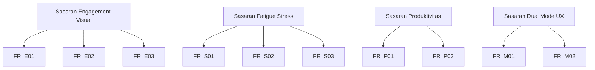

## 1. Ringkasan Eksekutif
Eaglearn adalah aplikasi pemantauan belajar on-device untuk mahasiswa mandiri yang mengutamakan ketajaman analitik seperti mata elang. Rilis perdana harus memantau keterlibatan visual, deteksi kelelahan dan stres, serta pola produktivitas tanpa koneksi jaringan luar. Seluruh pemrosesan (video, audio, metadata) berlangsung di laptop Acer Nitro 5 AN515-58 dengan retensi data lokal maksimum 30 hari dan anonimisasi sesuai GDPR.

## 2. Sasaran Bisnis dan Pedagogis
| ID | Sasaran | Indikator Keberhasilan | Prioritas |
| --- | --- | --- | --- |
| SB-01 | Memastikan keterlibatan visual mahasiswa tetap tinggi selama sesi belajar mandiri. | Pada uji 10 sesi, ≥80% frame mencatat tatapan on-screen atau postur tegak selama ≥70% durasi sesi. | Must |
| SB-02 | Menyediakan deteksi dini terhadap kelelahan dan stres untuk mencegah penurunan performa belajar. | Sistem memunculkan skor fatique/stress ≤60 detik setelah indikator multimodal melewati ambang tinggi. | Must |
| SB-03 | Menghadirkan metrik produktivitas dan pola belajar yang akurat. | Selisih pencatatan on-task vs break ≤5% dibanding penanda manual pada 5 sesi uji. | Must |
| SB-04 | Mendukung pengalaman dual-mode melalui dashboard desktop native yang responsif. | Dashboard menampilkan ringkasan KPI lengkap ≤5 detik setelah aplikasi dijalankan. | Must |

## 3. Ruang Lingkup Pengguna dan Skenario
| Skenario | Deskripsi | Acceptance Criteria |
| --- | --- | --- |
| Belajar campuran (laptop + catatan fisik) | Mahasiswa membaca materi digital sambil menulis catatan manual. | Sistem tetap melacak tatapan ketika pengguna menunduk ke catatan hingga 30° sambil mempertahankan akurasi gaze ≥75%. |
| Belajar digital penuh | Mahasiswa menggunakan konten digital (PDF, video, platform belajar) di laptop. | Dashboard real-time menyajikan KPI engagement, stress, dan produktivitas dengan pembaruan ≤2 detik dan tanpa gangguan jaringan. |

## 4. Kebutuhan Fungsional
| ID | Deskripsi Terukur | Metrik Verifikasi | Prioritas |
| --- | --- | --- | --- |
| FR_E01 | Sistem mengestimasi arah tatapan (left, center, right, off-screen) dari webcam 720p minimal 15 fps dengan akurasi ≥85% pada pencahayaan 200-500 lux. | Pengujian 10 menit/mahasiswa; confusion matrix menunjukkan akurasi ≥85%. | Must |
| FR_E02 | Sistem mengidentifikasi postur kepala (tegak, menunduk, miring) dengan kesalahan sudut ≤10° dan update ≥10 fps. | Pengukuran menggunakan sensor referensi; MAE ≤10°. | Must |
| FR_E03 | Sistem mendeteksi gesture tubuh bagian atas (mengangkat tangan, menopang dagu, membungkuk) dengan recall ≥0.8. | Evaluasi 100 cuplikan berlabel; recall ≥0.8. | Should |
| FR_S01 | Sistem menganalisis audio mikrofon internal untuk indeks stress vokal dan memperbarui nilai setiap 30 detik. | Simulasi 5 sampel stress; estimasi indeks muncul ≤30 detik. | Must |
| FR_S02 | Sistem mengenali micro-expression kelelahan utama (kedipan cepat, mata menyipit, bibir tertekan) dengan akurasi ≥80%. | Uji dataset internal 300 klip; akurasi ≥80%. | Must |
| FR_S03 | Sistem menggabungkan sinyal audio dan video menjadi skor fatigue 0-100 dengan smoothing <60 detik. | Inspeksi log; skor diperbarui per menit dan stabil (varian antar menit <15). | Must |
| FR_P01 | Sistem mencatat durasi on-task vs break dengan kesalahan ≤5% dibanding penanda manual. | Validasi 5 sesi x 45 menit; deviasi ≤5%. | Must |
| FR_P02 | Sistem mengidentifikasi pola jeda (Pomodoro, flowtime) dan memberikan ringkasannya per sesi. | Laporan otomatis menampilkan total break, rata-rata durasi, tipe pola. | Should |
| FR_M01 | Dashboard desktop native menampilkan KPI utama (engagement visual, fatigue, produktivitas) dengan refresh ≤2 detik dan indikator status jelas. | Uji stopwatch: perubahan data → dashboard diperbarui ≤2 detik pada 95% kejadian. | Must |
| FR_M02 | Sistem menyimpan log sesi (metadata, skor KPI) secara terenkripsi on-device dan menghapus otomatis setelah 30 hari. | Uji retensi selama 31 hari; log >30 hari tidak tersedia tanpa eskalasi. | Must |

## 5. Kebutuhan Non-Fungsional
| ID | Deskripsi | Kriteria Verifikasi | Prioritas |
| --- | --- | --- | --- |
| NFR-01 | Seluruh pemrosesan berjalan offline; aplikasi menolak koneksi outbound kecuali update manual yang disetujui. | Audit firewall menunjukkan tidak ada request outbound selama 8 jam operasi. | Must |
| NFR-02 | Latensi inferensi end-to-end per frame ≤200 ms untuk input 720p. | Profiling 1000 frame; p95 ≤200 ms. | Must |
| NFR-03 | Dashboard menyegarkan UI tanpa tearing dan menjaga FPS UI ≥30. | Pengukuran menggunakan profiler UI; FPS rata-rata ≥30. | Should |
| NFR-04 | Data disimpan terenkripsi (AES-256) dengan kunci lokal dan pseudonimisasi identitas pengguna. | Audit keamanan memastikan file log tidak dapat dibaca tanpa dekripsi. | Must |
| NFR-05 | Aplikasi berjalan pada Windows 11 23H2 dan Ubuntu 22.04 LTS tanpa penurunan performa >10%. | Pengujian regresi lintas OS; gap performa ≤10%. | Must |
| NFR-06 | Dashboard menyediakan mode kontras tinggi, navigasi keyboard, dan teks minimal 14pt. | Uji WCAG 2.1 AA: 100% kriteria terpenuhi. | Should |
| NFR-07 | Konsumsi GPU rata-rata <60% dan CPU <70% selama sesi 60 menit. | Monitoring Resource Monitor; p95 tetap di bawah ambang. | Should |
| NFR-08 | Mekanisme retensi otomatis menghapus atau menganonimkan data >30 hari tanpa intervensi manual. | Uji 31 hari; skrip housekeeping menghapus data lawas. | Must |

## 6. Batasan Hardware
- Laptop target: Acer Nitro 5 AN515-58 (Intel i5-12500H, GPU RTX 3050 Mobile, RAM minimal 16 GB).
- Kamera bawaan 720p@30fps sebagai sumber video utama.
- Mikrofon internal tunggal; tidak ada sensor tambahan.
- Penyimpanan lokal minimal 50 GB bebas untuk log dan model.

## 7. Asumsi dan Dependensi
- Pengguna duduk 50-80 cm dari kamera dengan pencahayaan ambient 200-500 lux.
- Pengguna memberikan izin eksplisit untuk akses kamera/mikrofon sesuai GDPR Art. 7.
- Parameter model baseline berasal dari studi pada folder `science-source/` dan dikalibrasi ulang saat instalasi awal.
- Sistem operasi memiliki hak admin untuk mengaktifkan penjadwalan tugas housekeeping dan enkripsi file.

## 8. Referensi
- Folder riset internal `science-source/` (mis. 17_Webcam_Gaze_Estimation_Computer_Screen, 18_Contact_Free_Cognitive_Stress_Measurement, 25_Real_Time_Emotional_Recognition_Pilot).
- Regulasi GDPR (khususnya Pasal 5, 6, 7, 32 tentang pemrosesan dan keamanan data pribadi).
- Pedoman ergonomi pembelajaran digital Kementerian Pendidikan dan Kebudayaan RI 2023.

## 9. Matriks Traceability Awal
| Sasaran | Kebutuhan Terkait |
| --- | --- |
| SB-01 | FR_E01, FR_E02, FR_E03, NFR-03 |
| SB-02 | FR_S01, FR_S02, FR_S03, NFR-02, NFR-04, NFR-08 |
| SB-03 | FR_P01, FR_P02, NFR-02, NFR-07 |
| SB-04 | FR_M01, FR_M02, NFR-01, NFR-05, NFR-06 |

