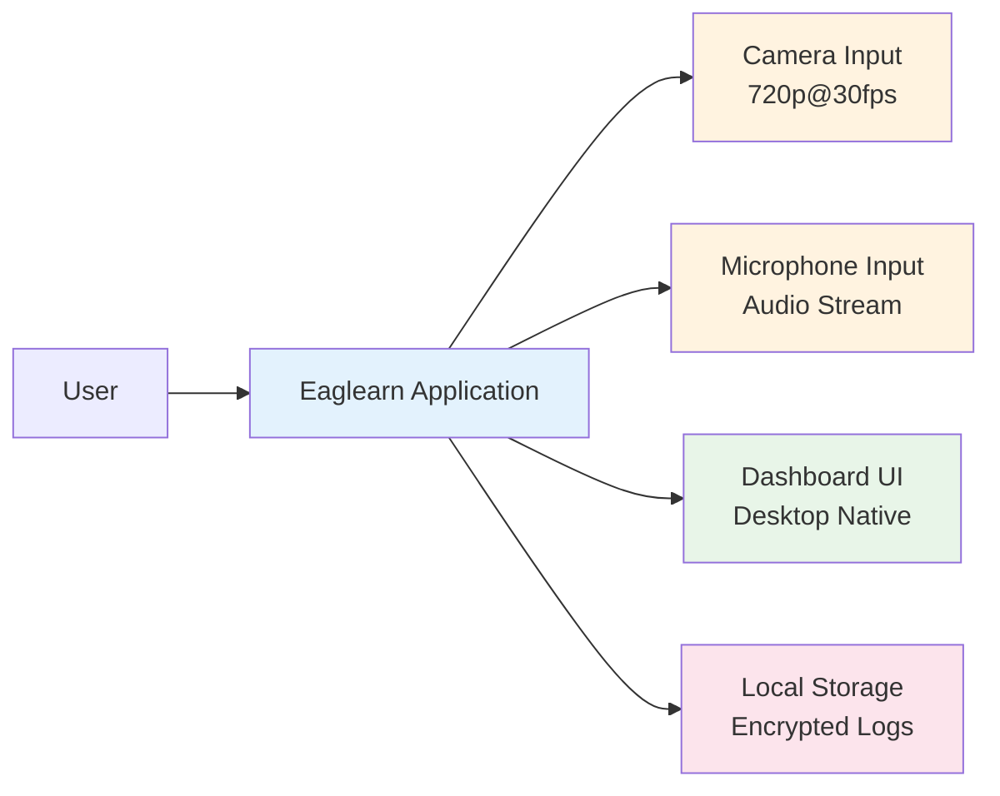

## 1. Konteks Produk dan Batasan Platform

Eaglearn Wave 1 difokuskan pada implementasi sistem pemantauan belajar AI-powered untuk mahasiswa mandiri dengan pendekatan **offline-first**. Sistem beroperasi secara eksklusif pada perangkat laptop target (Acer Nitro 5 AN515-58) tanpa memerlukan koneksi internet untuk operasi inti, kecuali untuk pembaruan sistem manual yang disetujui pengguna.

**Platform Target:**
- **Hardware**: Acer Nitro 5 AN515-58 (Intel i5-12500H, RTX 3050 Mobile, RAM 16GB)
- **Operating System**: Windows 11 23H2 dan Ubuntu 22.04 LTS
- **Input Devices**: Kamera internal 720p@30fps, mikrofon internal
- **Storage**: Minimum 50 GB free space untuk log dan model

## 2. Ruang Lingkup Fungsional

### 2.1 In-Scope Features (Wave 1)

#### 2.1.1 Computer Vision Pipeline
**FR-E01: Gaze Estimation**
- ✅ Estimasi arah tatapan (left, center, right, off-screen)
- ✅ Input: Webcam 720p minimal 15 fps
- ✅ Akurasi target: ≥85% pada pencahayaan 200-500 lux
- ✅ Output: Unit vector gaze direction dengan confidence score

**FR-E02: Head Pose Detection**
- ✅ Identifikasi postur kepala (tegak, menunduk, miring)
- ✅ Kesalahan sudut maksimal: ≤10° Mean Absolute Error (MAE)
- ✅ Update frequency: ≥10 fps
- ✅ Output: 3D rotation angles (pitch, yaw, roll)

**FR-E03: Gesture Recognition** (Should Have)
- ✅ Deteksi gesture tubuh bagian atas (mengangkat tangan, menopang dagu, membungkuk)
- ✅ Recall target: ≥0.8 pada dataset internal
- ✅ Output: Gesture class dengan confidence score

#### 2.1.2 Audio Analysis Pipeline
**FR-S01: Audio Stress Analysis**
- ✅ Analisis mikrofon internal untuk indeks stress vokal
- ✅ Window analysis: Setiap 30 detik dengan smoothing
- ✅ Output: Stress score 0-100 dengan trend indicator

**FR-S02: Micro-Expression Detection**
- ✅ Pengenalan micro-expression kelelahan utama (kedipan cepat, mata menyipit, bibir tertekan)
- ✅ Akurasi target: ≥80% pada dataset internal 300 klip
- ✅ Output: Expression class dengan intensity score

**FR-S03: Fatigue Scoring**
- ✅ Kombinasi sinyal audio dan video menjadi skor fatigue 0-100
- ✅ Smoothing window: <60 detik untuk stabilitas
- ✅ Output: Fatigue score dengan confidence interval

#### 2.1.3 Produktivitas Tracking
**FR-P01: On-Task Duration Tracking**
- ✅ Pencatatan durasi on-task vs break
- ✅ Kesalahan maksimal: ≤5% dibanding penanda manual
- ✅ Output: Session summary dengan ratio on-task/break

**FR-P02: Break Pattern Identification** (Should Have)
- ✅ Identifikasi pola jeda (Pomodoro, flowtime)
- ✅ Output: Break pattern analysis per session

#### 2.1.4 Dashboard dan Monitoring
**FR-M01: Real-time Dashboard**
- ✅ Dashboard desktop native dengan KPI utama
- ✅ Refresh rate: ≤2 detik untuk semua indikator
- ✅ UI elements: Engagement visual, fatigue level, produktivitas score
- ✅ Mode operasi: Non-intrusive dengan indikator status jelas

**FR-M02: Data Retention Management**
- ✅ Penyimpanan log terenkripsi on-device (AES-256)
- ✅ Retensi otomatis: Maksimum 30 hari
- ✅ Housekeeping: Purge otomatis tanpa intervensi manual

### 2.2 Out-of-Scope Features (Wave 1)

#### 2.2.1 Fitur yang Ditunda ke Wave Berikutnya
- ❌ Integrasi cloud atau remote server
- ❌ Multi-device synchronization
- ❌ Real-time collaboration features
- ❌ Advanced machine learning model retraining
- ❌ Third-party API integrations (kecuali update sistem)
- ❌ Mobile application support
- ❌ Web-based interface
- ❌ Multi-user session management

#### 2.2.2 Batasan Teknis yang Disengaja
- ❌ Koneksi internet untuk operasi normal (offline-first)
- ❌ Penggunaan sensor eksternal (hanya kamera/mikrofon internal)
- ❌ Processing pipeline yang kompleks (>200ms latency)
- ❌ Storage requirement >100 GB
- ❌ Resource usage >70% GPU/CPU pada hardware target

## 3. Ruang Lingkup Non-Fungsional

### 3.1 In-Scope Non-Functional Requirements

#### 3.1.1 Performance (NFR-02, NFR-07)
- ✅ End-to-end latency ≤200ms untuk input 720p
- ✅ Dashboard UI refresh rate ≥30 FPS tanpa tearing
- ✅ Resource consumption: GPU <60%, CPU <70% (p95)
- ✅ Memory footprint <2 GB untuk aplikasi + model

#### 3.1.2 Security & Privacy (NFR-04, NFR-08)
- ✅ Data encryption: AES-256 untuk semua log lokal
- ✅ Key management: Local key dengan user authentication
- ✅ Pseudonimisasi: Identitas pengguna tidak tersimpan dalam log
- ✅ Retensi enforcement: Auto-purge setelah 30 hari
- ✅ GDPR compliance: Consent management untuk kamera/mikrofon

#### 3.1.3 Accessibility (NFR-06)
- ✅ High contrast mode untuk dashboard
- ✅ Keyboard navigation support penuh
- ✅ Minimum font size: 14pt untuk semua UI elements
- ✅ WCAG 2.1 AA compliance untuk color contrast

#### 3.1.4 Platform Compatibility (NFR-05)
- ✅ Windows 11 23H2 native support
- ✅ Ubuntu 22.04 LTS compatibility
- ✅ Performance degradation <10% across platforms
- ✅ Hardware acceleration pada GPU target (RTX 3050)

### 3.2 Out-of-Scope Non-Functional Requirements

#### 3.2.1 Quality Attributes yang Ditunda
- ❌ Scalability untuk multiple concurrent users
- ❌ High availability (99.9% uptime)
- ❌ Disaster recovery mechanisms
- ❌ Internationalization (i18n) support
- ❌ Advanced logging dan telemetry
- ❌ Performance monitoring dashboard

## 4. Skenario Pengguna Dalam Lingkup

### 4.1 Skenario Utama (Primary Use Cases)

#### 4.1.1 Belajar Campuran (Laptop + Catatan Fisik)
**Kontekstual:**
- Mahasiswa membaca materi digital sambil menulis catatan manual
- Posisi: Duduk 50-80 cm dari kamera
- Pencahayaan: 200-500 lux ambient
- Durasi: 45-90 menit session

**In-Scope:**
- ✅ Tracking gaze saat pengguna menunduk ke catatan (toleransi hingga 30°)
- ✅ Maintenance akurasi gaze ≥75% selama head movement alami
- ✅ Kombinasi sinyal visual dan audio untuk stress detection
- ✅ Real-time dashboard dengan indikator non-intrusive

**Out-of-Scope:**
- ❌ Adaptive content recommendation
- ❌ Note-taking assistance
- ❌ Digital note integration

#### 4.1.2 Belajar Digital Penuh
**Kontekstual:**
- Mahasiswa menggunakan konten digital (PDF, video, platform belajar)
- Posisi: Head-on dengan kamera laptop
- Interaksi: Mouse/trackpad untuk navigation

**In-Scope:**
- ✅ KPI real-time dengan pembaruan ≤2 detik
- ✅ Dashboard responsif tanpa gangguan operasi utama
- ✅ Kombinasi semua sensor pipeline untuk analisis komprehensif
- ✅ Session summary otomatis setelah aktivitas selesai

**Out-of-Scope:**
- ❌ Browser extension untuk web platforms
- ❌ Content analysis atau summarization
- ❌ Integration dengan learning management systems

### 4.2 Skenario Pendukung (Secondary Use Cases)

#### 4.2.1 Calibration Session
**Kontekstual:**
- Setup awal setelah instalasi
- User guided melalui calibration process
- Durasi: 2-3 menit untuk 4-point calibration

**In-Scope:**
- ✅ Guided calibration untuk gaze estimation
- ✅ Validation feedback untuk calibration quality
- ✅ Fallback parameters jika calibration gagal

#### 4.2.2 Data Management
**Kontekstual:**
- User-initiated data review atau export
- Emergency access untuk troubleshooting
- Durasi: On-demand, tidak rutin

**In-Scope:**
- ✅ Manual export encrypted log (emergency cases)
- ✅ Dashboard untuk review session history
- ✅ User consent management untuk data collection

## 5. Batasan dan Constraint Eksternal

### 5.1 Hardware Constraints
- **Kamera**: 720p resolution, 30 FPS maksimal
- **Mikrofon**: Single internal microphone, no external audio devices
- **Processing**: Limited oleh GPU memory (6GB pada RTX 3050)
- **Storage**: HDD/SSD performance untuk log writing

### 5.2 Environmental Constraints
- **Pencahayaan**: Optimal 200-500 lux, graceful degradation outside range
- **Posisi**: Optimal 50-80 cm dari kamera, warning jika di luar range
- **Noise**: Background noise dapat mempengaruhi audio analysis
- **Movement**: Excessive movement dapat mempengaruhi computer vision accuracy

### 5.3 Regulatory Constraints
- **GDPR Compliance**: Article 5 (data minimization), 6 (lawful basis), 7 (consent), 32 (security)
- **Data Residency**: Semua data tetap on-device, no cloud storage
- **User Rights**: Right to access, rectification, erasure, data portability

## 6. Interface Boundaries

### 6.1 System Boundaries

### 6.2 Data Flow Boundaries
- **Input Boundary**: Raw sensor data (video frames, audio samples)
- **Processing Boundary**: AI model inference (gaze, stress, fatigue)
- **Output Boundary**: Dashboard display dan local log storage
- **External Boundary**: Manual update mechanism (user-initiated)

## 7. Acceptance Criteria untuk Scope Compliance

| Aspek | Kriteria | Metode Verifikasi |
|-------|----------|-------------------|
| **Functional Scope** | Semua FR-E01 hingga FR-M02 terimplementasi | Demonstration dengan test scenarios |
| **Non-Functional Scope** | NFR-01 hingga NFR-08 terpenuhi | Performance benchmarking dan security audit |
| **Out-of-Scope** | Tidak ada fitur wave 2+ yang diimplementasi | Code review dan feature checklist |
| **Platform Scope** | Berjalan optimal pada hardware target | Hardware compatibility testing |

## 8. Risiko Scope Creep

### 8.1 Identifikasi Risiko
- **Feature Creep**: Tekanan untuk menambah advanced analytics
- **Platform Creep**: Request support untuk hardware berbeda
- **Integration Creep**: Tekanan untuk cloud connectivity

### 8.2 Mitigasi Strategi
- **Scope Review**: Weekly review terhadap feature requests
- **Change Control**: Setiap perubahan scope harus melalui CR process
- **Communication**: Clear communication bahwa fitur adalah "planned for future waves"

## 9. Traceability ke Requirements

| Scope Item | Requirement ID | Rationale |
|------------|----------------|-----------|
| Computer Vision Pipeline | FR-E01, FR-E02, FR-E03 | Core functionality untuk engagement monitoring |
| Audio Analysis Pipeline | FR-S01, FR-S02, FR-S03 | Essential untuk stress dan fatigue detection |
| Produktivitas Tracking | FR-P01, FR-P02 | Key differentiator untuk productivity insights |
| Dashboard Native | FR-M01, FR-M02 | Primary user interface untuk semua features |
| Offline-First | NFR-01 | Fundamental constraint untuk privacy dan reliability |
| AES-256 Encryption | NFR-04 | Security requirement untuk data protection |
| 30-day Retention | NFR-08 | GDPR compliance requirement |

## 10. Asumsi Konservatif untuk Scope

**Calibration Parameters:**
- Menggunakan baseline dari [`science-source/17_Webcam_Gaze_Estimation_Computer_Screen.pdf`](science-source/17_Webcam_Gaze_Estimation_Computer_Screen.pdf)
- MAE target: 10° (konservatif dari 6.95° reported)
- Fallback: Manual calibration jika auto-calibration gagal

**Model Performance:**
- Stress detection sensitivity: 80% (berdasarkan micro-expression survey)
- Fatigue scoring stability: <15 varian antar menit
- Resource usage: Safety margin 20% di bawah hardware limits

**User Experience:**
- Dashboard intrusiveness: Level minimal dengan gradual indicators
- Accessibility: WCAG 2.1 AA sebagai minimum standard
- Error handling: Graceful degradation tanpa crash