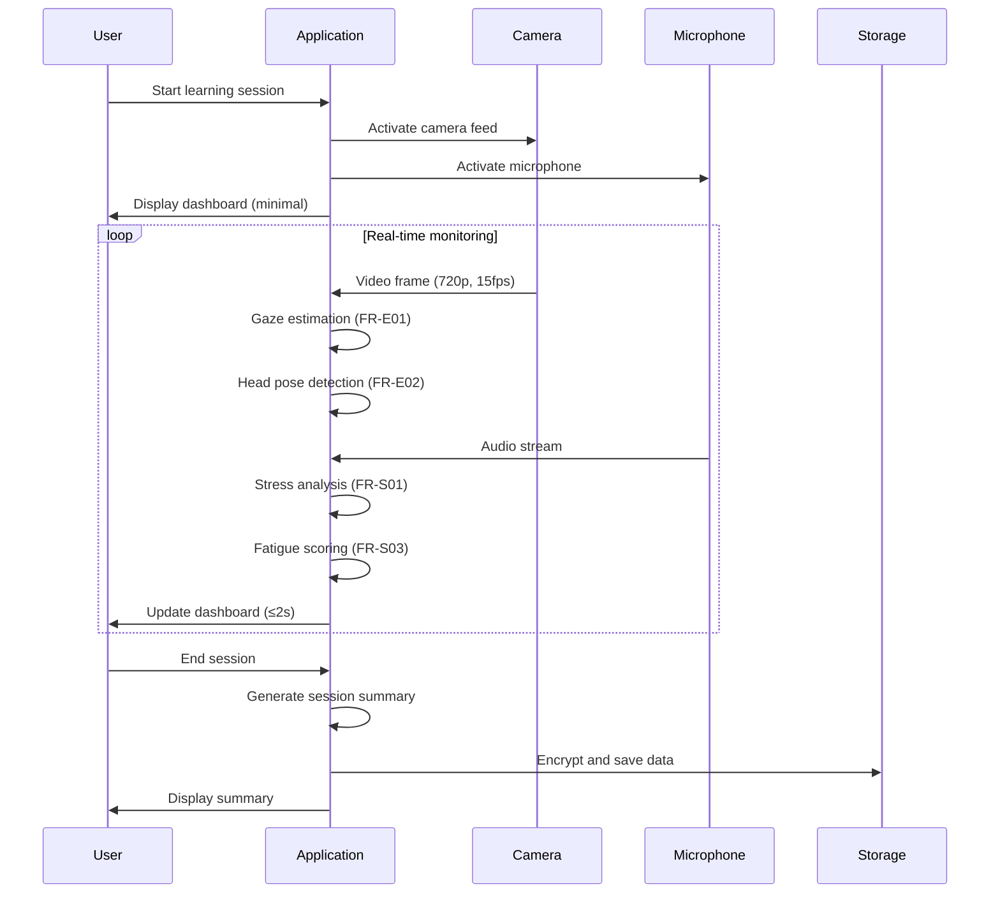
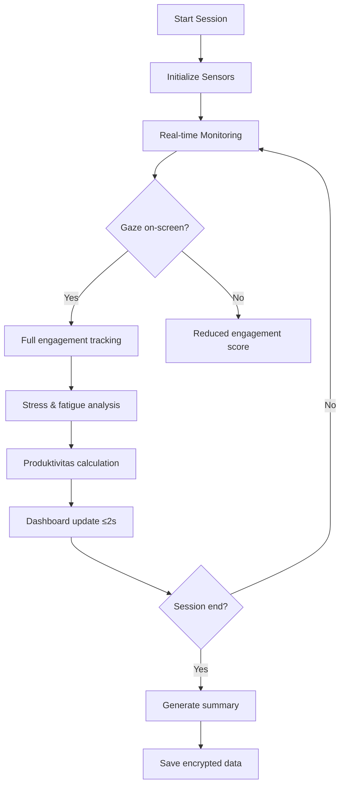
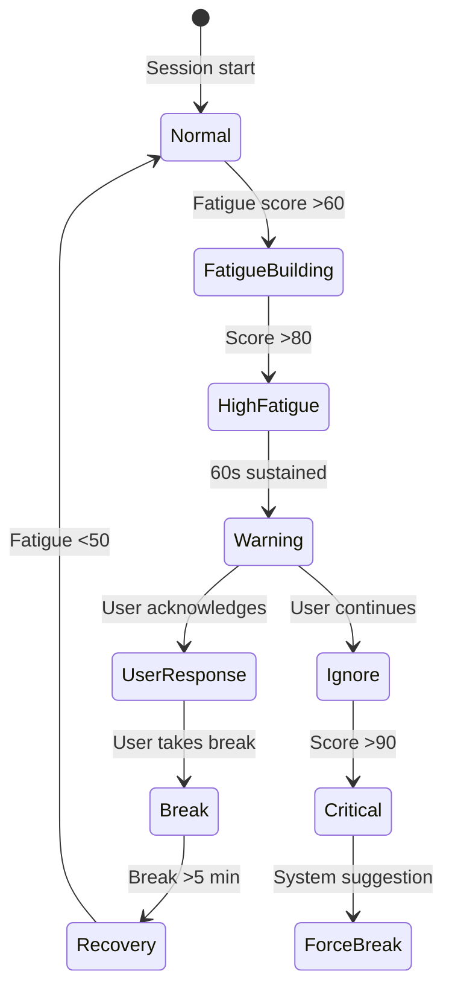
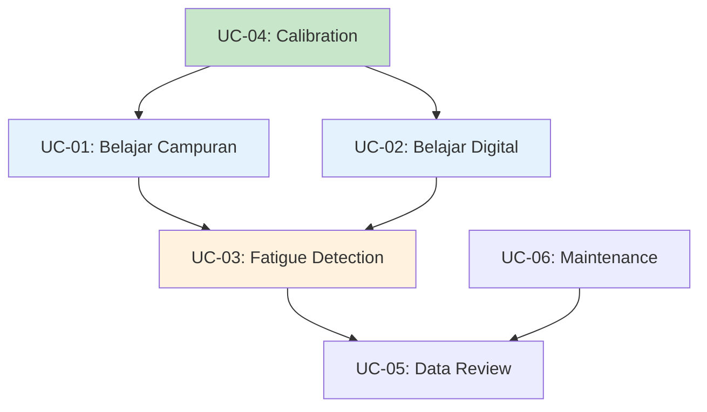

## 1. Daftar Aktor

| Aktor | Deskripsi | Tujuan Utama | Karakteristik |
|-------|-----------|--------------|---------------|
| **Mahasiswa Mandiri** | Pengguna utama sistem, mahasiswa yang belajar secara mandiri | Monitoring engagement, stress, dan produktivitas selama sesi belajar | Tech-savvy, fokus pada efisiensi belajar, peduli privasi |
| **System Administrator** | Teknisi yang melakukan instalasi dan maintenance | Setup awal, calibration, troubleshooting | Akses ke konfigurasi sistem, tidak perlu akses data pengguna |

## 2. Use Case Utama

### 2.1 UC-01: Belajar Campuran (Laptop + Catatan Fisik)

#### 2.1.1 Deskripsi
Mahasiswa membaca materi digital di laptop sambil secara bersamaan menulis catatan di buku fisik. Sistem harus tetap dapat melacak engagement visual meskipun pengguna sesekali menunduk untuk melihat catatan fisik.

#### 2.1.2 Aktor Utama
- Mahasiswa Mandiri

#### 2.1.3 Precondition
- Aplikasi Eaglearn sudah terinstal dan dikonfigurasi
- Kamera dan mikrofon memiliki permission akses
- Calibration awal sudah selesai
- Pencahayaan ruangan 200-500 lux

#### 2.1.4 Postcondition
- Session data tersimpan dengan engagement metrics
- Dashboard menampilkan summary session
- Data otomatis dienkripsi dan disimpan lokal

#### 2.1.5 Flow Utama

#### 2.1.6 Alternate Flow: Note-taking Interruption

| Step | Kondisi | Action | Post-condition |
|------|---------|--------|---------------|
| 4.1 | User menunduk melihat catatan | Gaze detection: off-screen | Engagement score adjusted |
| 4.2 | Head pose: menunduk ≤30° | Pose tracking: maintain accuracy | Dashboard: visual indicator |
| 4.3 | Return to screen | Gaze detection: on-screen | Normal monitoring resumed |

#### 2.1.7 Exception Flow: Technical Issues

| Kondisi | Detection | Action | Fallback |
|---------|-----------|--------|----------|
| Kamera mati | Frame rate = 0 | Alert user, pause monitoring | Session pause, manual resume |
| Pencahayaan rendah | Brightness <200 lux | Warning indicator | Graceful degradation dengan confidence score lebih rendah |
| Mikrofon bermasalah | Audio level = 0 | Disable audio analysis | Visual-only monitoring |

#### 2.1.8 Requirement Mapping
- **FR-E01**: Gaze estimation dengan akurasi ≥85%
- **FR-E02**: Head pose dengan MAE ≤10°
- **FR-S01**: Audio stress analysis setiap 30 detik
- **FR-M01**: Dashboard update ≤2 detik
- **NFR-02**: End-to-end latency ≤200ms

#### 2.1.9 Business Value
- **SB-01**: Maintain engagement tracking selama aktivitas campuran
- **SB-02**: Early detection stress/fatigue selama note-taking

### 2.2 UC-02: Belajar Digital Penuh

#### 2.2.1 Deskripsi
Mahasiswa fokus pada konten digital (PDF, video pembelajaran, platform online) tanpa aktivitas manual. Sistem memberikan monitoring komprehensif dengan semua sensor aktif.

#### 2.2.2 Aktor Utama
- Mahasiswa Mandiri

#### 2.2.3 Precondition
- Konten digital aktif di layar
- Posisi duduk optimal (50-80 cm dari kamera)
- Tidak ada gangguan eksternal signifikan

#### 2.2.4 Postcondition
- Session lengkap dengan semua KPI metrics
- Produktivitas analysis tersedia
- Pattern recognition untuk future sessions

#### 2.2.5 Flow Utama

#### 2.2.6 Alternate Flow: Content Interaction

| Step | Kondisi | Action | Post-condition |
|------|---------|--------|---------------|
| 3.1 | User scroll/zoom content | Mouse/trackpad activity | On-task duration tracking |
| 3.2 | Video playback | Screen brightness change | Adaptive gaze calibration |
| 3.3 | Break untuk rest | No input activity | Break pattern detection |

#### 2.2.7 Exception Flow: Platform-specific Issues

| Kondisi | Detection | Action | Fallback |
|---------|-----------|--------|----------|
| Screen recording active | API detection | Warning tentang privacy | Pause monitoring atau blur sensitive content |
| Multiple monitors | Monitor detection | Primary monitor focus | Secondary monitor sebagai out-of-scope |
| Full-screen application | Window state | Adaptive dashboard positioning | Minimal overlay mode |

#### 2.2.8 Requirement Mapping
- **FR-P01**: On-task vs break tracking dengan ≤5% error
- **FR-M01**: Real-time KPI display
- **NFR-03**: UI responsiveness tanpa tearing
- **NFR-07**: Resource usage dalam batas

#### 2.2.9 Business Value
- **SB-03**: Accurate produktivitas measurement
- **SB-04**: Responsive dashboard experience

### 2.3 UC-03: Deteksi Kelelahan dan Stres

#### 2.3.1 Deskripsi
Selama sesi belajar panjang, sistem mendeteksi tanda-tanda kelelahan dan stres melalui kombinasi sinyal audio-visual dan memberikan feedback yang tepat waktu tanpa mengganggu fokus pengguna.

#### 2.3.2 Aktor Utama
- Mahasiswa Mandiri

#### 2.3.3 Precondition
- Session aktif minimal 15 menit
- Semua sensor berfungsi normal
- Calibration stress baseline sudah ada

#### 2.3.4 Postcondition
- Early warning diberikan sebelum fatigue tinggi
- User dapat mengambil break yang tepat
- Data pattern untuk session berikutnya

#### 2.3.5 Flow Utama

#### 2.3.6 Alternate Flow: Multi-modal Detection

| Signal | Detection Method | Threshold | Action |
|--------|------------------|-----------|--------|
| **Visual** | Micro-expression (FR-S02) | ≥80% confidence | Fatigue score increment |
| **Audio** | Stress vocal index (FR-S01) | Score >70 | Combined scoring |
| **Behavioral** | Break pattern (FR-P02) | Irregular breaks | Warning trigger |

#### 2.3.7 Exception Flow: False Positive Handling

| Kondisi | Detection | Action | Mitigation |
|---------|-----------|--------|-----------|
| Temporary discomfort | Single spike | Wait and observe | Require sustained pattern |
| Environmental factor | External noise/light | Correlation check | Filter external factors |
| User movement | Motion artifact | Signal quality check | Temporary pause scoring |

#### 2.3.8 Requirement Mapping
- **FR-S02**: Micro-expression accuracy ≥80%
- **FR-S03**: Fatigue score stability <15 varian
- **FR-M02**: Secure log storage 30 hari
- **NFR-04**: AES-256 encryption

#### 2.3.9 Business Value
- **SB-02**: Early fatigue detection untuk prevent performance decline
- **SB-03**: Break pattern optimization untuk produktivitas

## 3. Use Case Pendukung

### 3.1 UC-04: Calibration Awal

#### 3.1.1 Deskripsi
Proses setup awal untuk mengkalibrasi sistem sesuai karakteristik pengguna dan environment.

#### 3.1.2 Aktor Utama
- Mahasiswa Mandiri
- System Administrator (opsional)

#### 3.1.3 Flow
1. User memilih calibration mode
2. Sistem menampilkan 4 titik calibration
3. User fokus pada setiap titik selama 2 detik
4. Sistem menghitung transformation matrix
5. Validation dengan physical measurement
6. Save calibration parameters

#### 3.1.4 Requirement Mapping
- **FR-E01**: 4-point calibration process
- **NFR-02**: Setup time <3 menit

### 3.2 UC-05: Data Review dan Export

#### 3.2.1 Deskripsi
User dapat review session history dan export data untuk keperluan khusus.

#### 3.2.2 Aktor Utama
- Mahasiswa Mandiri

#### 3.2.3 Flow
1. User akses dashboard history
2. Pilih session atau time range
3. Review metrics dan patterns
4. Optional: Export encrypted data
5. Confirm action dengan authentication

#### 3.2.4 Requirement Mapping
- **FR-M02**: Encrypted storage access
- **NFR-04**: Secure export mechanism

## 4. Non-Functional Use Cases

### 4.1 UC-06: System Maintenance

#### 4.1.1 Deskripsi
Background process untuk maintenance sistem tanpa intervensi user.

#### 4.1.2 Trigger
- Daily schedule (low activity period)
- Storage usage >80%
- 30-day retention timer

#### 4.1.3 Process
1. Scan storage untuk old data
2. Identify data >30 hari
3. Encrypt dan archive (jika diperlukan)
4. Purge old data
5. Update storage metrics

#### 4.1.4 Requirement Mapping
- **NFR-08**: Automated retention enforcement
- **NFR-07**: Background process resource efficient

## 5. Use Case Relationships

## 6. Use Case Prioritization Matrix

| Use Case | Frequency | Business Value | Technical Complexity | Priority |
|----------|-----------|----------------|---------------------|----------|
| UC-01 Belajar Campuran | High | High | Medium | P0 (Core) |
| UC-02 Belajar Digital | High | High | Low | P0 (Core) |
| UC-03 Fatigue Detection | Medium | High | High | P1 (Important) |
| UC-04 Calibration | Low | Medium | Medium | P2 (Setup) |
| UC-05 Data Review | Low | Low | Low | P2 (Utility) |
| UC-06 Maintenance | Low | Medium | Low | P3 (Background) |

## 7. Cross-Cutting Concerns

### 7.1 Privacy dan Security
- Semua use case harus menghormati GDPR compliance
- Data minimization principle diterapkan
- User consent untuk setiap session

### 7.2 Performance
- Real-time requirement untuk semua monitoring use case
- Graceful degradation untuk resource-intensive scenarios
- Background process tidak boleh mengganggu user experience

### 7.3 Accessibility
- Keyboard navigation untuk semua interaction
- High contrast mode untuk visual indicators
- Screen reader compatibility untuk dashboard

## 8. Success Metrics per Use Case

| Use Case | Success Criteria | Measurement Method |
|----------|------------------|-------------------|
| **UC-01** | Gaze tracking accuracy ≥75% selama note-taking | Manual validation vs system log |
| **UC-02** | Dashboard update ≤2 detik tanpa lag | Stopwatch measurement |
| **UC-03** | Fatigue warning 60 detik sebelum score tinggi | Correlation analysis dengan self-report |
| **UC-04** | Calibration success rate ≥90% | User feedback dan retry rate |
| **UC-05** | Data export <30 detik untuk 1 hari data | Performance timing |

## 9. Assumptions dan Dependencies

**Assumptions:**
- User memiliki basic computer literacy
- Environment lighting mendukung computer vision
- Hardware specification sesuai target (Acer Nitro 5)

**Dependencies:**
- Q01: Calibration parameters dari research papers
- Q02: Dashboard intervention thresholds
- Q04: Data retention policy details

## 10. Future Evolution Considerations

**Wave 2 Use Cases:**
- UC-07: Personalized intervention recommendations
- UC-08: Multi-session pattern analysis
- UC-09: Peer comparison (anonymous)

**Wave 3 Use Cases:**
- UC-10: Cross-device synchronization
- UC-11: Collaborative learning monitoring
- UC-12: Integration dengan LMS platforms