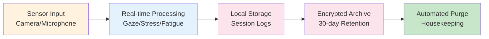
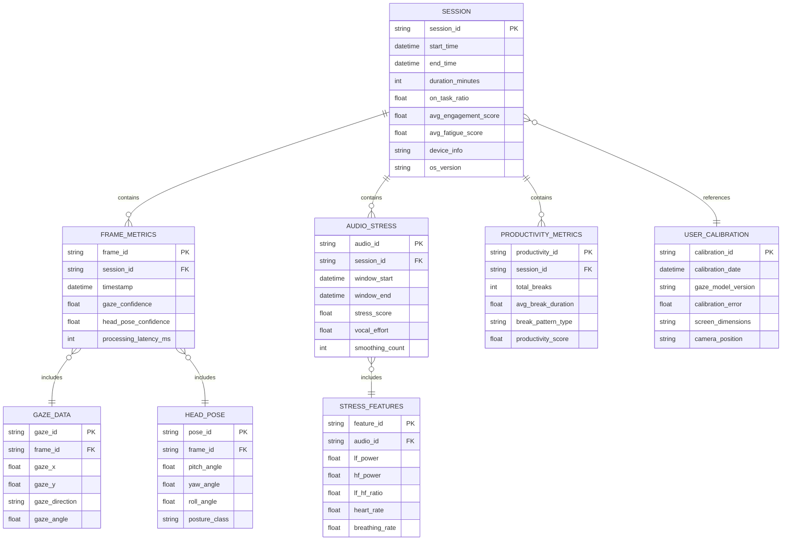
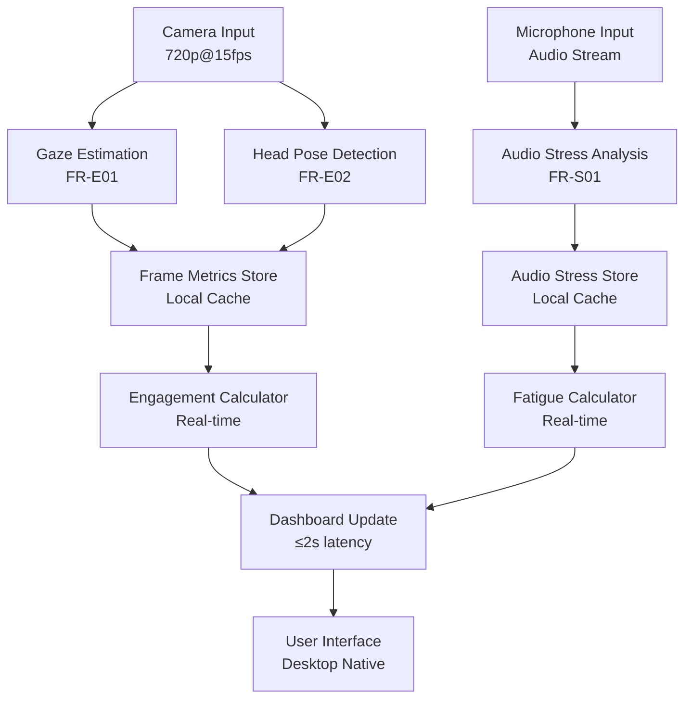
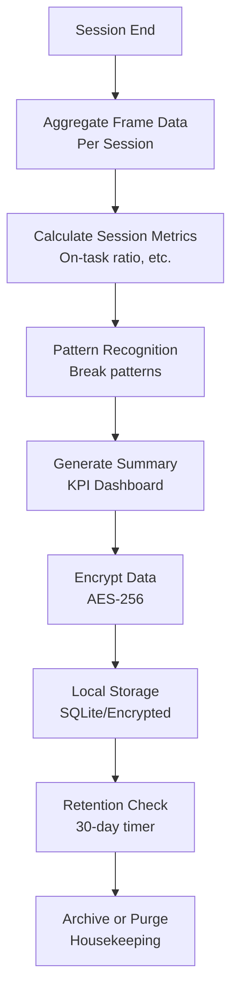

## 1. Overview Data Architecture

Eaglearn Wave 1 mengimplementasikan data model yang berfokus pada **real-time processing** dengan **local storage** untuk memenuhi requirement offline-first dan privacy. Data flow mengikuti pipeline: Sensor Input → Real-time Processing → Local Storage → Encrypted Archive.

## 2. Entity Relationship Diagram

### 2.1 Core Entities

## 3. Data Entities Detail

### 3.1 Session Entity

**Purpose**: Menyimpan informasi high-level tentang setiap session belajar

| Field | Type | Description | Requirement | Encryption |
|-------|------|-------------|-------------|------------|
| `session_id` | UUID | Primary key unik untuk session | FR-P01 | ✅ |
| `start_time` | DateTime | Waktu mulai session | FR-M01 | ❌ |
| `end_time` | DateTime | Waktu selesai session (null jika aktif) | FR-M01 | ❌ |
| `duration_minutes` | Integer | Durasi dalam menit | FR-P01 | ❌ |
| `on_task_ratio` | Float (0-1) | Rasio waktu on-task vs total | FR-P01 | ❌ |
| `avg_engagement_score` | Float (0-100) | Rata-rata engagement score | FR-E01 | ❌ |
| `avg_fatigue_score` | Float (0-100) | Rata-rata fatigue score | FR-S03 | ❌ |
| `device_info` | String | Informasi hardware (hashed) | NFR-05 | ✅ |
| `os_version` | String | Version OS (hashed) | NFR-05 | ✅ |

**Constraints:**
- Maximum session duration: 8 jam
- Auto-close jika inactive >30 menit
- Encryption: Session metadata dienkripsi dengan user key

### 3.2 Frame Metrics Entity

**Purpose**: Menyimpan data per-frame dari computer vision pipeline

| Field | Type | Description | Requirement | Encryption |
|-------|------|-------------|-------------|------------|
| `frame_id` | UUID | Primary key unik per frame | FR-E01 | ✅ |
| `session_id` | UUID (FK) | Reference ke session | FR-E01 | ✅ |
| `timestamp` | DateTime | Timestamp frame capture | FR-E01 | ❌ |
| `gaze_confidence` | Float (0-1) | Confidence score gaze estimation | FR-E01 | ❌ |
| `head_pose_confidence` | Float (0-1) | Confidence score pose estimation | FR-E02 | ❌ |
| `processing_latency_ms` | Integer | Latency processing frame | NFR-02 | ❌ |

**Constraints:**
- Frame rate: 15 FPS untuk gaze, 10 FPS untuk pose
- Maximum latency: 200ms per frame
- Auto-drop frame jika latency >200ms

### 3.3 Gaze Data Entity

**Purpose**: Menyimpan hasil gaze estimation per frame

| Field | Type | Description | Requirement | Encryption |
|-------|------|-------------|-------------|------------|
| `gaze_id` | UUID | Primary key | FR-E01 | ✅ |
| `frame_id` | UUID (FK) | Reference ke frame | FR-E01 | ✅ |
| `gaze_x` | Float | Koordinat X gaze point (pixel) | FR-E01 | ❌ |
| `gaze_y` | Float | Koordinat Y gaze point (pixel) | FR-E01 | ❌ |
| `gaze_direction` | Enum | left/center/right/off-screen | FR-E01 | ❌ |
| `gaze_angle` | Float | Sudut gaze dari kamera (degrees) | FR-E01 | ❌ |

**Constraints:**
- Gaze coordinates dalam screen bounds
- Accuracy target: ≥85% pada 200-500 lux
- Smoothing: Exponential moving average untuk stability

### 3.4 Head Pose Entity

**Purpose**: Menyimpan hasil head pose estimation per frame

| Field | Type | Description | Requirement | Encryption |
|-------|------|-------------|-------------|------------|
| `pose_id` | UUID | Primary key | FR-E02 | ✅ |
| `frame_id` | UUID (FK) | Reference ke frame | FR-E02 | ✅ |
| `pitch_angle` | Float | Pitch angle (degrees) | FR-E02 | ❌ |
| `yaw_angle` | Float | Yaw angle (degrees) | FR-E02 | ❌ |
| `roll_angle` | Float | Roll angle (degrees) | FR-E02 | ❌ |
| `posture_class` | Enum | tegak/menunduk/miring | FR-E02 | ❌ |

**Constraints:**
- Angle range: -90° to +90° untuk semua axes
- MAE target: ≤10° untuk semua angles
- Update rate: ≥10 FPS

### 3.5 Audio Stress Entity

**Purpose**: Menyimpan hasil analisis audio stress per window

| Field | Type | Description | Requirement | Encryption |
|-------|------|-------------|-------------|------------|
| `audio_id` | UUID | Primary key | FR-S01 | ✅ |
| `session_id` | UUID (FK) | Reference ke session | FR-S01 | ✅ |
| `window_start` | DateTime | Start time window analisis | FR-S01 | ❌ |
| `window_end` | DateTime | End time window analisis | FR-S01 | ❌ |
| `stress_score` | Float (0-100) | Combined stress score | FR-S01 | ❌ |
| `vocal_effort` | Float | Vocal effort indicator | FR-S01 | ❌ |
| `smoothing_count` | Integer | Number of samples untuk smoothing | FR-S03 | ❌ |

**Constraints:**
- Window size: 30 detik dengan 15 detik overlap
- Update frequency: Setiap 30 detik
- Smoothing: Exponential weighted moving average

### 3.6 Stress Features Entity

**Purpose**: Menyimpan fitur detail dari analisis audio stress

| Field | Type | Description | Requirement | Encryption |
|-------|------|-------------|-------------|------------|
| `feature_id` | UUID | Primary key | FR-S01 | ✅ |
| `audio_id` | UUID (FK) | Reference ke audio window | FR-S01 | ✅ |
| `lf_power` | Float | Low frequency power (0.04-0.15Hz) | FR-S01 | ❌ |
| `hf_power` | Float | High frequency power (0.15-0.4Hz) | FR-S01 | ❌ |
| `lf_hf_ratio` | Float | LF/HF power ratio | FR-S01 | ❌ |
| `heart_rate` | Float | Estimated heart rate (BPM) | FR-S01 | ❌ |
| `breathing_rate` | Float | Estimated breathing rate (Hz) | FR-S01 | ❌ |

**Constraints:**
- HR range: 50-150 BPM (valid physiological range)
- BR range: 0.1-0.5 Hz (normal breathing)
- Power values: Normalized units untuk consistency

### 3.7 Productivity Metrics Entity

**Purpose**: Menyimpan hasil analisis produktivitas per session

| Field | Type | Description | Requirement | Encryption |
|-------|------|-------------|-------------|------------|
| `productivity_id` | UUID | Primary key | FR-P01 | ✅ |
| `session_id` | UUID (FK) | Reference ke session | FR-P01 | ✅ |
| `total_breaks` | Integer | Jumlah break terdeteksi | FR-P02 | ❌ |
| `avg_break_duration` | Float | Rata-rata durasi break (menit) | FR-P02 | ❌ |
| `break_pattern_type` | Enum | pomodoro/flowtime/irregular | FR-P02 | ❌ |
| `productivity_score` | Float (0-100) | Combined productivity score | FR-P01 | ❌ |

**Constraints:**
- Break detection: Inactivity >2 menit
- Pattern recognition: Minimal 3 breaks untuk classification
- Score calculation: Weighted combination on-task ratio dan break pattern

### 3.8 User Calibration Entity

**Purpose**: Menyimpan parameter calibration untuk akurasi optimal

| Field | Type | Description | Requirement | Encryption |
|-------|------|-------------|-------------|------------|
| `calibration_id` | UUID | Primary key | FR-E01 | ✅ |
| `calibration_date` | DateTime | Tanggal calibration terakhir | FR-E01 | ❌ |
| `gaze_model_version` | String | Version model yang digunakan | FR-E01 | ❌ |
| `calibration_error` | Float | MAE calibration (degrees) | FR-E01 | ❌ |
| `screen_dimensions` | String | Ukuran screen (WxH pixel) | FR-E01 | ❌ |
| `camera_position` | String | Posisi kamera relatif screen | FR-E01 | ❌ |

**Constraints:**
- Recalibration: Setiap 30 hari atau jika error >15°
- Validation: Physical measurement untuk accuracy
- Fallback: Default parameters jika calibration gagal

## 4. Data Flow Architecture

### 4.1 Real-time Data Flow

### 4.2 Batch Processing Flow

## 5. Data Storage Strategy

### 5.1 Storage Technology

| Data Type | Storage | Encryption | Retention | Access Pattern |
|-----------|---------|------------|-----------|----------------|
| **Real-time Metrics** | Memory cache | ❌ | Session only | Read/write heavy |
| **Session Data** | SQLite local | ✅ AES-256 | 30 hari | Write-once, read session-end |
| **Calibration** | JSON file | ✅ AES-256 | Indefinite | Read on startup, write on calibration |
| **System Logs** | Rolling file | ✅ AES-256 | 7 hari | Append-only |

### 5.2 Encryption Strategy

**Encryption Levels:**
1. **Transport Layer**: TLS 1.3 untuk system updates (jika diperlukan)
2. **Storage Layer**: AES-256-GCM untuk semua local data
3. **Key Management**: Local key derivation dari user password

**Pseudonimisasi:**
- User identity: Hashed dengan salt
- Session data: Stripped dari personal identifiers
- Calibration data: Device-fingerprint only

## 6. Data Retention dan Privacy

### 6.1 Retention Policy

**30-Day Retention (NFR-08):**
- Active data: Available untuk analysis dan dashboard
- Day 31: Automatic encryption dan archival
- Day 32: Secure deletion tanpa recovery

**Emergency Export (Q04 Resolution):**
- User-initiated export untuk compliance
- Encrypted dengan separate key
- Metadata-only untuk audit purposes

### 6.2 GDPR Compliance Mapping

| GDPR Article | Implementation | Data Entity | Verification |
|--------------|----------------|-------------|-------------|
| **Art. 5** Data Minimization | Collect only necessary metrics | All entities | Data audit log |
| **Art. 6** Lawful Basis | User consent per session | Session | Consent timestamp |
| **Art. 7** Consent Management | Granular permission control | User preferences | UI consent flow |
| **Art. 32** Security | AES-256 encryption | All stored data | Security audit |

## 7. Data Quality dan Validation

### 7.1 Data Quality Metrics

| Entity | Quality Check | Threshold | Action jika Failed |
|--------|---------------|-----------|-------------------|
| **Frame Metrics** | Confidence score | ≥0.7 | Drop frame atau interpolate |
| **Gaze Data** | Angle consistency | <15° variance | Recalibration warning |
| **Audio Stress** | Signal quality | SNR >10dB | Disable audio analysis |
| **Session** | Completeness | >80% frames valid | Flag session sebagai partial |

### 7.2 Validation Rules

**Cross-Entity Validation:**
- Frame timestamp harus dalam session time range
- Gaze coordinates harus dalam screen bounds
- Audio windows tidak boleh overlap >50%
- Calibration error harus <15° untuk production use

## 8. Performance Considerations

### 8.1 Data Volume Estimation

| Entity | Records/Session | Size/Record | Total/Session |
|--------|-----------------|-------------|---------------|
| **Frame Metrics** | 45,000 (15fps × 50min) | 64 bytes | ~2.8 MB |
| **Gaze Data** | 45,000 | 48 bytes | ~2.1 MB |
| **Head Pose** | 30,000 (10fps) | 56 bytes | ~1.6 MB |
| **Audio Stress** | 100 (30s windows) | 128 bytes | ~12.5 KB |
| **Session Summary** | 1 | 256 bytes | ~256 bytes |
| **Total per Session** | ~120,000 records | - | ~6.5 MB |

### 8.2 Storage Optimization

**Compression Strategy:**
- Time-series data: Delta encoding untuk timestamps
- Floating point: Precision reduction (2 decimal places)
- Repeated values: Run-length encoding

**Indexing Strategy:**
- Session_id: Primary index untuk fast lookup
- Timestamp: Composite index untuk time-range queries
- Confidence scores: Partial index untuk quality filtering

## 9. Data Migration Strategy

### 9.1 Version Management

**Schema Versioning:**
- Current version: 1.0.0
- Backward compatibility: Maintain untuk 2 versions
- Migration scripts: Automatic pada application startup

### 9.2 Backup dan Recovery

**Local Backup:**
- Automatic daily backup ke encrypted container
- Retention: 7 hari untuk recovery purposes
- Recovery: Point-in-time restore untuk last 24 jam

## 10. Assumptions dan Dependencies

**Assumptions:**
- SQLite performance sufficient untuk single-user workload
- Local storage I/O tidak menjadi bottleneck pada hardware target
- User tidak akan generate >100 sessions per hari

**Dependencies:**
- Q01: Calibration parameters mempengaruhi data accuracy thresholds
- Q04: Retention policy mempengaruhi storage architecture decisions

## 11. Future Considerations (Wave 2+)

**Scalability Needs:**
- Partitioning strategy untuk multi-session analysis
- Aggregation pipeline untuk historical trends
- Export interface untuk third-party integration

**Advanced Analytics:**
- Machine learning features untuk pattern recognition
- Anomaly detection untuk unusual behavior
- Predictive modeling untuk intervention recommendations