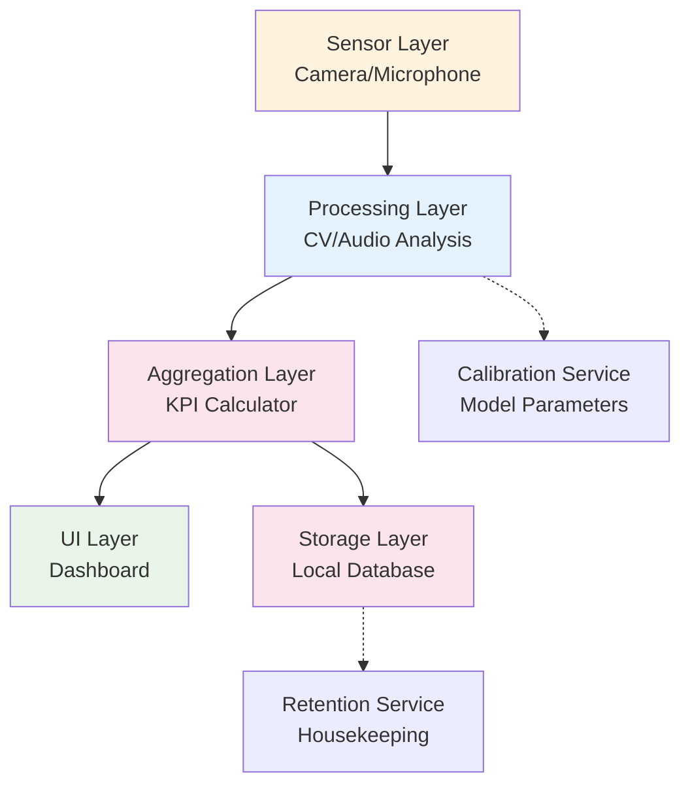

## 1. Overview API Architecture

Eaglearn Wave 1 mengimplementasikan **internal API contracts** untuk komunikasi antar komponen sistem. API design mengikuti prinsip **offline-first** dengan **synchronous processing** untuk real-time requirements. Semua API calls berjalan dalam single process untuk meminimalkan latency.



## 2. API Endpoint Specifications

### 2.1 Computer Vision APIs

#### 2.1.1 Gaze Estimation API

**Endpoint:** `POST /v1/gaze/predict`

**Purpose:** Real-time gaze direction estimation dari video frame

**Request Format:**
```json
{
  "frame_id": "uuid",
  "timestamp": "2025-09-30T10:30:00Z",
  "frame_data": "base64_encoded_image",
  "calibration_id": "uuid",
  "metadata": {
    "frame_width": 1280,
    "frame_height": 720,
    "format": "RGB",
    "quality_score": 0.95
  }
}
```

**Response Format:**
```json
{
  "frame_id": "uuid",
  "processing_timestamp": "2025-09-30T10:30:01Z",
  "gaze_result": {
    "gaze_x": 640.5,
    "gaze_y": 360.2,
    "gaze_direction": "center",
    "gaze_angle": 2.3,
    "confidence": 0.87,
    "processing_latency_ms": 45
  },
  "calibration_info": {
    "calibration_id": "uuid",
    "model_version": "1.0.0",
    "calibration_error": 3.2
  },
  "error": null
}
```

**Error Responses:**
```json
{
  "frame_id": "uuid",
  "processing_timestamp": "2025-09-30T10:30:01Z",
  "gaze_result": null,
  "error": {
    "code": "LOW_LIGHT",
    "message": "Insufficient lighting for accurate gaze estimation",
    "confidence": 0.2,
    "suggested_action": "Increase ambient lighting to 200-500 lux"
  }
}
```

**Performance Requirements:**
- **Latency**: p95 ≤ 50ms untuk 720p frame
- **Throughput**: 15 FPS continuous
- **Accuracy**: ≥85% pada kondisi optimal
- **Error Rate**: <5% frame drop

**Dependencies:**
- Q01: Calibration parameters dari research baseline

#### 2.1.2 Head Pose Estimation API

**Endpoint:** `POST /v1/pose/estimate`

**Purpose:** 3D head pose estimation dari video frame

**Request Format:**
```json
{
  "frame_id": "uuid",
  "timestamp": "2025-09-30T10:30:00Z",
  "frame_data": "base64_encoded_image",
  "face_bbox": {
    "x": 100,
    "y": 80,
    "width": 200,
    "height": 240
  }
}
```

**Response Format:**
```json
{
  "frame_id": "uuid",
  "processing_timestamp": "2025-09-30T10:30:01Z",
  "pose_result": {
    "pitch": 5.2,
    "yaw": -3.1,
    "roll": 1.8,
    "posture_class": "tegak",
    "confidence": 0.92,
    "processing_latency_ms": 38
  },
  "error": null
}
```

**Error Responses:**
```json
{
  "frame_id": "uuid",
  "error": {
    "code": "FACE_NOT_DETECTED",
    "message": "No face detected in frame",
    "confidence": 0.0
  }
}
```

**Performance Requirements:**
- **Latency**: p95 ≤ 40ms untuk 720p frame
- **Throughput**: 10 FPS continuous
- **Accuracy**: MAE ≤10° untuk semua angles

### 2.2 Audio Analysis APIs

#### 2.2.1 Audio Stress Analysis API

**Endpoint:** `POST /v1/stress/analyze`

**Purpose:** Real-time stress analysis dari audio stream

**Request Format:**
```json
{
  "audio_id": "uuid",
  "session_id": "uuid",
  "window_start": "2025-09-30T10:30:00Z",
  "window_end": "2025-09-30T10:30:30Z",
  "audio_data": "base64_encoded_wav",
  "sample_rate": 16000,
  "channels": 1,
  "metadata": {
    "signal_quality": 0.89,
    "background_noise_db": -45
  }
}
```

**Response Format:**
```json
{
  "audio_id": "uuid",
  "processing_timestamp": "2025-09-30T10:30:31Z",
  "stress_result": {
    "stress_score": 67.5,
    "vocal_effort": 0.73,
    "confidence": 0.81,
    "features": {
      "heart_rate": 72.3,
      "breathing_rate": 0.28,
      "lf_power": 45.2,
      "hf_power": 28.7,
      "lf_hf_ratio": 1.57
    },
    "processing_latency_ms": 120
  },
  "error": null
}
```

**Error Responses:**
```json
{
  "audio_id": "uuid",
  "error": {
    "code": "POOR_AUDIO_QUALITY",
    "message": "Audio signal quality below threshold",
    "quality_score": 0.3,
    "suggested_action": "Check microphone connection and reduce background noise"
  }
}
```

**Performance Requirements:**
- **Latency**: p95 ≤ 150ms untuk 30-second window
- **Update Rate**: Setiap 30 detik dengan 15 detik overlap
- **Accuracy**: ≥80% untuk stress level classification

**Dependencies:**
- Q01: Baseline parameters untuk stress model

### 2.3 Session Management APIs

#### 2.3.1 Session Control API

**Endpoint:** `POST /v1/session/control`

**Purpose:** Start, pause, resume, dan end learning sessions

**Request Format:**
```json
{
  "command": "start|pause|resume|end",
  "session_id": "uuid",
  "timestamp": "2025-09-30T10:30:00Z",
  "user_consent": true,
  "calibration_confirmed": true
}
```

**Response Format:**
```json
{
  "command": "start",
  "session_id": "uuid",
  "status": "active",
  "start_time": "2025-09-30T10:30:00Z",
  "calibration_status": "valid",
  "estimated_duration": 60,
  "components_status": {
    "gaze_engine": "ready",
    "stress_analyzer": "ready",
    "dashboard": "ready",
    "storage": "ready"
  }
}
```

**Error Responses:**
```json
{
  "command": "start",
  "error": {
    "code": "CALIBRATION_INVALID",
    "message": "Calibration expired or error >15°",
    "calibration_id": "uuid",
    "error_degrees": 18.5,
    "suggested_action": "Run calibration process"
  }
}
```

#### 2.3.2 Session Summary API

**Endpoint:** `GET /v1/session/summary`

**Purpose:** Retrieve session metrics dan KPIs

**Request Parameters:**
- `session_id`: UUID (required)
- `include_frames`: Boolean (optional, default: false)
- `time_range`: ISO8601 (optional)

**Response Format:**
```json
{
  "session_id": "uuid",
  "summary": {
    "duration_minutes": 45,
    "on_task_ratio": 0.78,
    "avg_engagement_score": 82.3,
    "avg_fatigue_score": 45.6,
    "break_pattern": "pomodoro",
    "total_breaks": 3,
    "productivity_score": 79.2
  },
  "kpi_timeline": [
    {
      "timestamp": "2025-09-30T10:30:00Z",
      "engagement": 85.0,
      "fatigue": 40.2,
      "stress": 35.1
    }
  ],
  "frame_count": 40500,
  "processing_stats": {
    "avg_latency_ms": 52,
    "dropped_frames": 45,
    "quality_score": 0.91
  }
}
```

**Performance Requirements:**
- **Latency**: p95 ≤ 100ms untuk summary generation
- **Data Size**: <1MB untuk single session response

### 2.4 Dashboard APIs

#### 2.4.1 Real-time KPI API

**Endpoint:** `GET /v1/dashboard/kpi`

**Purpose:** Real-time KPI data untuk dashboard display

**Request Parameters:**
- `session_id`: UUID (required)
- `metrics`: Array of strings (optional)
- `update_interval_ms`: Integer (optional, default: 2000)

**Response Format:**
```json
{
  "session_id": "uuid",
  "timestamp": "2025-09-30T10:30:00Z",
  "kpi_data": {
    "engagement": {
      "current": 78.5,
      "trend": "stable",
      "confidence": 0.89
    },
    "fatigue": {
      "current": 52.3,
      "trend": "increasing",
      "confidence": 0.76
    },
    "stress": {
      "current": 45.1,
      "trend": "stable",
      "confidence": 0.82
    },
    "productivity": {
      "current": 71.2,
      "trend": "decreasing",
      "confidence": 0.85
    }
  },
  "alerts": [
    {
      "type": "fatigue_warning",
      "message": "Fatigue score above 50 for 5 minutes",
      "severity": "medium",
      "timestamp": "2025-09-30T10:30:00Z"
    }
  ]
}
```

**Performance Requirements:**
- **Latency**: p95 ≤ 100ms untuk real-time updates
- **Update Rate**: 2-second intervals tanpa frame drop
- **UI Responsiveness**: 30 FPS untuk smooth animations

**Dependencies:**
- Q02: Dashboard intervention thresholds

#### 2.4.2 Alert Configuration API

**Endpoint:** `POST /v1/dashboard/alerts/config`

**Purpose:** Configure alert thresholds dan notification preferences

**Request Format:**
```json
{
  "alert_types": {
    "fatigue_high": {
      "threshold": 70,
      "sustained_minutes": 3,
      "notification_type": "visual",
      "severity": "medium"
    },
    "stress_elevated": {
      "threshold": 80,
      "notification_type": "subtle",
      "cooldown_minutes": 5
    }
  },
  "ui_preferences": {
    "theme": "auto",
    "animation_enabled": true,
    "sound_enabled": false,
    "high_contrast": false
  }
}
```

**Response Format:**
```json
{
  "config_id": "uuid",
  "status": "applied",
  "applied_timestamp": "2025-09-30T10:30:00Z",
  "active_alerts": 2,
  "next_review_date": "2025-10-30"
}
```

### 2.5 Storage dan Retention APIs

#### 2.5.1 Data Export API

**Endpoint:** `POST /v1/storage/export`

**Purpose:** Export session data untuk compliance atau analysis

**Request Format:**
```json
{
  "export_type": "session|time_range|all",
  "session_ids": ["uuid1", "uuid2"],
  "time_range": {
    "start": "2025-09-01T00:00:00Z",
    "end": "2025-09-30T23:59:59Z"
  },
  "data_types": ["frames", "audio", "metrics"],
  "format": "json|csv|encrypted_archive",
  "encryption_password": "user_provided_password"
}
```

**Response Format:**
```json
{
  "export_id": "uuid",
  "status": "processing",
  "estimated_size_mb": 156.7,
  "estimated_completion": "2025-09-30T10:35:00Z",
  "download_url": "file://local/path/export_20250930.zip",
  "retention_until": "2025-10-01T10:35:00Z"
}
```

**Performance Requirements:**
- **Processing Time**: <30 detik untuk 1 hari data
- **File Size**: <500MB per export
- **Security**: AES-256 encryption dengan user-provided key

#### 2.5.2 Retention Management API

**Endpoint:** `POST /v1/retention/housekeeping`

**Purpose:** Execute data retention policies

**Request Format:**
```json
{
  "operation": "scan|purge|archive",
  "retention_days": 30,
  "dry_run": true,
  "confirmation_required": true
}
```

**Response Format:**
```json
{
  "operation_id": "uuid",
  "operation": "purge",
  "status": "completed",
  "processed_sessions": 15,
  "purged_sessions": 3,
  "freed_space_mb": 234.5,
  "execution_time_seconds": 12.3,
  "next_scheduled": "2025-10-01T02:00:00Z",
  "errors": []
}
```

**Error Responses:**
```json
{
  "operation_id": "uuid",
  "error": {
    "code": "PURGE_FAILED",
    "message": "Failed to purge session data",
    "session_id": "uuid",
    "suggested_action": "Check file permissions and disk space"
  }
}
```

**Dependencies:**
- Q04: Retention policy untuk post-30-day handling

### 2.6 Calibration APIs

#### 2.6.1 Calibration Process API

**Endpoint:** `POST /v1/calibration/start`

**Purpose:** Initiate calibration process untuk accuracy optimization

**Request Format:**
```json
{
  "calibration_type": "gaze_4point|full_system",
  "screen_dimensions": {
    "width": 1920,
    "height": 1080
  },
  "camera_position": "top_center",
  "user_distance_cm": 65,
  "lighting_lux": 350
}
```

**Response Format:**
```json
{
  "calibration_id": "uuid",
  "status": "in_progress",
  "current_step": 1,
  "total_steps": 4,
  "instructions": "Please focus on the red dot at top-left corner",
  "estimated_duration_seconds": 120,
  "calibration_points": [
    {"x": 100, "y": 100, "order": 1},
    {"x": 1820, "y": 100, "order": 2},
    {"x": 1820, "y": 980, "order": 3},
    {"x": 100, "y": 980, "order": 4}
  ]
}
```

**Performance Requirements:**
- **Setup Time**: <30 detik untuk initialization
- **Calibration Time**: <3 menit untuk 4-point process
- **Accuracy**: Final error ≤10° untuk production use

## 3. API Security Specifications

### 3.1 Authentication

**Internal API Security:**
- Component-to-component authentication menggunakan shared secrets
- API keys rotation setiap 30 hari
- Request signing untuk integrity verification

**User Consent Management:**
- Explicit consent untuk setiap session
- Granular permission control (camera, microphone, storage)
- Consent withdrawal dengan immediate effect

### 3.2 Data Protection

**Encryption in Transit:**
- TLS 1.3 untuk system update APIs
- Internal APIs menggunakan local sockets dengan authentication

**Encryption at Rest:**
- All stored data encrypted dengan AES-256-GCM
- Key derivation dari user password + hardware fingerprint

## 4. Error Handling Framework

### 4.1 Error Categories

| Category | Code Range | Description | Handling Strategy |
|----------|------------|-------------|-------------------|
| **Client Errors** | 400-499 | Invalid request format atau parameters | Return detailed error dengan suggestions |
| **Server Errors** | 500-599 | Internal processing failures | Graceful degradation dengan fallback |
| **Resource Errors** | 503 | Insufficient resources | Queue request atau reduce quality |
| **Calibration Errors** | 422 | Calibration-related issues | Guide user melalui recalibration |

### 4.2 Standard Error Response Format

```json
{
  "error": {
    "code": "GAZE_ESTIMATION_FAILED",
    "message": "Failed to estimate gaze direction",
    "details": {
      "frame_id": "uuid",
      "failure_reason": "Low confidence detection",
      "confidence_score": 0.23
    },
    "suggested_actions": [
      "Check lighting conditions",
      "Ensure face is clearly visible",
      "Run calibration process"
    ],
    "retry_after_seconds": 5,
    "fallback_available": true
  },
  "request_id": "uuid",
  "timestamp": "2025-09-30T10:30:00Z"
}
```

## 5. API Versioning Strategy

### 5.1 Version Management

**Current Version:** v1.0.0
- **Breaking Changes**: Major version increment (v2.x.x)
- **New Features**: Minor version increment (v1.x.x)
- **Bug Fixes**: Patch version increment (v1.0.x)

**Backward Compatibility:**
- Minimum 2 versions maintained
- Deprecation notice 30 hari sebelum removal
- Migration guides untuk breaking changes

## 6. Performance Benchmarks

### 6.1 Latency Requirements

| API Endpoint | p50 Latency | p95 Latency | p99 Latency | Throughput |
|--------------|-------------|-------------|-------------|------------|
| `/v1/gaze/predict` | 35ms | 50ms | 80ms | 15 FPS |
| `/v1/pose/estimate` | 25ms | 40ms | 65ms | 10 FPS |
| `/v1/stress/analyze` | 100ms | 150ms | 200ms | 2 per minute |
| `/v1/dashboard/kpi` | 50ms | 100ms | 150ms | 30 FPS |
| `/v1/session/summary` | 80ms | 150ms | 250ms | On-demand |

### 6.2 Resource Usage Limits

| Component | CPU Usage | Memory Usage | Network I/O | Storage I/O |
|-----------|-----------|--------------|-------------|-------------|
| **Gaze Engine** | <15% | <200MB | Internal only | <10MB/session |
| **Stress Analyzer** | <10% | <150MB | Internal only | <5MB/session |
| **Dashboard** | <20% | <100MB | Internal only | Read-only |
| **Storage** | <5% | <50MB | None | <20MB/session |

## 7. Monitoring dan Observability

### 7.1 API Health Checks

**Endpoint:** `GET /v1/health`

**Response Format:**
```json
{
  "status": "healthy|degraded|unhealthy",
  "timestamp": "2025-09-30T10:30:00Z",
  "components": {
    "gaze_engine": {"status": "healthy", "latency_ms": 45},
    "stress_analyzer": {"status": "healthy", "latency_ms": 120},
    "dashboard": {"status": "healthy", "fps": 30},
    "storage": {"status": "healthy", "space_mb": 15420}
  },
  "metrics": {
    "uptime_seconds": 3600,
    "requests_per_second": 18.5,
    "error_rate_percent": 2.1
  }
}
```

### 7.2 Logging Specifications

**Log Levels:**
- **ERROR**: API failures, security events
- **WARN**: Performance degradation, quality issues
- **INFO**: Session lifecycle, calibration events
- **DEBUG**: Detailed processing information

**Log Format:**
```json
{
  "timestamp": "2025-09-30T10:30:00Z",
  "level": "INFO",
  "component": "gaze_engine",
  "event": "session_started",
  "session_id": "uuid",
  "details": {
    "calibration_id": "uuid",
    "model_version": "1.0.0",
    "processing_fps": 15
  },
  "performance": {
    "latency_ms": 45,
    "memory_mb": 180,
    "confidence": 0.87
  }
}
```

## 8. Assumptions dan Dependencies

**Assumptions:**
- All APIs operate dalam single process untuk low latency
- Network I/O hanya untuk system updates (user-initiated)
- API consumers handle retry logic untuk transient failures

**Dependencies:**
- Q01: Calibration parameters mempengaruhi API accuracy specifications
- Q02: Dashboard intervention thresholds mempengaruhi alert APIs
- Q03: UI preferences mempengaruhi dashboard API responses

## 9. Future API Evolution (Wave 2+)

**Planned Extensions:**
- `/v1/analytics/patterns` - Advanced pattern recognition
- `/v1/interventions/recommendations` - Personalized suggestions
- `/v1/export/third_party` - Integration dengan external systems
- `/v1/calibration/adaptive` - Continuous learning calibration

**API Scalability Considerations:**
- Async processing untuk heavy computations
- Caching layer untuk frequently accessed data
- Batch processing untuk bulk operations