## 1. System Architecture Overview

Eaglearn Wave 1 mengimplementasikan arsitektur **on-device AI processing** dengan fokus pada **offline-first operation** dan **real-time performance**. Sistem terdiri dari pipeline terintegrasi yang memproses input sensor, melakukan inference AI, dan menyajikan hasil melalui dashboard native.

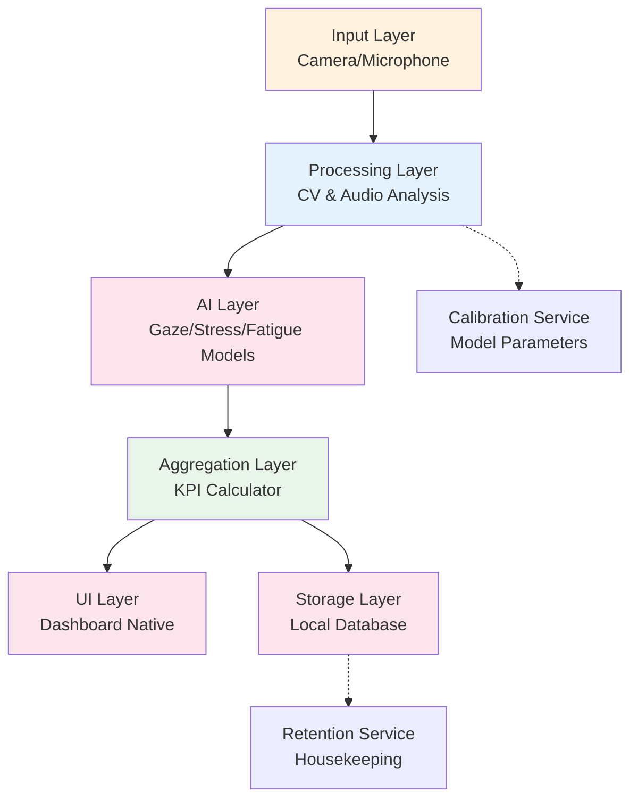
```mermaid
graph TB
    A[Input Layer<br/>Camera/Microphone] --> B[Processing Layer<br/>CV & Audio Analysis]
    B --> C[AI Layer<br/>Gaze/Stress/Fatigue Models]
    C --> D[Aggregation Layer<br/>KPI Calculator]
    D --> E[UI Layer<br/>Dashboard Native]
    D --> F[Storage Layer<br/>Local Database]
    
    B -.-> G[Calibration Service<br/>Model Parameters]
    F -.-> H[Retention Service<br/>Housekeeping]
    
    style A fill:#fff3e0
    style B fill:#e3f2fd
    style C fill:#fce4ec
    style D fill:#e8f5e8
    style E fill:#fce4ec
    style F fill:#fce4ec
```

## 2. Component Architecture

### 2.1 Input Layer Components

#### 2.1.1 Camera Capture Service

**Purpose:** Menangkap dan preprocessing video input untuk computer vision pipeline

**Key Specifications:**
- **Input Resolution**: 720p (1280x720) pada 15 FPS
- **Output Format**: Preprocessed frames untuk model inference
- **Latency Target**: <10ms untuk frame capture
- **Error Handling**: Graceful degradation pada low-light conditions

**Internal Structure:**
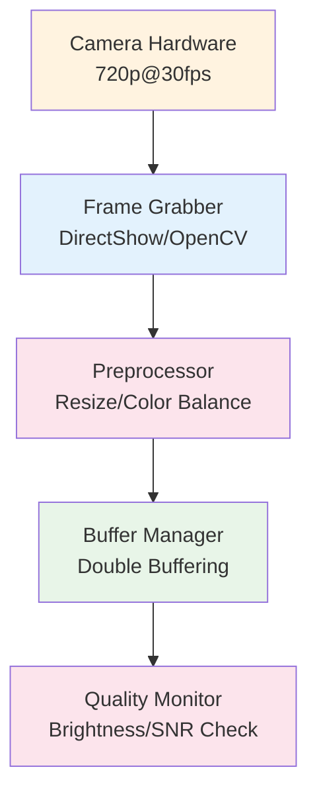
```mermaid
graph TD
    A[Camera Hardware<br/>720p@30fps] --> B[Frame Grabber<br/>DirectShow/OpenCV]
    B --> C[Preprocessor<br/>Resize/Color Balance]
    C --> D[Buffer Manager<br/>Double Buffering]
    D --> E[Quality Monitor<br/>Brightness/SNR Check]
    
    style A fill:#fff3e0
    style B fill:#e3f2fd
    style C fill:#fce4ec
    style D fill:#e8f5e8
    style E fill:#fce4ec
```

**Interfaces:**
- **Camera API**: Direct hardware access via OS APIs
- **Processing API**: Synchronous frame delivery ke CV pipeline
- **Configuration API**: Runtime parameter adjustment

#### 2.1.2 Audio Capture Service

**Purpose:** Menangkap dan preprocessing audio input untuk stress analysis

**Key Specifications:**
- **Sample Rate**: 16kHz, 16-bit mono
- **Buffer Size**: 30-second windows dengan 15-second overlap
- **Noise Reduction**: Adaptive filtering untuk background noise
- **Latency Target**: <50ms untuk audio processing

**Internal Structure:**
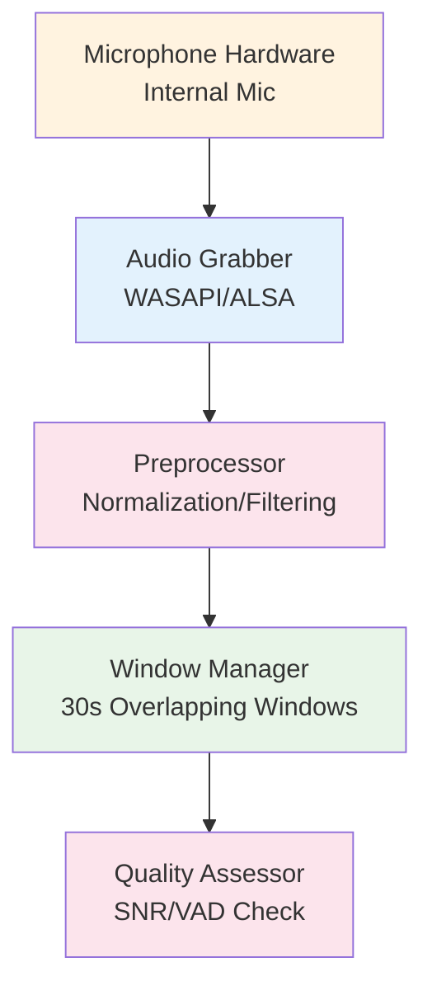
```mermaid
graph TD
    A[Microphone Hardware<br/>Internal Mic] --> B[Audio Grabber<br/>WASAPI/ALSA]
    B --> C[Preprocessor<br/>Normalization/Filtering]
    C --> D[Window Manager<br/>30s Overlapping Windows]
    D --> E[Quality Assessor<br/>SNR/VAD Check]
    
    style A fill:#fff3e0
    style B fill:#e3f2fd
    style C fill:#fce4ec
    style D fill:#e8f5e8
    style E fill:#fce4ec
```

### 2.2 Processing Layer Components

#### 2.2.1 Computer Vision Engine

**Purpose:** Real-time analysis untuk gaze estimation dan head pose detection

**Key Specifications:**
- **Model Framework**: OpenVINO untuk Intel GPU optimization
- **Inference Latency**: p95 ≤50ms per frame
- **Accuracy Target**: ≥85% untuk gaze direction
- **Memory Usage**: <200MB untuk model + buffers

**Internal Structure:**
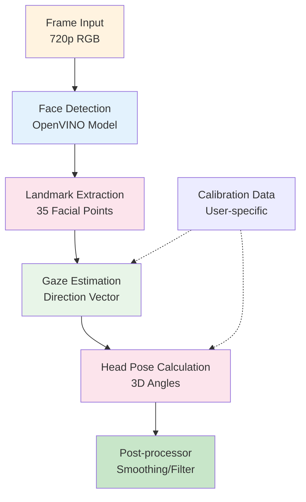
```mermaid
graph TD
    A[Frame Input<br/>720p RGB] --> B[Face Detection<br/>OpenVINO Model]
    B --> C[Landmark Extraction<br/>35 Facial Points]
    C --> D[Gaze Estimation<br/>Direction Vector]
    D --> E[Head Pose Calculation<br/>3D Angles]
    E --> F[Post-processor<br/>Smoothing/Filter]
    
    G[Calibration Data<br/>User-specific] -.-> D
    G -.-> E
    
    style A fill:#fff3e0
    style B fill:#e3f2fd
    style C fill:#fce4ec
    style D fill:#e8f5e8
    style E fill:#fce4ec
    style F fill:#c8e6c9
```

**Model Specifications:**
- **Gaze Model**: `gaze-estimation-adas-0002` (OpenVINO)
- **Face Detection**: `face-detection-adas-0001` (OpenVINO)
- **Landmarks**: `facial-landmarks-35-adas-0002` (OpenVINO)
- **Head Pose**: `head-pose-estimation-adas-0001` (OpenVINO)

#### 2.2.2 Audio Analysis Engine

**Purpose:** Real-time stress analysis dari audio input

**Key Specifications:**
- **Model Framework**: Custom DSP pipeline dengan ML components
- **Processing Latency**: p95 ≤150ms untuk 30s window
- **Features Extracted**: LF/HF power, heart rate, breathing rate
- **Memory Usage**: <150MB untuk processing pipeline

**Internal Structure:**
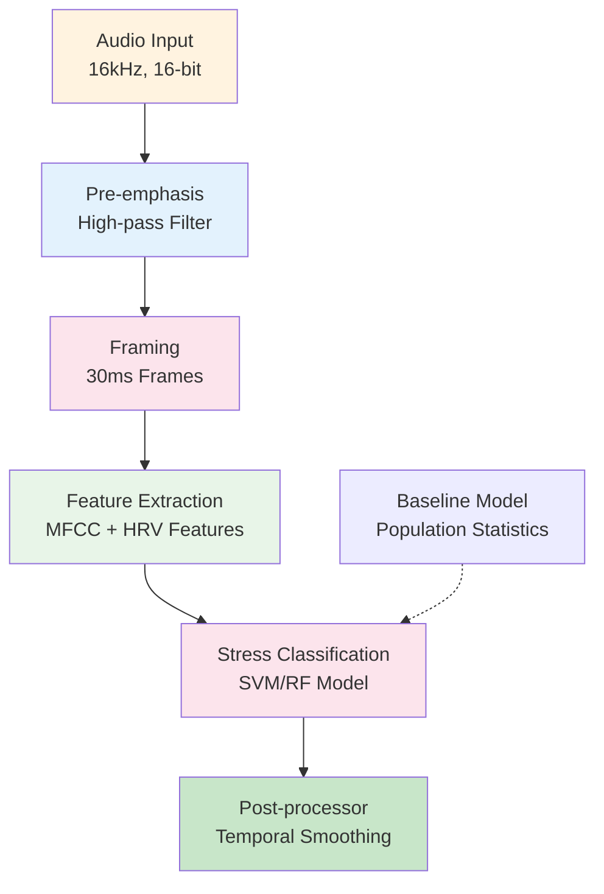
```mermaid
graph TD
    A[Audio Input<br/>16kHz, 16-bit] --> B[Pre-emphasis<br/>High-pass Filter]
    B --> C[Framing<br/>30ms Frames]
    C --> D[Feature Extraction<br/>MFCC + HRV Features]
    D --> E[Stress Classification<br/>SVM/RF Model]
    E --> F[Post-processor<br/>Temporal Smoothing]
    
    G[Baseline Model<br/>Population Statistics] -.-> E
    
    style A fill:#fff3e0
    style B fill:#e3f2fd
    style C fill:#fce4ec
    style D fill:#e8f5e8
    style E fill:#fce4ec
    style F fill:#c8e6c9
```

### 2.3 AI Layer Components

#### 2.3.1 Model Management Service

**Purpose:** Load, configure, dan manage AI models untuk optimal performance

**Key Specifications:**
- **Model Loading**: <2 detik untuk all models
- **Memory Management**: Efficient memory pooling untuk inference
- **Version Control**: Automatic model updates dengan rollback
- **Fallback Strategy**: CPU fallback jika GPU unavailable

**Internal Structure:**
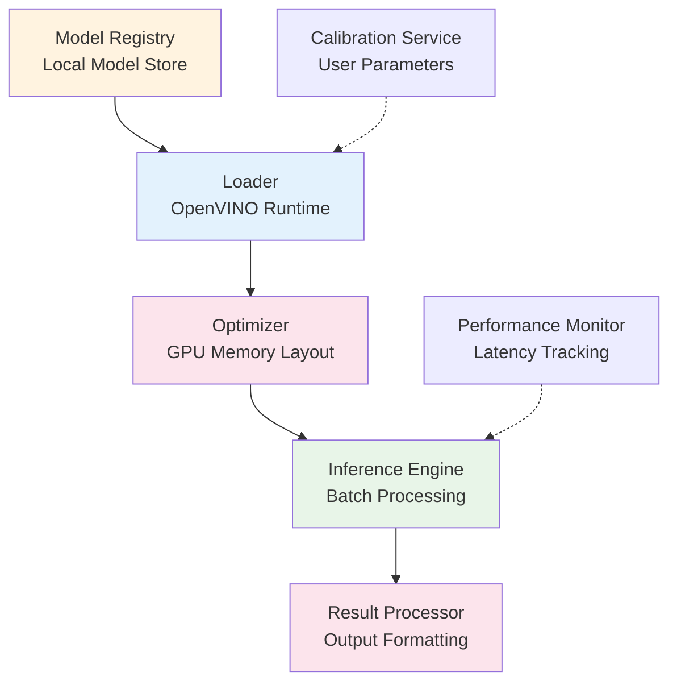
```mermaid
graph TD
    A[Model Registry<br/>Local Model Store] --> B[Loader<br/>OpenVINO Runtime]
    B --> C[Optimizer<br/>GPU Memory Layout]
    C --> D[Inference Engine<br/>Batch Processing]
    D --> E[Result Processor<br/>Output Formatting]
    
    F[Calibration Service<br/>User Parameters] -.-> B
    G[Performance Monitor<br/>Latency Tracking] -.-> D
    
    style A fill:#fff3e0
    style B fill:#e3f2fd
    style C fill:#fce4ec
    style D fill:#e8f5e8
    style E fill:#fce4ec
```

#### 2.3.2 Calibration Engine

**Purpose**: Adapt model parameters untuk individual user characteristics

**Key Specifications:**
- **Calibration Time**: <3 menit untuk 4-point calibration
- **Accuracy Improvement**: 15-20% improvement post-calibration
- **Persistence**: Calibration data stored encrypted locally
- **Recalibration**: Automatic suggestion jika error >15°

**Calibration Process:**
1. **Point Display**: Show 4 calibration points di screen corners
2. **Data Collection**: Capture gaze data untuk setiap point (2 detik)
3. **Matrix Calculation**: Compute transformation matrix menggunakan regression
4. **Validation**: Physical measurement untuk accuracy verification
5. **Storage**: Encrypt dan save calibration parameters

### 2.4 Aggregation Layer Components

#### 2.4.1 KPI Calculator

**Purpose**: Menggabungkan multiple data streams menjadi unified metrics

**Key Specifications:**
- **Update Rate**: Real-time KPI calculation setiap 2 detik
- **Data Integration**: Combine visual, audio, dan behavioral signals
- **Smoothing**: Exponential moving average untuk stability
- **Confidence Scoring**: Weighted confidence berdasarkan signal quality

**Internal Structure:**
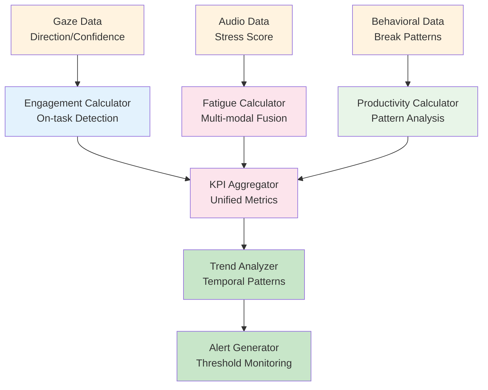
```mermaid
graph TD
    A[Gaze Data<br/>Direction/Confidence] --> B[Engagement Calculator<br/>On-task Detection]
    C[Audio Data<br/>Stress Score] --> D[Fatigue Calculator<br/>Multi-modal Fusion]
    E[Behavioral Data<br/>Break Patterns] --> F[Productivity Calculator<br/>Pattern Analysis]
    
    B --> G[KPI Aggregator<br/>Unified Metrics]
    D --> G
    F --> G
    
    G --> H[Trend Analyzer<br/>Temporal Patterns]
    H --> I[Alert Generator<br/>Threshold Monitoring]
    
    style A fill:#fff3e0
    style B fill:#e3f2fd
    style C fill:#fff3e0
    style D fill:#fce4ec
    style E fill:#fff3e0
    style F fill:#e8f5e8
    style G fill:#fce4ec
    style H fill:#c8e6c9
    style I fill:#c8e6c9
```

**KPI Calculation Formulas:**
- **Engagement Score**: `0.6 * gaze_onscreen + 0.3 * posture_upright + 0.1 * activity_level`
- **Fatigue Score**: `0.5 * visual_fatigue + 0.3 * audio_stress + 0.2 * time_factor`
- **Productivity Score**: `0.7 * on_task_ratio + 0.3 * break_optimization`

### 2.5 UI Layer Components

#### 2.5.1 Dashboard Renderer

**Purpose**: Real-time visualization untuk semua KPIs dan alerts

**Key Specifications:**
- **Framework**: Desktop native (WPF untuk Windows, GTK untuk Linux)
- **Update Rate**: 30 FPS untuk smooth animations
- **Responsiveness**: <100ms untuk user interactions
- **Accessibility**: WCAG 2.1 AA compliance

**Internal Structure:**
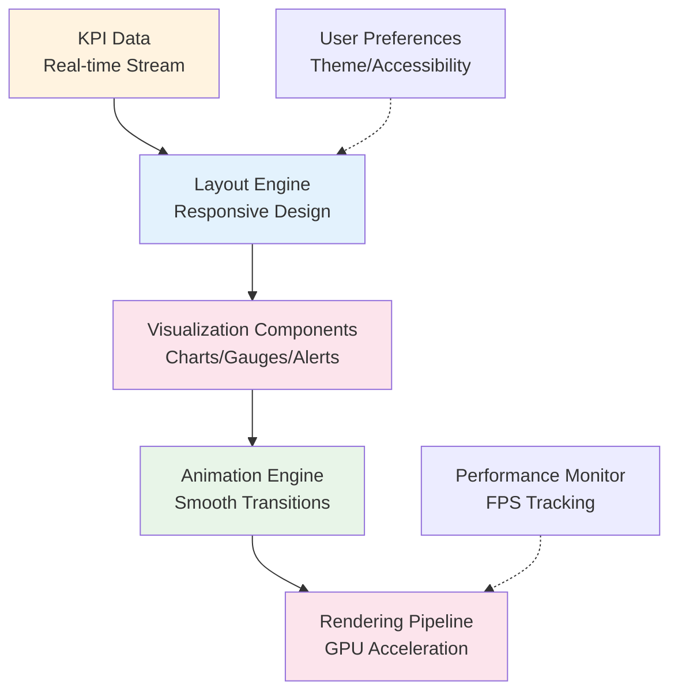
```mermaid
graph TD
    A[KPI Data<br/>Real-time Stream] --> B[Layout Engine<br/>Responsive Design]
    B --> C[Visualization Components<br/>Charts/Gauges/Alerts]
    C --> D[Animation Engine<br/>Smooth Transitions]
    D --> E[Rendering Pipeline<br/>GPU Acceleration]
    
    F[User Preferences<br/>Theme/Accessibility] -.-> B
    G[Performance Monitor<br/>FPS Tracking] -.-> E
    
    style A fill:#fff3e0
    style B fill:#e3f2fd
    style C fill:#fce4ec
    style D fill:#e8f5e8
    style E fill:#fce4ec
```

#### 2.5.2 Alert System

**Purpose**: Generate contextual alerts berdasarkan KPI thresholds

**Key Specifications:**
- **Alert Types**: Visual, subtle, non-intrusive notifications
- **Threshold Management**: Configurable per user preference
- **False Positive**: <5% untuk fatigue alerts
- **Response Time**: <1 detik dari threshold breach

**Alert Levels:**
- **Info**: General notifications (calibration needed)
- **Warning**: Medium priority (fatigue building)
- **Critical**: High priority (break recommended)
- **Error**: System issues (sensor problems)

### 2.6 Storage Layer Components

#### 2.6.1 Local Database Manager

**Purpose**: Manage structured storage untuk session data dan configuration

**Key Specifications:**
- **Database**: SQLite dengan encryption overlay
- **Performance**: <100ms untuk typical queries
- **Concurrency**: Thread-safe untuk multiple readers
- **Backup**: Automatic daily backup dengan integrity check

**Internal Structure:**
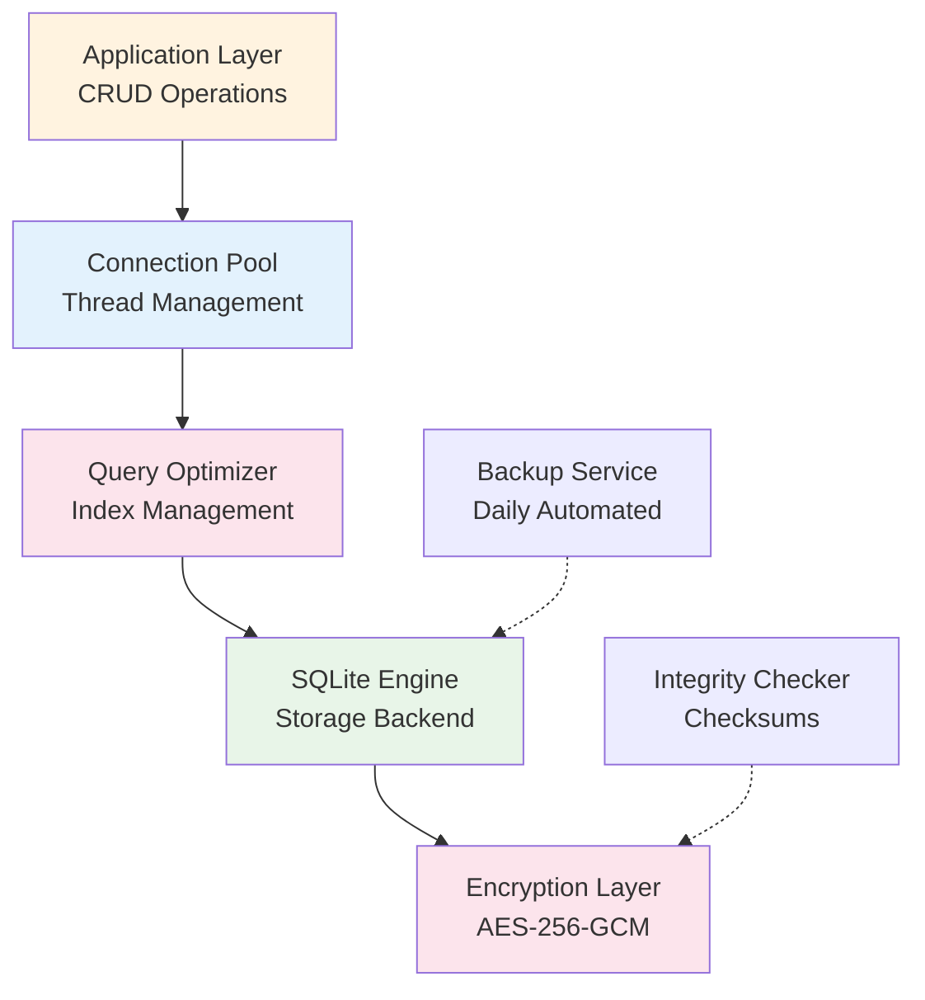
```mermaid
graph TD
    A[Application Layer<br/>CRUD Operations] --> B[Connection Pool<br/>Thread Management]
    B --> C[Query Optimizer<br/>Index Management]
    C --> D[SQLite Engine<br/>Storage Backend]
    D --> E[Encryption Layer<br/>AES-256-GCM]
    
    F[Backup Service<br/>Daily Automated] -.-> D
    G[Integrity Checker<br/>Checksums] -.-> E
    
    style A fill:#fff3e0
    style B fill:#e3f2fd
    style C fill:#fce4ec
    style D fill:#e8f5e8
    style E fill:#fce4ec
```

#### 2.6.2 Retention Manager

**Purpose**: Enforce data retention policies dengan automated housekeeping

**Key Specifications:**
- **Retention Period**: 30 hari untuk all session data
- **Housekeeping Schedule**: Daily scan dan cleanup
- **Performance Impact**: <5% resource usage during cleanup
- **Audit Trail**: Complete log untuk compliance

**Housekeeping Process:**
1. **Scan Phase**: Identify data >30 hari
2. **Archive Phase**: Encrypt dan move ke archive (jika required)
3. **Purge Phase**: Secure deletion tanpa recovery
4. **Verification Phase**: Confirm deletion dan update metrics

## 3. Deployment Topology

### 3.1 On-Device Deployment

**Single Device Architecture:**
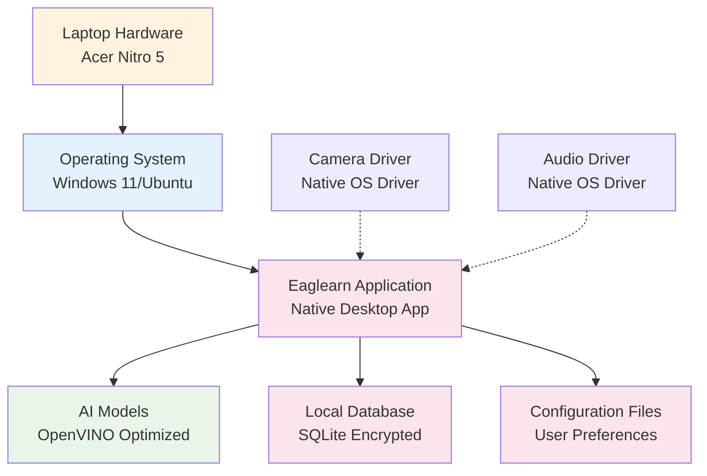
```mermaid
graph TB
    A[Laptop Hardware<br/>Acer Nitro 5] --> B[Operating System<br/>Windows 11/Ubuntu]
    B --> C[Eaglearn Application<br/>Native Desktop App]
    C --> D[AI Models<br/>OpenVINO Optimized]
    C --> E[Local Database<br/>SQLite Encrypted]
    C --> F[Configuration Files<br/>User Preferences]
    
    G[Camera Driver<br/>Native OS Driver] -.-> C
    H[Audio Driver<br/>Native OS Driver] -.-> C
    
    style A fill:#fff3e0
    style B fill:#e3f2fd
    style C fill:#fce4ec
    style D fill:#e8f5e8
    style E fill:#fce4ec
    style F fill:#fce4ec
```

**Deployment Specifications:**
- **Installation**: Single MSI/DEB package <50MB
- **Dependencies**: OpenVINO runtime, OS media drivers
- **Configuration**: Zero-config untuk basic operation
- **Updates**: Manual update dengan user consent

### 3.2 Component Interaction Patterns

#### 3.2.1 Synchronous Processing Pipeline

**Pattern:** Linear pipeline dengan synchronous processing untuk real-time requirements

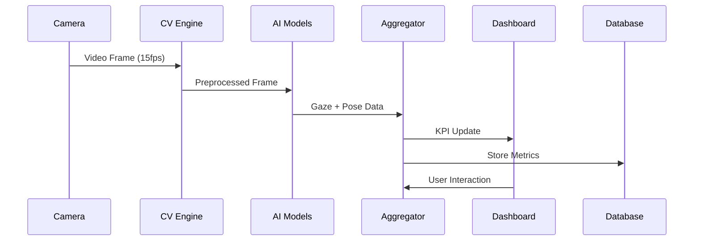
```mermaid
sequenceDiagram
    participant C as Camera
    participant CV as CV Engine
    participant AI as AI Models
    participant AG as Aggregator
    participant UI as Dashboard
    participant DB as Database

    C->>CV: Video Frame (15fps)
    CV->>AI: Preprocessed Frame
    AI->>AG: Gaze + Pose Data
    AG->>UI: KPI Update
    AG->>DB: Store Metrics
    UI->>AG: User Interaction
```

**Characteristics:**
- **Latency**: End-to-end <200ms
- **Throughput**: 15 FPS continuous
- **Error Handling**: Immediate fallback pada component failure
- **Resource Usage**: Optimized untuk single-thread efficiency

#### 3.2.2 Asynchronous Service Pattern

**Pattern:** Background services untuk non-real-time operations

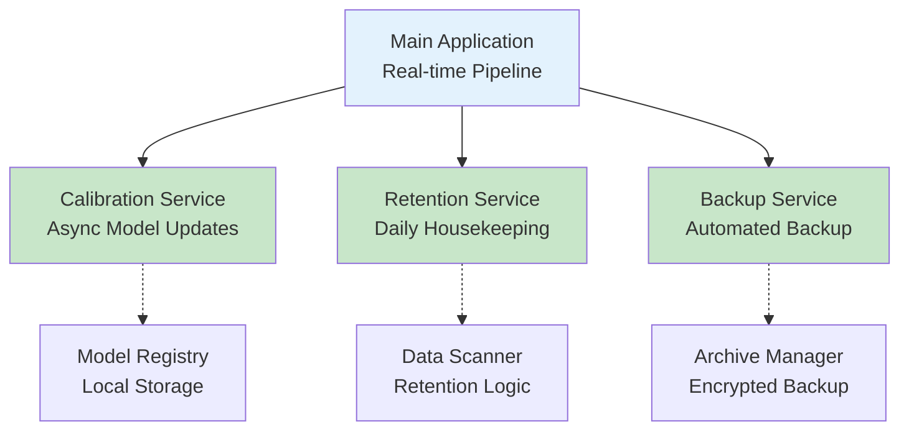
```mermaid
graph TD
    A[Main Application<br/>Real-time Pipeline] --> B[Calibration Service<br/>Async Model Updates]
    A --> C[Retention Service<br/>Daily Housekeeping]
    A --> D[Backup Service<br/>Automated Backup]
    
    B -.-> E[Model Registry<br/>Local Storage]
    C -.-> F[Data Scanner<br/>Retention Logic]
    D -.-> G[Archive Manager<br/>Encrypted Backup]
    
    style A fill:#e3f2fd
    style B fill:#c8e6c9
    style C fill:#c8e6c9
    style D fill:#c8e6c9
```

## 4. Data Flow Architecture

### 4.1 Real-time Data Flow

**High-Frequency Pipeline (15 FPS):**
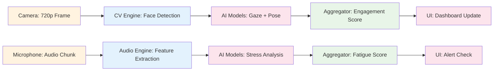
```mermaid
graph LR
    A[Camera: 720p Frame] --> B[CV Engine: Face Detection]
    B --> C[AI Models: Gaze + Pose]
    C --> D[Aggregator: Engagement Score]
    D --> E[UI: Dashboard Update]
    
    F[Microphone: Audio Chunk] --> G[Audio Engine: Feature Extraction]
    G --> H[AI Models: Stress Analysis]
    H --> I[Aggregator: Fatigue Score]
    I --> J[UI: Alert Check]
    
    style A fill:#fff3e0
    style B fill:#e3f2fd
    style C fill:#fce4ec
    style D fill:#e8f5e8
    style E fill:#fce4ec
    style F fill:#fff3e0
    style G fill:#e3f2fd
    style H fill:#fce4ec
    style I fill:#e8f5e8
    style J fill:#fce4ec
```

**Data Flow Specifications:**
- **Frame Processing**: 15 FPS dengan <50ms latency per frame
- **Audio Processing**: 30-second windows dengan <150ms latency
- **KPI Updates**: 2-second intervals dengan <100ms latency
- **Storage**: Asynchronous write dengan <200ms acknowledgment

### 4.2 Batch Processing Flow

**Low-Frequency Pipeline (Session End):**
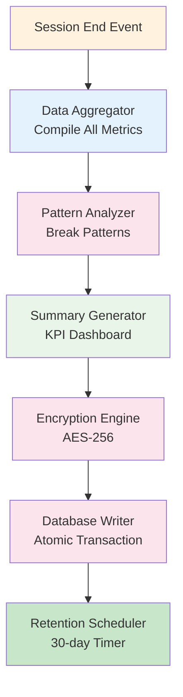
```mermaid
graph TD
    A[Session End Event] --> B[Data Aggregator<br/>Compile All Metrics]
    B --> C[Pattern Analyzer<br/>Break Patterns]
    C --> D[Summary Generator<br/>KPI Dashboard]
    D --> E[Encryption Engine<br/>AES-256]
    E --> F[Database Writer<br/>Atomic Transaction]
    F --> G[Retention Scheduler<br/>30-day Timer]
    
    style A fill:#fff3e0
    style B fill:#e3f2fd
    style C fill:#fce4ec
    style D fill:#e8f5e8
    style E fill:#fce4ec
    style F fill:#fce4ec
    style G fill:#c8e6c9
```

## 5. Security Architecture

### 5.1 Data Protection Framework

**Defense in Depth Strategy:**
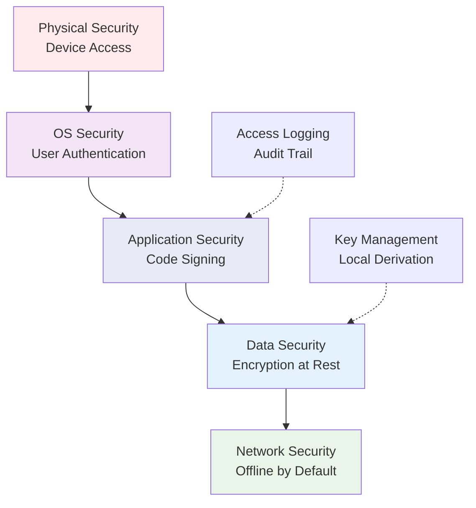
```mermaid
graph TD
    A[Physical Security<br/>Device Access] --> B[OS Security<br/>User Authentication]
    B --> C[Application Security<br/>Code Signing]
    C --> D[Data Security<br/>Encryption at Rest]
    D --> E[Network Security<br/>Offline by Default]
    
    F[Key Management<br/>Local Derivation] -.-> D
    G[Access Logging<br/>Audit Trail] -.-> C
    
    style A fill:#ffebee
    style B fill:#f3e5f5
    style C fill:#e8eaf6
    style D fill:#e3f2fd
    style E fill:#e8f5e8
```

**Security Components:**
- **Encryption Layer**: AES-256-GCM untuk all stored data
- **Key Management**: PBKDF2 key derivation dari user password
- **Access Control**: Role-based access untuk configuration
- **Audit Logging**: Comprehensive logs untuk security events

### 5.2 Privacy by Design

**GDPR Compliance Architecture:**
- **Data Minimization**: Collect only necessary metrics
- **Purpose Limitation**: Clear consent untuk each data type
- **Storage Limitation**: Automatic deletion setelah 30 hari
- **Integrity & Confidentiality**: Encryption dan access controls

## 6. Performance Architecture

### 6.1 Resource Management

**Resource Allocation Strategy:**
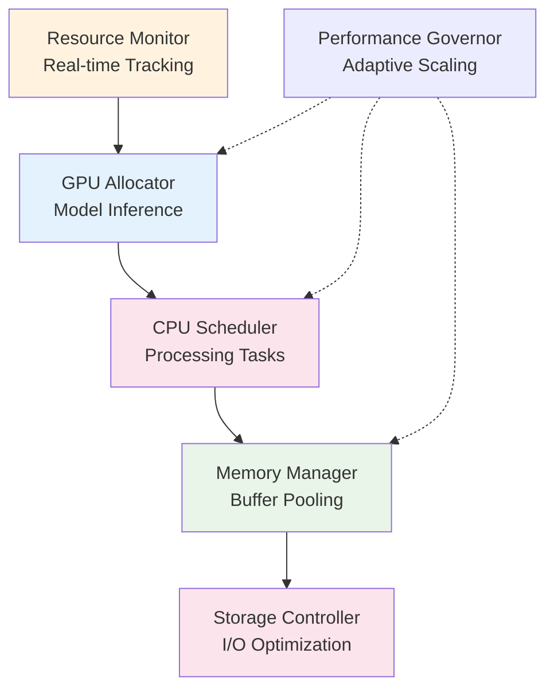
```mermaid
graph TD
    A[Resource Monitor<br/>Real-time Tracking] --> B[GPU Allocator<br/>Model Inference]
    B --> C[CPU Scheduler<br/>Processing Tasks]
    C --> D[Memory Manager<br/>Buffer Pooling]
    D --> E[Storage Controller<br/>I/O Optimization]
    
    F[Performance Governor<br/>Adaptive Scaling] -.-> B
    F -.-> C
    F -.-> D
    
    style A fill:#fff3e0
    style B fill:#e3f2fd
    style C fill:#fce4ec
    style D fill:#e8f5e8
    style E fill:#fce4ec
```

**Resource Limits:**
- **GPU Memory**: <60% untuk AI models dan buffers
- **CPU Usage**: <70% dengan dynamic frequency scaling
- **RAM Usage**: <80% dengan memory pooling
- **Storage I/O**: <20 MB/s untuk database operations

### 6.2 Caching Strategy

**Multi-Level Caching:**
- **Level 1**: CPU cache untuk hot frame data (milliseconds)
- **Level 2**: GPU memory untuk model weights (seconds)
- **Level 3**: RAM buffer untuk recent session data (minutes)
- **Level 4**: SSD cache untuk calibration data (hours)

## 7. Error Handling Architecture

### 7.1 Fault Tolerance Design

**Component Failure Handling:**
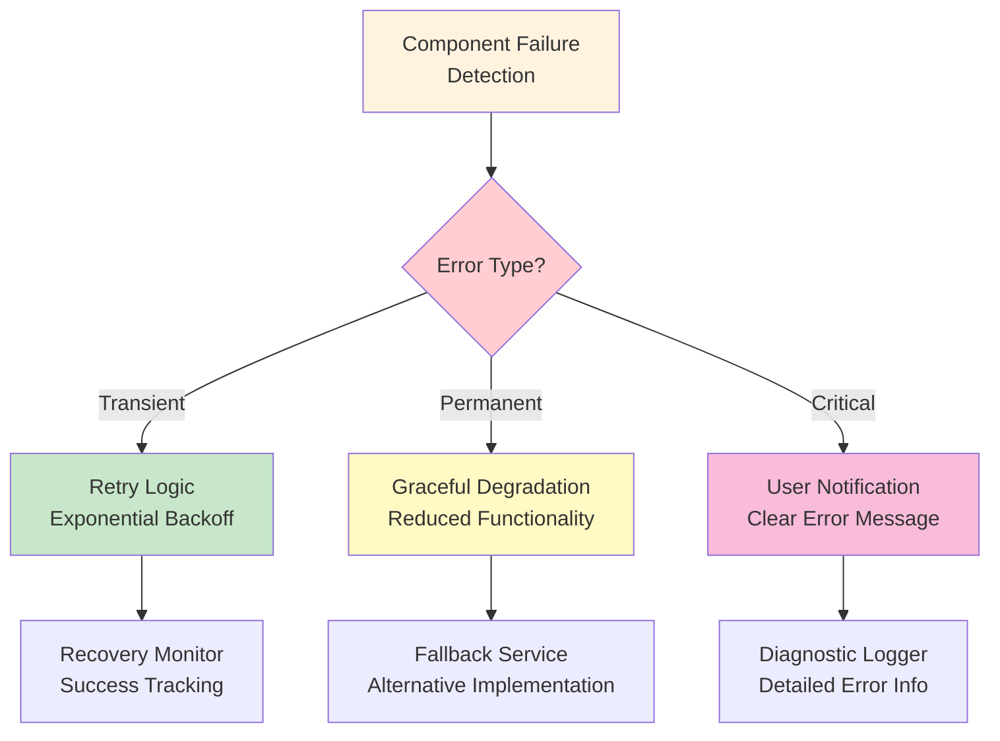
```mermaid
graph TD
    A[Component Failure<br/>Detection] --> B{Error Type?}
    B -->|Transient| C[Retry Logic<br/>Exponential Backoff]
    B -->|Permanent| D[Graceful Degradation<br/>Reduced Functionality]
    B -->|Critical| E[User Notification<br/>Clear Error Message]
    
    C --> F[Recovery Monitor<br/>Success Tracking]
    D --> G[Fallback Service<br/>Alternative Implementation]
    E --> H[Diagnostic Logger<br/>Detailed Error Info]
    
    style A fill:#fff3e0
    style B fill:#ffcdd2
    style C fill:#c8e6c9
    style D fill:#fff9c4
    style E fill:#f8bbd9
```

**Failure Scenarios:**
- **Camera Failure**: Switch ke audio-only mode
- **Model Failure**: Use baseline parameters dengan warning
- **Storage Failure**: Cache in memory dengan flush on recovery
- **UI Failure**: Command-line fallback untuk critical functions

## 8. Deployment Architecture

### 8.1 Installation Strategy

**Package Structure:**
```
eaglearn/
├── bin/
│   ├── eaglearn.exe (Windows)
│   └── eaglearn (Linux)
├── models/
│   ├── gaze_estimation.bin
│   ├── stress_analysis.bin
│   └── calibration_baseline.bin
├── config/
│   ├── default_config.json
│   └── user_preferences.json
├── data/
│   ├── sessions.db
│   └── archive/
└── docs/
    └── user_guide.md
```

**Installation Process:**
1. **Download**: Single package <50MB
2. **Verification**: Signature verification untuk security
3. **Dependencies**: Automatic installation of runtime dependencies
4. **Configuration**: Zero-config untuk basic operation

### 8.2 Update Strategy

**Update Mechanism:**
- **Trigger**: Manual user-initiated updates only
- **Delivery**: Encrypted package dengan signature verification
- **Rollback**: Automatic rollback pada update failure
- **Testing**: Staged update dengan validation

## 9. Assumptions dan Dependencies

**Assumptions:**
- Hardware capabilities sesuai target specifications
- Operating system provides stable driver interfaces
- User environment supports basic computer vision requirements
- Network connectivity not required untuk core functionality

**Dependencies:**
- Q01: Calibration parameters mempengaruhi model accuracy architecture
- Q02: Dashboard intervention requirements mempengaruhi UI architecture
- Q03: Accessibility preferences mempengaruhi UI component design
- Q04: Retention policies mempengaruhi storage architecture decisions

## 10. Architecture Quality Attributes

### 10.1 Performance Attributes

| Attribute | Target | Measurement | Verification |
|-----------|--------|-------------|--------------|
| **Latency** | p95 ≤200ms | End-to-end timing | Automated benchmarking |
| **Throughput** | 15 FPS | Frame processing rate | Continuous monitoring |
| **Resource Efficiency** | GPU <60% | Resource utilization | Performance profiling |

### 10.2 Security Attributes

| Attribute | Target | Measurement | Verification |
|-----------|--------|-------------|--------------|
| **Encryption** | AES-256 | Algorithm compliance | Security audit |
| **Access Control** | Role-based | Permission verification | Access testing |
| **Data Privacy** | GDPR compliant | Regulation mapping | Compliance audit |

### 10.3 Reliability Attributes

| Attribute | Target | Measurement | Verification |
|-----------|--------|-------------|--------------|
| **Availability** | 99% uptime | Downtime tracking | Long-term monitoring |
| **Fault Tolerance** | Graceful degradation | Error scenario testing | Failure injection |
| **Data Integrity** | Zero corruption | Checksum verification | Data validation |

## 11. Future Architecture Evolution

**Wave 2 Architecture Extensions:**
- **Distributed Processing**: Multi-component load balancing
- **Advanced AI**: Model ensemble dengan adaptive learning
- **Extended Storage**: Hierarchical storage dengan cloud backup
- **Rich UI**: Web-based dashboard dengan advanced visualizations

**Scalability Considerations:**
- **Horizontal Scaling**: Multi-session support
- **Vertical Scaling**: Higher resolution processing
- **Storage Scaling**: Partitioning untuk large datasets
- **Network Scaling**: Optional cloud integration untuk advanced features