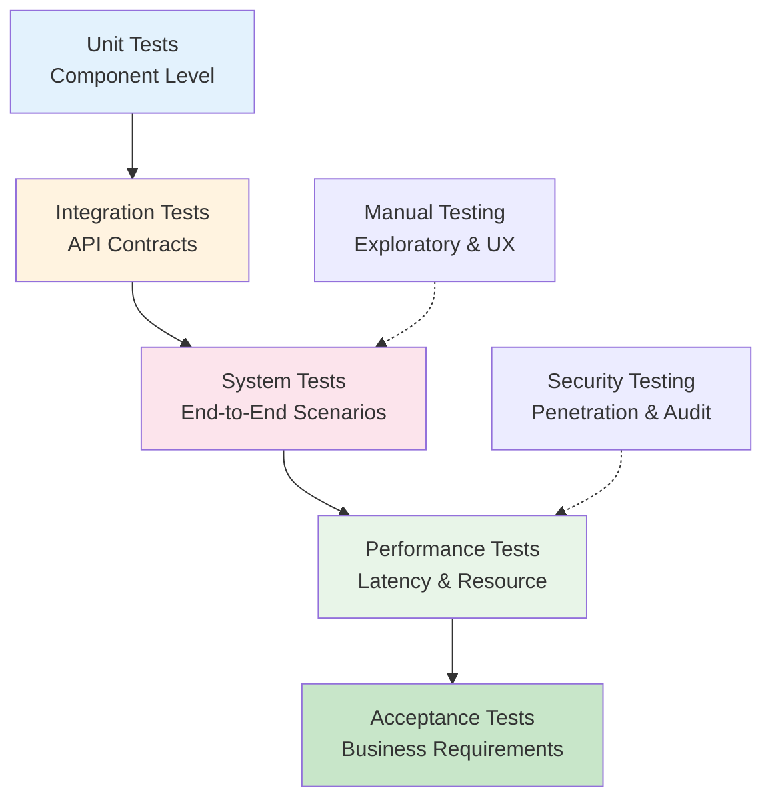
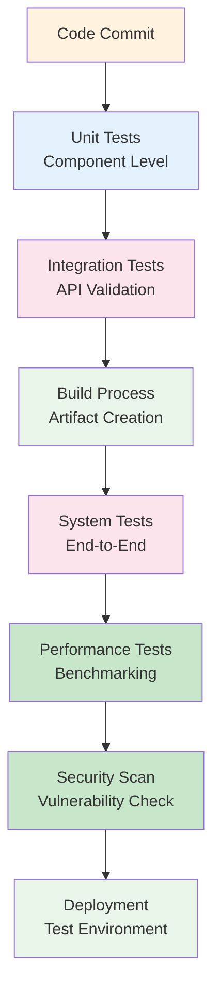
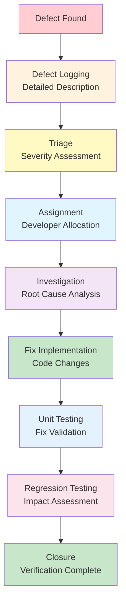

## 1. Testing Strategy Overview

Eaglearn Wave 1 testing strategy mengikuti pendekatan **pyramid testing** dengan fokus pada **early validation** dan **automated testing**. Strategy ini memastikan semua requirements terverifikasi sebelum deployment sambil meminimalkan manual testing effort.

## 2. Test Categories dan Coverage

### 2.1 Unit Testing

**Purpose**: Test individual components dalam isolation untuk early bug detection

**Coverage Target**: >80% code coverage untuk critical components

#### 2.1.1 Computer Vision Unit Tests

**Test Scope:** Gaze estimation, head pose detection, face landmark extraction

**Test Cases:**
- **UT-CV-01**: Gaze direction accuracy dengan known test vectors
- **UT-CV-02**: Head pose angle calculation dengan synthetic data
- **UT-CV-03**: Face detection robustness pada various lighting conditions
- **UT-CV-04**: Calibration matrix calculation accuracy
- **UT-CV-05**: Frame preprocessing pipeline validation

**Test Data:**
- **Synthetic Data**: Computer-generated faces dengan known gaze directions
- **Reference Data**: Pre-labeled test set dari research papers
- **Edge Cases**: Extreme angles, poor lighting, partial face occlusion

**Mock Strategy:**
- Mock camera input dengan pre-recorded test videos
- Mock OpenVINO runtime untuk controlled model outputs
- Mock calibration data untuk consistent testing

#### 2.1.2 Audio Analysis Unit Tests

**Test Scope:** Audio feature extraction, stress analysis, signal processing

**Test Cases:**
- **UT-AU-01**: Audio window segmentation accuracy
- **UT-AU-02**: Feature extraction (LF/HF power) correctness
- **UT-AU-03**: Stress score calculation dengan reference signals
- **UT-AU-04**: Noise reduction effectiveness
- **UT-AU-05**: Heart rate estimation accuracy dari synthetic audio

**Test Data:**
- **Synthetic Audio**: Computer-generated physiological signals
- **Reference Audio**: Pre-analyzed audio dengan known stress levels
- **Noise Samples**: Various background noise scenarios

#### 2.1.3 Dashboard Unit Tests

**Test Scope:** UI components, KPI calculations, alert generation

**Test Cases:**
- **UT-UI-01**: KPI calculation accuracy dari mock data
- **UT-UI-02**: Alert threshold triggering correctness
- **UT-UI-03**: UI responsiveness measurement
- **UT-UI-04**: Accessibility compliance validation
- **UT-UI-05**: Theme switching functionality

### 2.2 Integration Testing

**Purpose**: Test component interactions dan API contracts

**Coverage Target**: 100% API endpoints dengan contract validation

#### 2.2.1 Pipeline Integration Tests

**Test Scope:** End-to-end data flow dari sensor ke storage

**Test Cases:**
- **IT-PL-01**: Camera → Gaze Engine → Storage pipeline
- **IT-PL-02**: Microphone → Stress Analyzer → Dashboard pipeline
- **IT-PL-03**: Multi-modal data aggregation untuk KPI calculation
- **IT-PL-04**: Real-time processing dengan timing constraints
- **IT-PL-05**: Error propagation dan fallback mechanisms

**Test Environment:**
- **Hardware**: Acer Nitro 5 test device dengan target specifications
- **Software**: Full application stack dengan test database
- **Network**: Offline mode untuk eliminate external dependencies

#### 2.2.2 API Integration Tests

**Test Scope:** Internal API contracts dan data exchange

**Test Cases:**
- **IT-API-01**: `/v1/gaze/predict` response format validation
- **IT-API-02**: `/v1/stress/analyze` performance under load
- **IT-API-03**: `/v1/session/control` state management
- **IT-API-04**: `/v1/dashboard/kpi` real-time data streaming
- **IT-API-05**: Error handling untuk malformed requests

### 2.3 System Testing

**Purpose**: Test complete system behavior dalam realistic scenarios

**Coverage Target**: All use cases dengan primary dan alternate flows

#### 2.3.1 End-to-End Scenario Tests

**Test Scope:** Complete user journeys dari setup hingga data analysis

**Test Cases:**
- **ST-UC-01**: Complete learning session dengan mixed activities
- **ST-UC-02**: Calibration process end-to-end
- **ST-UC-03**: Data export dan retention compliance
- **ST-UC-04**: Cross-platform compatibility validation
- **ST-UC-05**: Recovery dari various failure scenarios

**Test Scenarios:**
1. **Normal Operation**: Standard usage tanpa interruptions
2. **Stress Conditions**: High load dengan resource constraints
3. **Error Conditions**: Component failures dan recovery
4. **Edge Cases**: Boundary conditions dan unusual inputs

#### 2.3.2 Platform Compatibility Tests

**Test Scope:** Cross-platform functionality dan performance parity

**Test Cases:**
- **ST-PL-01**: Windows 11 vs Ubuntu 22.04 performance comparison
- **ST-PL-02**: Installation dan setup pada both platforms
- **ST-PL-03**: Hardware acceleration verification
- **ST-PL-04**: Platform-specific feature validation
- **ST-PL-05**: Update mechanism testing per platform

### 2.4 Performance Testing

**Purpose**: Validate non-functional requirements untuk latency dan resource usage

**Coverage Target**: All NFR performance requirements dengan statistical confidence

#### 2.4.1 Latency Testing

**Test Scope:** End-to-end latency measurement untuk critical paths

**Test Cases:**
- **PT-LT-01**: Frame processing latency (target: p95 ≤200ms)
- **PT-LT-02**: Dashboard update latency (target: ≤100ms)
- **PT-LT-03**: API response latency (target: p95 ≤150ms)
- **PT-LT-04**: Storage operation latency (target: ≤100ms)
- **PT-LT-05**: Calibration process latency (target: <3 menit)

**Measurement Strategy:**
- **Tools**: Custom benchmarking scripts dengan high-precision timers
- **Metrics**: p50, p95, p99 latencies dengan confidence intervals
- **Load**: Realistic usage patterns dengan varying complexity

#### 2.4.2 Resource Usage Testing

**Test Scope:** Resource consumption validation untuk hardware targets

**Test Cases:**
- **PT-RU-01**: GPU usage selama 60-menit session (target: p95 <60%)
- **PT-RU-02**: CPU usage dengan concurrent processes (target: p95 <70%)
- **PT-RU-03**: Memory consumption trends (target: p95 <80%)
- **PT-RU-04**: Storage I/O patterns (target: <20 MB/s average)
- **PT-RU-05**: Power consumption impact (target: <30W additional)

**Monitoring Setup:**
- **GPU**: NVIDIA SMI monitoring setiap 5 detik
- **CPU**: Performance counters dengan process isolation
- **Memory**: RAM usage tracking dengan leak detection
- **Storage**: I/O statistics dengan queue depth monitoring

### 2.5 Security Testing

**Purpose**: Validate security requirements dan identify vulnerabilities

**Coverage Target**: OWASP Top 10 coverage untuk application security

#### 2.5.1 Data Security Tests

**Test Scope:** Encryption, access control, dan data protection

**Test Cases:**
- **ST-SEC-01**: AES-256 encryption effectiveness verification
- **ST-SEC-02**: Access control mechanism validation
- **ST-SEC-03**: Data sanitization pada export operations
- **ST-SEC-04**: Key management security assessment
- **ST-SEC-05**: GDPR compliance validation

#### 2.5.2 Privacy Testing

**Test Scope:** Privacy protection dan consent management

**Test Cases:**
- **ST-PRIV-01**: Consent mechanism enforcement
- **ST-PRIV-02**: Data minimization validation
- **ST-PRIV-03**: Retention policy compliance testing
- **ST-PRIV-04**: Pseudonimisasi effectiveness
- **ST-PRIV-05**: Right to erasure implementation

### 2.6 Accessibility Testing

**Purpose**: Validate WCAG 2.1 AA compliance dan usability

**Coverage Target**: 100% automated accessibility testing

#### 2.6.1 Automated Accessibility Tests

**Test Scope:** UI accessibility compliance menggunakan automated tools

**Test Cases:**
- **AT-ACC-01**: Color contrast ratio validation (target: >4.5:1)
- **AT-ACC-02**: Keyboard navigation path testing
- **AT-ACC-03**: Screen reader compatibility verification
- **AT-ACC-04**: Font size scalability testing (target: 14pt minimum)
- **AT-ACC-05**: High contrast mode functionality

**Tools:**
- **axe-core**: Automated accessibility scanning
- **WAVE**: Web accessibility evaluation
- **Lighthouse**: Performance dan accessibility audit
- **Custom Scripts**: Specialized accessibility test automation

#### 2.6.2 Manual Accessibility Tests

**Test Scope:** Human validation untuk complex accessibility scenarios

**Test Cases:**
- **MT-ACC-01**: Full keyboard-only navigation workflow
- **MT-ACC-02**: Screen reader user journey testing
- **MT-ACC-03**: Color vision deficiency simulation
- **MT-ACC-04**: Motor skill impairment scenario testing
- **MT-ACC-05**: Cognitive load assessment untuk UI complexity

## 3. Test Environment Setup

### 3.1 Hardware Test Environment

**Primary Test Device:**
- **Model**: Acer Nitro 5 AN515-58
- **CPU**: Intel i5-12500H
- **GPU**: RTX 3050 Mobile (6GB)
- **RAM**: 16GB DDR4
- **Storage**: 512GB NVMe SSD
- **Camera**: Integrated 720p webcam
- **Microphone**: Integrated stereo microphone

**Test Environment Variations:**
- **Lighting**: Controlled lighting (200-500 lux) vs variable lighting
- **Background**: Office environment vs home environment
- **Network**: Offline vs simulated poor connectivity
- **Power**: AC power vs battery power

### 3.2 Software Test Environment

**Operating Systems:**
- **Windows 11 23H2**: Primary development platform
- **Ubuntu 22.04 LTS**: Cross-platform compatibility
- **Test Tools**: Python 3.11, OpenVINO 2023, CUDA 12.2

**Test Data Management:**
- **Synthetic Data**: Generated test datasets untuk controlled testing
- **Reference Data**: Curated datasets dari research sources
- **Production Data**: Anonymized real session data untuk integration testing

## 4. Test Execution Strategy

### 4.1 Automated Test Execution

**CI/CD Integration:**

**Test Execution Schedule:**
- **Unit Tests**: Every code commit dengan <5 menit execution time
- **Integration Tests**: Every merge ke main branch dengan <15 menit execution
- **System Tests**: Daily regression dengan <2 jam execution
- **Performance Tests**: Weekly benchmarking dengan <4 jam execution

### 4.2 Manual Test Execution

**Exploratory Testing Sessions:**
- **Duration**: 2-hour sessions per major feature area
- **Participants**: 3-5 testers dengan diverse backgrounds
- **Coverage**: Edge cases dan real-world usage patterns
- **Documentation**: Session notes dengan screenshots dan observations

**User Acceptance Testing:**
- **Participants**: Target users (students) dengan no technical background
- **Scenarios**: Real learning sessions dengan actual coursework
- **Duration**: 1-week testing period dengan daily check-ins
- **Feedback**: Structured surveys dan interview sessions

## 5. Test Data Strategy

### 5.1 Synthetic Test Data

**Computer Vision Test Data:**
- **Face Images**: 1000 synthetic faces dengan varying angles dan lighting
- **Gaze Directions**: Ground truth gaze vectors untuk accuracy validation
- **Head Poses**: 3D pose annotations untuk pose estimation testing
- **Edge Cases**: Occluded faces, extreme lighting, motion blur

**Audio Test Data:**
- **Physiological Signals**: Synthetic heart rate dan breathing rate signals
- **Stress Patterns**: Controlled stress level variations
- **Noise Conditions**: Various SNR levels dan noise types
- **Edge Cases**: Audio clipping, silence periods, background speech

### 5.2 Reference Test Data

**Research Datasets:**
- **Gaze Data**: ETH-XGaze dataset samples untuk baseline comparison
- **Stress Data**: Contact-free stress measurement dataset
- **Behavioral Data**: Student engagement patterns dari educational research

**Validation Strategy:**
- **Ground Truth**: Manual annotation untuk accuracy assessment
- **Cross-Validation**: Multiple annotators untuk consistency
- **Quality Metrics**: SNR, confidence scores, manual review flags

## 6. Defect Management

### 6.1 Defect Tracking Process

**Defect Lifecycle:**

**Severity Classification:**
- **Critical**: System crash, data loss, security breach
- **High**: Feature broken, major performance degradation
- **Medium**: Minor functionality issues, UI problems
- **Low**: Cosmetic issues, minor improvements

### 6.2 Test Reporting

**Daily Test Reports:**
- Test execution summary dengan pass/fail rates
- Performance trends dengan regression detection
- Resource usage patterns dan anomalies
- Defect summary dengan aging analysis

**Weekly Test Reports:**
- Coverage analysis dengan gap identification
- Risk assessment untuk untested areas
- Performance benchmarking results
- Recommendations untuk test improvement

## 7. Success Metrics dan Exit Criteria

### 7.1 Quality Gates

**Pre-Release Gates:**
- ✅ Unit test coverage >80% untuk critical components
- ✅ Integration tests pass rate >95%
- ✅ System tests cover all primary use cases
- ✅ Performance tests meet all NFR targets
- ✅ Security scan zero critical vulnerabilities
- ✅ Accessibility compliance 100% WCAG 2.1 AA

**Release Gates:**
- ✅ All critical defects resolved
- ✅ Regression test suite passes
- ✅ Performance benchmarks within acceptable ranges
- ✅ User acceptance testing feedback incorporated

### 7.2 Test Coverage Metrics

| Test Level | Coverage Target | Measurement Method | Current Status |
|------------|-----------------|-------------------|---------------|
| **Unit Tests** | >80% code coverage | Coverage.py analysis | Pending baseline |
| **API Tests** | 100% endpoints | Postman/Newman automation | Pending implementation |
| **Integration Tests** | >90% component pairs | Custom integration test framework | Pending development |
| **E2E Tests** | All primary scenarios | Selenium + custom scripts | Pending automation |

### 7.3 Performance Baselines

**Latency Baselines:**
- **Gaze Estimation**: p95 ≤50ms pada 720p input
- **Stress Analysis**: p95 ≤150ms pada 30s audio window
- **Dashboard Update**: p95 ≤100ms untuk KPI changes
- **Storage Operations**: p95 ≤100ms untuk database queries

**Resource Usage Baselines:**
- **GPU Usage**: p95 <60% selama typical session
- **CPU Usage**: p95 <70% dengan concurrent applications
- **Memory Usage**: p95 <80% tanpa memory pressure
- **Storage I/O**: Average <20 MB/s untuk session data

## 8. Risk Assessment

### 8.1 Testing Risks

| Risk | Probability | Impact | Mitigation Strategy |
|------|-------------|--------|-------------------|
| **Hardware Variability** | High | Medium | Test pada multiple devices dengan same specifications |
| **Environment Differences** | Medium | High | Controlled test environment dengan documented conditions |
| **Flaky Tests** | High | Medium | Retry logic dengan statistical analysis untuk transient failures |
| **Test Data Quality** | Medium | High | Rigorous validation dan cross-checking untuk all test data |

### 8.2 Mitigation Strategies

**Risk Mitigation:**
- **Automated Monitoring**: Real-time test execution monitoring dengan alerting
- **Parallel Testing**: Multiple test environments untuk faster feedback
- **Test Data Management**: Version-controlled test data dengan quality gates
- **Continuous Validation**: Automated regression detection dengan trend analysis

## 9. Tools dan Infrastructure

### 9.1 Testing Tools

| Category | Tool | Purpose | Configuration |
|----------|------|---------|---------------|
| **Unit Testing** | pytest | Python unit test framework | Parallel execution, coverage reporting |
| **API Testing** | Postman/Newman | API contract validation | Automated regression, performance testing |
| **Performance** | Locust | Load testing framework | Custom scenarios, real-time monitoring |
| **Accessibility** | axe-core | Automated accessibility scanning | CI/CD integration, detailed reporting |
| **Security** | OWASP ZAP | Security vulnerability scanning | Automated scanning, API testing |

### 9.2 Test Infrastructure

**CI/CD Pipeline:**
- **Build Server**: GitHub Actions dengan self-hosted runners
- **Test Database**: Dedicated SQLite instances per test run
- **Artifact Storage**: Local storage dengan encryption untuk test artifacts
- **Monitoring**: ELK stack untuk test execution analytics

## 10. Assumptions dan Dependencies

**Assumptions:**
- Test environment hardware matches production targets
- Test data sufficiently representative untuk real usage
- Automated testing provides reliable results dengan acceptable flake rate
- Manual testing resources available untuk exploratory testing

**Dependencies:**
- Q01: Calibration parameters mempengaruhi test data requirements
- Q02: Dashboard intervention thresholds mempengaruhi UI test scenarios
- Q03: Accessibility preferences mempengaruhi manual testing scope
- Q04: Retention policies mempengaruhi data cleanup testing

## 11. Future Testing Evolution

**Wave 2 Testing Enhancements:**
- **Advanced Performance**: Multi-user load testing
- **AI Model Testing**: Model drift detection dan validation
- **Integration Testing**: Third-party system integration validation
- **User Experience**: Advanced usability testing dengan eye-tracking

**Testing Infrastructure Evolution:**
- **Test Automation**: Increased automation untuk manual test scenarios
- **Performance Testing**: Advanced profiling dengan production-like loads
- **Security Testing**: Enhanced penetration testing dengan threat modeling
- **Compliance Testing**: Automated GDPR compliance validation