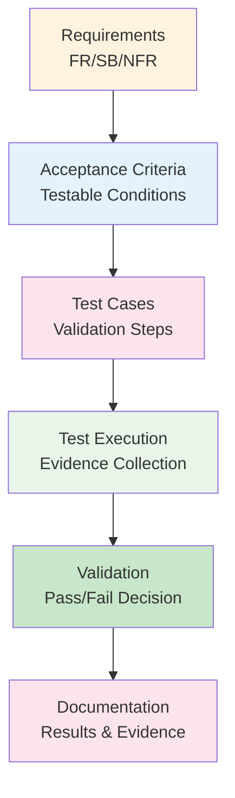

## 1. Acceptance Testing Overview

Eaglearn Wave 1 acceptance criteria mendefinisikan kondisi konkret untuk memvalidasi bahwa sistem memenuhi business requirements dan technical specifications. Criteria ini menjadi dasar untuk **user acceptance testing** dan **final validation** sebelum deployment.

## 2. Business Goal Acceptance Criteria

### 2.1 SB-01: Visual Engagement Monitoring

**Acceptance Criteria:** Pada uji 10 sesi, ≥80% frame mencatat tatapan on-screen atau postur tegak selama ≥70% durasi sesi

**Validation Tests:**

#### AT-SB01-01: Mixed Learning Session Test
**Test Scenario:** User melakukan belajar campuran (laptop + catatan fisik) selama 45 menit

**Preconditions:**
- Aplikasi terinstall dan dikalibrasi
- Pencahayaan ruangan 200-500 lux
- User duduk 50-80 cm dari kamera
- Test scenario: Baca PDF sambil buat catatan manual

**Test Steps:**
1. Start session dan begin mixed learning activity
2. Monitor gaze tracking selama note-taking periods
3. Record engagement scores setiap 30 detik
4. End session setelah 45 menit
5. Analyze session log untuk engagement metrics

**Expected Results:**
- Gaze tracking accuracy ≥75% selama note-taking
- Engagement score ≥80% untuk 70% session duration
- No false disengagement selama active note-taking

**Evidence Required:**
- Session log dengan timestamped engagement scores
- Video recording untuk manual verification
- Calibration report dengan error metrics

#### AT-SB01-02: Digital Learning Focus Test
**Test Scenario:** User fokus pada konten digital tanpa note-taking

**Preconditions:**
- Full-screen application atau PDF viewer aktif
- User position optimal untuk gaze tracking
- No physical note-taking activity

**Test Steps:**
1. Start session dengan digital content focus
2. Monitor on-screen gaze percentage
3. Track head pose untuk attention indicators
4. End session setelah 30 menit

**Expected Results:**
- On-screen gaze ≥90% selama active content engagement
- Head pose "tegak" untuk ≥85% session time
- Engagement score consistently above 80%

**Evidence Required:**
- Gaze tracking log dengan screen coordinate mapping
- Head pose analysis dengan angle measurements
- Session summary dengan engagement timeline

### 2.2 SB-02: Early Fatigue Detection

**Acceptance Criteria:** Sistem memunculkan skor fatigue/stress ≤60 detik setelah indikator multimodal melewati ambang tinggi

**Validation Tests:**

#### AT-SB02-01: Fatigue Build-up Detection Test
**Test Scenario:** Simulate extended learning session dengan increasing fatigue

**Preconditions:**
- User telah belajar selama 2+ jam sebelum test
- Baseline fatigue score established
- Multi-modal sensors aktif dan calibrated

**Test Steps:**
1. Start monitoring session
2. Track visual indicators (micro-expressions, posture)
3. Monitor audio stress indicators
4. Combine signals untuk fatigue scoring
5. Measure response time untuk score changes

**Expected Results:**
- Fatigue score update ≤60 detik setelah visual/audio indicators
- Multi-modal fusion accuracy ≥80%
- Early warning sebelum user self-reports fatigue

**Evidence Required:**
- Timestamped fatigue score log
- Multi-modal signal correlation analysis
- User feedback survey tentang fatigue experience

#### AT-SB02-02: Stress Response Validation Test
**Test Scenario:** Induce mild stress melalui challenging tasks

**Preconditions:**
- Stress baseline measurement completed
- Challenging but solvable tasks prepared
- Audio-visual monitoring active

**Test Steps:**
1. Present series of increasingly difficult tasks
2. Monitor stress indicators (vocal, facial, behavioral)
3. Track response time untuk stress score updates
4. Validate against self-reported stress levels

**Expected Results:**
- Stress detection latency ≤60 detik dari onset
- Correlation ≥0.7 dengan self-reported stress
- No false positives selama relaxed periods

**Evidence Required:**
- Stress score timeline dengan task markers
- Audio feature analysis (LF/HF power ratios)
- Self-report stress questionnaire results

### 2.3 SB-03: Productivity Measurement Accuracy

**Acceptance Criteria:** Selisih pencatatan on-task vs break ≤5% dibanding penanda manual pada 5 sesi uji

**Validation Tests:**

#### AT-SB03-01: On-task Detection Accuracy Test
**Test Scenario:** Manual annotation vs system detection comparison

**Preconditions:**
- Video recording dengan clear view of user activity
- Manual annotator trained untuk on-task classification
- System monitoring active selama test

**Test Steps:**
1. Conduct 45-menit learning session dengan varied activities
2. Manual annotator mark on-task periods dari video
3. Compare dengan system-generated on-task timeline
4. Calculate accuracy metrics untuk different activity types

**Expected Results:**
- On-task detection accuracy ≥95% overall
- Break detection accuracy ≥90%
- False positive rate <5% untuk break classification

**Evidence Required:**
- Side-by-side comparison of manual vs system annotations
- Confusion matrix untuk different activity types
- Accuracy statistics dengan confidence intervals

#### AT-SB03-02: Break Pattern Recognition Test
**Test Scenario:** Validate break pattern identification algorithms

**Preconditions:**
- Multiple sessions dengan different break patterns
- Ground truth break timing dari manual observation
- Pattern recognition algorithms calibrated

**Test Steps:**
1. Analyze sessions dengan known break patterns (Pomodoro, flowtime, irregular)
2. Compare system-identified patterns dengan ground truth
3. Validate pattern classification accuracy
4. Test pattern adaptation untuk individual users

**Expected Results:**
- Pattern classification accuracy ≥85%
- Break duration estimation error ≤10%
- Pattern evolution tracking across sessions

**Evidence Required:**
- Pattern analysis report dengan classification confidence
- Break timing comparison charts
- User behavior adaptation metrics

### 2.4 SB-04: Responsive Dashboard Experience

**Acceptance Criteria:** Dashboard menampilkan ringkasan KPI lengkap ≤5 detik setelah aplikasi dijalankan

**Validation Tests:**

#### AT-SB04-01: Application Startup Performance Test
**Test Scenario:** Cold start performance measurement

**Preconditions:**
- Application not running in background
- System resources available (no high CPU/memory usage)
- Target hardware (Acer Nitro 5) dengan clean state

**Test Steps:**
1. Measure time dari application launch ke dashboard ready
2. Track loading sequence untuk each component
3. Monitor resource usage during startup
4. Test startup performance across multiple runs

**Expected Results:**
- Dashboard ready ≤5 detik dari application launch
- All KPIs populated dengan current data
- No blocking operations during startup sequence

**Evidence Required:**
- Startup timing logs dengan component breakdown
- Resource usage graphs during startup
- User experience survey tentang perceived responsiveness

#### AT-SB04-02: Real-time Responsiveness Test
**Test Scenario:** Live dashboard performance selama active session

**Preconditions:**
- Active monitoring session in progress
- Dashboard displaying real-time KPIs
- Multiple data streams feeding dashboard

**Test Steps:**
1. Monitor dashboard update frequency
2. Measure latency dari data change ke UI reflection
3. Track frame rate untuk smooth animations
4. Test responsiveness dengan various data volumes

**Expected Results:**
- Dashboard updates ≤2 detik untuk all KPI changes
- Animation frame rate ≥30 FPS consistently
- No UI freezing atau stuttering selama monitoring

**Evidence Required:**
- Real-time performance logs dengan timestamp correlation
- Frame rate monitoring data
- User interaction responsiveness metrics

## 3. Functional Requirements Acceptance Criteria

### 3.1 Computer Vision Features (FR-E01, FR-E02, FR-E03)

#### AT-FRE01: Gaze Estimation Accuracy
**Criteria:** Akurasi ≥85% pada pencahayaan 200-500 lux dengan 10 menit testing

**Test Method:**
- **Setup**: Controlled lighting environment (200-500 lux)
- **Calibration**: 4-point calibration sebelum testing
- **Validation**: 10 menit continuous gaze tracking
- **Measurement**: Confusion matrix untuk gaze directions

**Pass Criteria:**
- Overall accuracy ≥85% untuk gaze direction classification
- Left/right/off-screen detection ≥80% accuracy
- Processing latency p95 ≤50ms

#### AT-FRE02: Head Pose Detection
**Criteria:** Kesalahan sudut ≤10° dengan update ≥10 fps

**Test Method:**
- **Setup**: Fixed camera position dengan known distances
- **Reference**: Ground truth head pose measurements
- **Validation**: Continuous 5-menit pose tracking
- **Measurement**: Mean Absolute Error (MAE) untuk pitch/yaw/roll

**Pass Criteria:**
- MAE ≤10° untuk all pose angles
- Update rate ≥10 FPS selama testing
- Pose classification accuracy ≥85%

#### AT-FRE03: Gesture Recognition
**Criteria:** Recall ≥0.8 untuk gesture tubuh bagian atas

**Test Method:**
- **Setup**: Video recording dengan labeled gestures
- **Dataset**: 100 cuplikan dengan ground truth labels
- **Validation**: Gesture classification performance
- **Measurement**: Precision, recall, F1-score per gesture type

**Pass Criteria:**
- Recall ≥0.8 untuk primary gestures (mengangkat tangan, menopang dagu)
- False positive rate <15% untuk non-gesture movements
- Processing confidence scores >0.7 untuk valid detections

### 3.2 Audio Analysis Features (FR-S01, FR-S02, FR-S03)

#### AT-FRS01: Audio Stress Analysis
**Criteria:** Indeks stress update setiap 30 detik dengan smoothing

**Test Method:**
- **Setup**: Audio recording dengan known stress levels
- **Baseline**: Resting state stress measurement
- **Validation**: Stress induction dengan cognitive tasks
- **Measurement**: Stress score correlation dengan ground truth

**Pass Criteria:**
- Update interval = 30 detik dengan <5% variance
- Stress score correlation ≥0.7 dengan reference measurements
- Smoothing algorithm maintains score stability (varian <15%)

#### AT-FRS02: Micro-expression Detection
**Criteria:** Akurasi ≥80% untuk micro-expression kelelahan utama

**Test Method:**
- **Setup**: Video dataset dengan labeled micro-expressions
- **Dataset**: 300 klip dengan expert annotations
- **Validation**: Cross-validation dengan multiple folds
- **Measurement**: Accuracy, precision, recall per expression type

**Pass Criteria:**
- Overall accuracy ≥80% untuk fatigue-related expressions
- Detection latency <2 detik dari expression onset
- False positive rate <10% untuk neutral expressions

#### AT-FRS03: Fatigue Score Integration
**Criteria:** Skor fatigue 0-100 dengan smoothing <60 detik

**Test Method:**
- **Setup**: Multi-modal data collection (audio + visual)
- **Integration**: Weighted combination dari multiple signals
- **Validation**: Fatigue score correlation dengan behavioral observations
- **Measurement**: Score stability dan responsiveness metrics

**Pass Criteria:**
- Score range 0-100 dengan meaningful gradations
- Smoothing window <60 detik untuk responsiveness
- Multi-modal integration improves accuracy ≥10% vs single modality

### 3.3 Productivity Features (FR-P01, FR-P02)

#### AT-FRP01: On-task Tracking
**Criteria:** Kesalahan ≤5% dibanding penanda manual pada 5 sesi uji

**Test Method:**
- **Setup**: Side-by-side manual annotation vs system tracking
- **Sessions**: 5 sessions dengan varied activity types
- **Validation**: Statistical comparison of on-task periods
- **Measurement**: Mean absolute percentage error (MAPE)

**Pass Criteria:**
- MAPE ≤5% untuk on-task duration across all sessions
- Break detection accuracy ≥90%
- No systematic bias dalam tracking (even error distribution)

#### AT-FRP02: Break Pattern Analysis
**Criteria:** Identifikasi pola jeda dengan ringkasan per sesi

**Test Method:**
- **Setup**: Sessions dengan intentional break patterns
- **Analysis**: Pattern recognition algorithm validation
- **Validation**: Pattern classification accuracy assessment
- **Measurement**: Pattern recognition metrics dan summary quality

**Pass Criteria:**
- Pattern classification accuracy ≥80% untuk common patterns
- Break summary completeness ≥90% untuk session analysis
- Pattern evolution tracking across multiple sessions

### 3.4 Monitoring Features (FR-M01, FR-M02)

#### AT-FRM01: Dashboard Real-time Display
**Criteria:** KPI utama dengan refresh ≤2 detik dan indikator status jelas

**Test Method:**
- **Setup**: Live dashboard dengan active monitoring
- **Monitoring**: Real-time KPI updates measurement
- **Validation**: Update latency dan visual clarity assessment
- **Measurement**: End-to-end latency dari data ke display

**Pass Criteria:**
- KPI refresh interval ≤2 detik consistently
- Visual indicators clear dan unambiguous
- No information loss during rapid updates

#### AT-FRM02: Data Retention Management
**Criteria:** Log terenkripsi tersimpan lokal dan hapus otomatis setelah 30 hari

**Test Method:**
- **Setup**: System dengan data retention policies configured
- **Storage**: Monitor data storage dan encryption
- **Validation**: Retention enforcement dan cleanup verification
- **Measurement**: Data lifecycle compliance metrics

**Pass Criteria:**
- All logs encrypted dengan AES-256 before storage
- 30-day retention policy enforced automatically
- Secure deletion tanpa data recovery possibility

## 4. Non-Functional Requirements Acceptance Criteria

### 4.1 Performance NFRs

#### AT-NFR02: End-to-End Latency
**Criteria:** Latensi inferensi end-to-end per frame ≤200 ms untuk input 720p

**Test Method:**
- **Setup**: High-precision timing measurement
- **Load**: 1000 frame sample dengan 720p input
- **Validation**: Latency profiling across processing pipeline
- **Measurement**: p95 latency dengan statistical confidence

**Pass Criteria:**
- p95 latency ≤200ms untuk frame processing
- p99 latency ≤300ms untuk worst-case scenarios
- No frame drops selama measurement period

#### AT-NFR03: UI Responsiveness
**Criteria:** Dashboard refresh tanpa tearing dengan FPS UI ≥30

**Test Method:**
- **Setup**: Frame rate monitoring tools
- **Display**: Dashboard with real-time animations
- **Validation**: FPS measurement dan visual quality assessment
- **Measurement**: Frame timing dan rendering performance

**Pass Criteria:**
- Consistent 30+ FPS selama monitoring sessions
- Zero tearing atau visual artifacts
- Smooth animations tanpa stuttering

#### AT-NFR07: Resource Utilization
**Criteria:** Konsumsi GPU <60% dan CPU <70% selama sesi 60 menit

**Test Method:**
- **Setup**: Resource monitoring dengan baseline measurement
- **Load**: 60-menit continuous operation
- **Validation**: Resource usage profiling dan trend analysis
- **Measurement**: p95 resource utilization dengan alerting

**Pass Criteria:**
- GPU utilization p95 <60% selama entire session
- CPU utilization p95 <70% tanpa thermal throttling
- Memory usage stable tanpa leaks atau pressure

### 4.2 Security NFRs

#### AT-NFR04: Data Encryption
**Criteria:** Data disimpan terenkripsi AES-256 dengan kunci lokal

**Test Method:**
- **Setup**: Security audit dengan encryption validation
- **Storage**: Sample data files untuk encryption verification
- **Validation**: Cryptographic analysis dan key management review
- **Measurement**: Encryption strength dan implementation compliance

**Pass Criteria:**
- 100% stored data encrypted dengan AES-256-GCM
- Key management follows security best practices
- No plaintext sensitive data dalam storage

#### AT-NFR08: Data Retention
**Criteria:** Auto-delete data >30 hari tanpa intervensi manual

**Test Method:**
- **Setup**: System dengan seeded test data berbagai ages
- **Retention**: Monitor automated cleanup processes
- **Validation**: Data deletion verification dan audit trail
- **Measurement**: Retention compliance dan cleanup effectiveness

**Pass Criteria:**
- Data >30 hari automatically identified dan purged
- Zero manual intervention required untuk cleanup
- Complete audit trail untuk compliance reporting

### 4.3 Accessibility NFRs

#### AT-NFR06: WCAG Compliance
**Criteria:** Mode kontras tinggi, navigasi keyboard, teks ≥14pt

**Test Method:**
- **Setup**: Accessibility testing tools dan manual validation
- **Compliance**: WCAG 2.1 AA checklist verification
- **Validation**: Automated scanning dan manual testing
- **Measurement**: Compliance score dan accessibility metrics

**Pass Criteria:**
- 100% WCAG 2.1 AA compliance untuk dashboard
- Full keyboard navigation tanpa mouse dependency
- All text meets minimum 14pt requirement

### 4.4 Platform NFRs

#### AT-NFR05: Cross-Platform Compatibility
**Criteria:** Windows 11 & Ubuntu 22.04 tanpa degradation >10%

**Test Method:**
- **Setup**: Identical hardware dengan both operating systems
- **Performance**: Side-by-side benchmarking
- **Validation**: Feature parity dan performance comparison
- **Measurement**: Performance gap analysis dan feature coverage

**Pass Criteria:**
- Performance difference <10% antara platforms
- 100% feature availability pada both platforms
- Installation dan operation identical across platforms

## 5. Validation Evidence Framework

### 5.1 Evidence Collection Standards

**Test Evidence Requirements:**
- **Automated Tests**: Screenshots, logs, performance metrics dengan timestamps
- **Manual Tests**: Video recordings, observation notes, user feedback forms
- **Performance Tests**: Profiling data, benchmark results, statistical analysis
- **Security Tests**: Audit reports, scan results, compliance certificates

**Evidence Validation:**
- **Traceability**: All evidence linked ke specific requirement dan test case
- **Completeness**: Sufficient evidence untuk independent verification
- **Authenticity**: Digital signatures dan timestamps untuk evidence integrity
- **Relevance**: Evidence directly supports acceptance criteria evaluation

### 5.2 Pass/Fail Decision Framework

**Evaluation Process:**
1. **Evidence Review**: Technical team reviews all collected evidence
2. **Criteria Mapping**: Map evidence ke specific acceptance criteria
3. **Gap Analysis**: Identify any missing atau insufficient evidence
4. **Decision Meeting**: Stakeholder review dengan evidence presentation
5. **Documentation**: Formal acceptance decision dengan rationale

**Decision Criteria:**
- **Pass**: All criteria met dengan sufficient evidence
- **Conditional Pass**: Minor gaps dengan approved mitigation plan
- **Fail**: Critical criteria not met atau insufficient evidence
- **Retest**: Non-critical gaps requiring additional validation

## 6. Assumptions dan Dependencies

**Assumptions:**
- Test environment represents typical user environments
- Test data sufficiently representative untuk real-world usage
- Manual validation provides reliable ground truth
- Evidence collection tools provide accurate measurements

**Dependencies:**
- Q01: Calibration parameters mempengaruhi accuracy validation baselines
- Q02: Dashboard intervention requirements mempengaruhi UI acceptance criteria
- Q03: Accessibility preferences mempengaruhi manual testing scope
- Q04: Retention policies mempengaruhi data management acceptance criteria

## 7. Success Metrics Summary

| Requirement Type | Total Criteria | Validation Method | Target Success Rate |
|------------------|----------------|-------------------|-------------------|
| **Business Goals** | 4 | Demonstration + Evidence | 100% |
| **Functional** | 8 | Testing + Measurement | ≥95% |
| **Non-Functional** | 6 | Benchmarking + Audit | ≥90% |
| **Overall** | 18 | Comprehensive Validation | ≥95% |

## 8. Future Acceptance Evolution

**Wave 2 Acceptance Criteria:**
- **Advanced Analytics**: Pattern recognition accuracy validation
- **Personalization**: User adaptation effectiveness measurement
- **Integration**: Third-party system compatibility verification
- **Scalability**: Multi-user performance acceptance criteria

**Continuous Validation:**
- **Regression Testing**: Automated acceptance validation pada each release
- **Performance Monitoring**: Continuous validation untuk production systems
- **User Feedback**: Real-world usage validation dengan telemetry data
- **Compliance Auditing**: Regular validation untuk regulatory requirements